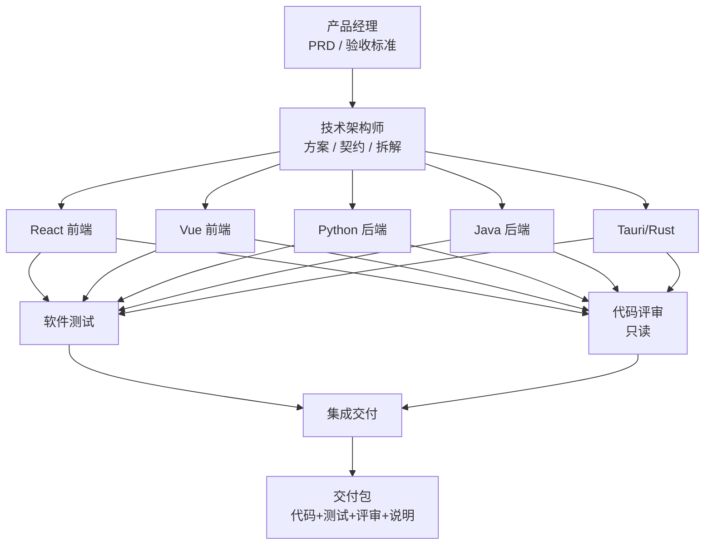

# 01 · 编排式案例：软件开发团队智能体群

> **协作模式：编排式（orchestrator）** — 主管拆解委派成员，逐子任务执行后汇总（可叠波次/依赖）。  
> 版本：v1.2 · 2026-09-28  
> 适用：WorkDuo 桌面端「智能体 / 小分队」——把一支软件研发团队固化为可编排、可验收的本地智能体群。  
> 基线：Tauri 2 + React 19 客户端；能力面 = 原生工具 + Skill + 本地插件（FaaS）+ 知识库 + 记忆宫殿（MCP 轻量预留）。  
> 原则：角色差异靠**工具面裁剪 + 交接契约**落地，不靠 prompt 空谈；交付必须带证据链。  
> 同系列：`02-流水线-需求到发布标准流水线.md` · `03-群聊-技术方案圆桌与评审.md`

---

## 1. 一句话定位

> **智能体群 = 一支可交付的微型软件研发团队。**  
> 输入一份需求/缺陷/迭代目标，输出：代码改动 + 接口/页面说明 + 测试报告 + 评审意见 + 交付包。

与「多个 Agent 聊天」的区别：

| 维度 | 本设计 | 朴素多 Agent |
|---|---|---|
| 角色边界 | 工具面 allow/deny + 期望产物类型 | 人人全能 |
| 协作 | 波次 DAG + HandoffBundle | 自由闲聊 |
| 验收 | expectedArtifacts + 测试/评审证据 | 自我报告 |
| 数据 | 本机工作区 / KB / 记忆沉淀 | 仅上下文 |

---

## 2. 角色总览（首发 10 岗）

| # | Agent 名 | identifier | 角色包 | 期望输出 | 主战场 |
|---|---|---|---|---|---|
| 1 | 产品经理 | `pm-product` | RESEARCHER + DECISION | PRD / 用户故事 / 验收标准 | 需求、优先级 |
| 2 | 技术架构师 | `arch-tech-lead` | DECISION + REVIEW | 技术方案 / API 契约 / 任务拆解 | 架构、接口 |
| 3 | Python 后端开发工程师 | `dev-python-backend` | WORKER | 服务/脚本/数据处理代码 + 自测 | API、批处理 |
| 4 | Java 后端开发工程师 | `dev-java-backend` | WORKER | 微服务/业务 API + 单测 | Spring/业务中台 |
| 5 | React 前端开发工程师 | `dev-react-frontend` | WORKER | 页面/组件/交互 + typecheck | UI、状态、样式 |
| 6 | Vue 前端开发工程师 | `dev-vue-frontend` | WORKER | Vue 页面/组件 + 构建自检 | 管理端、中台 UI |
| 7 | Tauri/Rust 客户端开发工程师 | `dev-tauri-rust` | WORKER | 命令/插件/桥接代码 | 桌面壳、IPC |
| 8 | 软件测试工程师 | `qa-test-engineer` | WORKER + CRITIC | 用例集 / 自动化脚本 / 测试报告 | 质量门禁 |
| 9 | 代码评审员 | `review-code-critic` | CRITIC | 评审意见（禁改代码） | 代码质量、安全 |
| 10 | 集成交付工程师 | `int-delivery` | INTEGRATOR | 变更说明 / 交付包 / 发布清单 | 合并、验收、归档 |

> 可选扩展（二期）：文档工程师 `docs-tech-writer`、运维工程师 `ops-devops`（接 server-host 域）。



---

## 3. 全局装配约定（对齐 WorkDuo）

| 项 | 约定 |
|---|---|
| 场景 scenario | `dev-programming`（主）/ `office-efficiency`（PM/文档） |
| 大脑模型 | 优先 `tool_calls=1` 的强推理模型；PM 可用偏文本书写模型 |
| llmConfig | **必须**从 `agent_list_models` 的 `config` 原样拷贝，不可留空 |
| memoryMode | 开发/测试 `active`；评审/汇总 `off` 或 `active`（短会话） |
| planAutoApproveMode | 外部无人值守：`never`；人机共创：`sensitive` |
| autoToolExecMode | 实现类 Agent `true`；评审/PM `false`（更稳） |
| allowSandbox | `true`（PathGuard 内执行） |
| 工作区 | 默认工程根；小分队成员可 isolated `{root}/{agent_id}` |
| Skill 挂载 | 每 Agent **≤3** |
| 插件挂载 | 每 Agent **≤10** |
| MCP | **轻量预留**，优先本地插件/原生工具；确需外部再挂 |

**能力面红线（与引擎一致）**

1. 可用工具由注册表决定，prompt 不能替代裁剪。  
2. 评审员默认 **deny `write_file` / `edit_file` / 执行类**，防止「评审改代码」。  
3. 产物校验走 `expectedArtifacts` + verifier，不做「做了活不交件」。  
4. 关键沉淀（架构决策、踩坑）用记忆锚定；团队规范进知识库。

---

## 4. 公共资产（先建再挂）

### 4.1 公共知识库（KB）

| KB | identifier | 用途 | 主要消费者 |
|---|---|---|---|
| 团队工程规范 | `kb-eng-standards` | 前端规范、API 规范、Git 规范、目录约定 | 全员 |
| 产品需求与验收 | `kb-product-prd` | PRD、用户故事、验收清单、变更记录 | PM、架构、QA |
| 架构决策记录 | `kb-adr` | ADR、接口契约、时序、数据模型 | 架构、前后端 |
| 测试资产库 | `kb-test-assets` | 用例、自动化脚本模板、缺陷模式 | QA、评审 |
| 历史缺陷与踩坑 | `kb-pitfalls` | 已知坑、回归清单、事故复盘 | 全员（召回） |

> 种子语料见 [`assets/kb-*.md`](./assets/README.md)：`kb-eng-standards.md`、`kb-product-prd.md`、`kb-adr.md`、`kb-test-assets.md`、`kb-pitfalls.md`（单文件合并，便于整库检索）。

> 对 WorkDuo 自身迭代时，可额外绑定产品源码说明 / `docs/` 精简摘要进 `kb-eng-standards`。

### 4.2 公共 Skill（跨角色复用）

| Skill | identifier | 一句话 | 适用 |
|---|---|---|---|
| 工程规范守卫 | `skill-eng-standards` | 目录/命名/依赖/禁止项检查清单 | 全员 |
| 接口契约写作 | `skill-api-contract` | REST/JSON Schema/OpenAPI 片段规范 | 架构、后端 |
| 测试用例设计 | `skill-test-case-design` | 等价类/边界/场景/失败路径模板 | QA、PM |
| 代码评审清单 | `skill-code-review-checklist` | 正确性/安全/可维护/性能四维清单 | 评审、架构 |
| 交付包组装 | `skill-delivery-pack` | 变更说明 + 证据链 + 风险说明结构 | 集成交付 |
| 任务拆解与验收 | `skill-task-breakdown` | 从需求拆到可执行任务与 DoD | PM、架构 |

### 4.3 公共本地插件（FaaS）

> 运行时：Python（micromamba 沙箱）或 Bun（TS）。函数签名固定 `run(params)` / `export async function run(params)`。  
> **沙箱边界澄清**：上述「沙箱」= **环境/依赖隔离**（防污染本机 Python/Node），**不是** OS 级安全沙箱——脚本内可 `subprocess` 派生宿主进程、读写工作区外路径（G-M1 审计结论，原文见 git 历史）。**产品不提供 Rust 沙箱**；Rust 能力一律经宿主工具链（见 §4.5）。

| 插件 | identifier | runtime | 用途 |
|---|---|---|---|
| 差异摘要 | `plugin-diff-summary` | bun | 扫描 git/diff 文本，输出变更摘要与风险点 |
| 类型检查 | `plugin-ts-typecheck` | bun | 调项目 typecheck，解析错误成结构化列表 |
| 测试执行 | `plugin-pytest-runner` | python | 跑 pytest/单测，解析 pass/fail 与失败堆栈 |
| 覆盖率汇总 | `plugin-coverage-report` | python | 解析 coverage 输出，生成缺口清单 |
| LOC/复杂度粗评 | `plugin-code-stats` | python | 行数、文件分布、简单热点 |
| Markdown 目录 | `plugin-md-toc` | bun | 生成/校验文档 TOC |
| 变更日志草稿 | `plugin-changelog-draft` | bun | 从任务/提交说明拼 changelog 草稿 |
| SQL DDL 幂等检查 | `plugin-sql-migrate-check` | python | 检查 init/updater 双轨与幂等 ALTER 约定 |
| OpenAPI 片段校验 | `plugin-openapi-lint` | python | 校验接口片段字段/命名 |
| 测试报告渲染 | `plugin-test-report-md` | python | 把 JSON 结果渲染为 Markdown 报告 |
| Cargo 检查 | `plugin-cargo-check` | python | **宿主 Rust 工具链**包装（非 Rust 沙箱）：check/test/clippy/metadata |
| Maven/Gradle 测试 | `plugin-java-build` | python | **宿主 JDK/Maven** 包装：compile/test，解析 surefire 失败 |
| Vue 构建自检 | `plugin-vue-build` | bun | 调 `vue-tsc`/`vite build`，解析错误（Vue3 管理端） |

> 可导入脚本与 Skill 正文见 [`assets/`](./assets/README.md)（`plugin-*.py/ts`、`skill-*.md`，按 identifier 命名）。

### 4.4 MCP（轻量预留）

优先级低，仅在本地能力不够时启用：

| MCP | 用途 | 挂载建议 |
|---|---|---|
| filesystem | 扩展文件读写面 | 一般不需要（原生工具已够） |
| git 平台类（GitHub/GitLab） | Issue/PR 元数据 | 集成交付可选 |
| 浏览器自动化（Playwright） | 真 UI 冒烟 | QA 可选 |
| 数据库查询 | 只读排查 | 后端可选 |

> 本阶段**默认不挂 MCP**；字段在 Agent 配置中留空数组即可，避免工具面膨胀与权限噪声。

### 4.5 宿主工具链（无语言沙箱时怎么跑检查）

| 语言 | 产品沙箱 | 宿主工具链路径 | 推荐接入 |
|---|---|---|---|
| Python | ✅ micromamba（环境隔离） | 也可直接 `pytest` | 优先沙箱 / `plugin-pytest-runner` |
| JS/TS | ✅ Bun（环境隔离） | 本机 node/pnpm | `plugin-ts-typecheck` / `plugin-vue-build` |
| Java | ❌ 无 JVM 沙箱 | 本机 JDK + Maven/Gradle | `plugin-java-build` 或 `execute_command` 白名单 |
| Rust | ❌ **无 Rust 沙箱** | 本机 `cargo`（`%USERPROFILE%\.cargo\bin`） | `plugin-cargo-check` 或 `execute_command` 白名单 |

**原则**

1. 插件沙箱 = **依赖/环境隔离**，不是 OS 安全边界；`subprocess` 可调宿主 `cargo`/`mvn`（G-M1 已实证可派生进程）。  
2. 调宿主工具链时 **子命令白名单 + `shell=False` 绝对路径**，禁止模型拼任意命令行。  
3. 检查类优先插件（结构化输出）；重交互/长输出可用原生 `execute_command` + 审批。  
4. 环境变量可用：`WD_CARGO_BIN` / `CARGO_HOME`、`JAVA_HOME`、`WD_MVN_BIN` 等显式定位，避免 PATH 不一致。  
5. 范例脚本见 `assets/plugin-cargo-check.py`（可 upsert 为 `plugin-cargo-check`）。

---

## 5. 分角色设计卡

### 5.1 产品经理 · `pm-product`

**职责**：澄清目标与范围 → PRD/用户故事/验收标准 → 优先级与变更说明。  
**不做**：写业务代码、改测试代码、直接部署。

| 项 | 配置 |
|---|---|
| 场景 | `office-efficiency` |
| 建议模型 | 文本书写强、结构化输出稳的模型 |
| planAutoApproveMode | `sensitive` |
| memoryMode | `active` |
| 期望输出 | `decision` / PRD 文档 artifact |

**工具面（allowlist）**  
原生：`read_file` `list_dir` `write_file`（仅文档目录）`archive_artifact` `anchor_memory`  
禁用：`execute_command` `run_python_sandbox` 高危执行类

**Skill（≤3）**
1. `skill-task-breakdown`
2. `skill-test-case-design`（写验收标准时用）
3. `skill-eng-standards`（约束文档落盘位置）

**插件**  
`plugin-md-toc` `plugin-changelog-draft` `plugin-code-stats`（了解改动规模）

**KB**  
`kb-product-prd` `kb-eng-standards` `kb-pitfalls`

**系统提示要点**
- 输出必须含：背景、目标、非目标、用户故事、验收标准（Given/When/Then 或清单）、优先级、风险。
- 不确定处显式标「待确认」，禁止臆造业务事实。
- 验收标准必须可被 QA 转成用例。

**交接契约（Handoff）**
- → 架构：`{prdPath, userStories[], acceptance[], constraints[]}`
- → QA：`{acceptance[], outOfScope[]}`

---

### 5.2 技术架构师 · `arch-tech-lead`

**职责**：技术方案、模块边界、API/数据契约、任务拆分与依赖、技术风险。  
**不做**：大段业务实现（可写骨架/接口定义）。

| 项 | 配置 |
|---|---|
| 场景 | `dev-programming` |
| 建议模型 | tool_calls=1 强推理 |
| planAutoApproveMode | `sensitive` |
| memoryMode | `active`（沉淀 ADR） |
| 期望输出 | `decision` + 契约文件 |

**工具面**  
原生：`read_file` `list_dir` `write_file` `edit_file` `archive_artifact` `anchor_memory`  
可选：`execute_command`（只读命令，如 `git status`）  
禁用：大范围重构执行、部署类

**Skill**
1. `skill-api-contract`
2. `skill-task-breakdown`
3. `skill-code-review-checklist`

**插件**  
`plugin-openapi-lint` `plugin-sql-migrate-check` `plugin-code-stats` `plugin-md-toc`

**KB**  
`kb-adr` `kb-eng-standards` `kb-product-prd` `kb-pitfalls`

**系统提示要点**
- 先给方案对比与取舍，再定契约；契约字段命名前后端统一。
- 拆任务必须带依赖边、预计产物文件、DoD。
- 涉及 WorkDuo 前端时遵守 `.workspace/.norms/frontend.md`（antd 封装、Sass 令牌、mapper 禁直写 SQL 等）。

**交接契约**
- → 前端/后端/Rust：`{apiContract, dataModel, taskList[], fileTargets[], risks[]}`
- → 评审：`{designDoc, contractPaths[]}`

---

### 5.3 Python 后端开发工程师 · `dev-python-backend`

**职责**：API/服务、数据处理、脚本、Python 插件、单测自证。  
**不做**：前端 UI、产品需求裁决。

| 项 | 配置 |
|---|---|
| 场景 | `dev-programming` |
| 建议模型 | tool_calls=1 + 代码强 |
| planAutoApproveMode | `never`（无人值守）/ `sensitive` |
| memoryMode | `active` |
| autoToolExecMode | `true` |
| 期望输出 | `artifact`（代码 + 自测） |

**工具面**  
原生：`read_file` `write_file` `edit_file` `list_dir` `run_python_sandbox` `execute_command`（白名单：pytest/mypy/ruff）`archive_artifact` `anchor_memory`  
禁用：任意网络外联、破坏性删除

**Skill**
1. `skill-eng-standards`
2. `skill-api-contract`
3. `skill-test-case-design`（写单测时）

**插件**  
`plugin-pytest-runner` `plugin-coverage-report` `plugin-code-stats` `plugin-openapi-lint` `plugin-sql-migrate-check` `plugin-diff-summary` `plugin-test-report-md`

**KB**  
`kb-eng-standards` `kb-adr` `kb-test-assets` `kb-pitfalls`

**系统提示要点**
- 改动后必须跑最小自测并落报告（plugin 或 sandbox pytest）。
- 接口变更同步契约片段；禁止私自改全局规范。
- 错误处理只在系统边界；内部信任引擎约束。

**交接契约**
- → QA/评审/集成：`{changedFiles[], apiDiff, testSummary, knownLimits[]}`

---

### 5.3B Java 后端开发工程师 · `dev-java-backend`

**职责**：Java/Spring 业务服务、中台 API、领域逻辑、MyBatis/JPA、单元与集成测试。  
**不做**：前端 UI、需求改判。

| 项 | 配置 |
|---|---|
| 场景 | `dev-programming` |
| 建议模型 | tool_calls=1 + 代码强 |
| planAutoApproveMode | `never` / `sensitive` |
| memoryMode | `active` |
| autoToolExecMode | `true` |
| 期望输出 | `artifact`（Java 代码 + 构建/测试结果） |

**工具面**  
原生：`read_file` `write_file` `edit_file` `list_dir` `execute_command`（`mvn`/`gradle` 测试类白名单）`archive_artifact` `anchor_memory`  
禁用：无审批的 `deploy`/远程发布、任意 shell

**Skill**
1. `skill-eng-standards`
2. `skill-api-contract`
3. `skill-test-case-design`

**插件**  
`plugin-java-build` `plugin-pytest-runner`（若有 Python 旁路）`plugin-diff-summary` `plugin-code-stats` `plugin-openapi-lint` `plugin-test-report-md`

**KB**  
`kb-eng-standards` `kb-adr` `kb-test-assets` `kb-pitfalls`

**系统提示要点**
- 接口与契约（OpenAPI）一致；DTO/异常码有文档。
- 改动后跑 `mvn -q test` 或 `gradle test`，结构化上报失败用例。
- 事务、空值、并发边界在代码评审清单内自检。
- **无 JVM 沙箱**：构建检查走宿主 JDK/Maven（§4.5），禁止在插件里拼任意命令。

**交接契约**
- → QA/评审/集成：`{changedFiles[], apiDiff, testSummary, knownLimits[]}`

---

### 5.4 React 前端开发工程师 · `dev-react-frontend`

**职责**：页面/组件/状态/样式/交互，typecheck 与基础自测。  
**不做**：后端逻辑、需求改判。

| 项 | 配置 |
|---|---|
| 场景 | `dev-programming` |
| 建议模型 | tool_calls=1 + 代码强 |
| planAutoApproveMode | 同后端 |
| memoryMode | `active` |
| 期望输出 | `artifact`（UI 代码 + typecheck 结果） |

**工具面**  
原生：`read_file` `write_file` `edit_file` `list_dir` `execute_command`（`npm run typecheck` 等白名单）`archive_artifact` `anchor_memory`  
禁用：直接改 DB、绕过 `src/core/mapper` 写 SQL

**Skill**
1. `skill-eng-standards`（内嵌 WorkDuo 前端铁律）
2. `skill-api-contract`（对接后端）
3. `skill-test-case-design`（交互验收）

**前端规范要点（写入 Skill/系统提示）**
- UI 一律 `@/components/ui` 封装，禁裸 antd；图标只用 lucide-react。
- 样式 `.scss`，只用 `var(--color-*)` 设计令牌；与 tsx 分离。
- 路由 HashRouter，新页面走 `src/core/router`。
- 数据访问走 mapper，组件不直写 SQL。
- 完成后跑 `npm run typecheck`，0 error 才算完成。

**插件**  
`plugin-ts-typecheck` `plugin-diff-summary` `plugin-code-stats` `plugin-md-toc` `plugin-test-report-md`

**KB**  
`kb-eng-standards` `kb-adr` `kb-product-prd` `kb-pitfalls`

**交接契约**
- → QA/评审/集成：`{changedFiles[], uiAcceptanceMap, typecheckResult, screenshotsNotes?}`

---

### 5.4B Vue 前端开发工程师 · `dev-vue-frontend`

**职责**：Vue 3 管理端/中台 UI——SFC、Pinia/Vuex、路由、组件库封装、构建自检。  
**不做**：后端业务、产品改判。

| 项 | 配置 |
|---|---|
| 场景 | `dev-programming` |
| 建议模型 | tool_calls=1 + 代码强 |
| planAutoApproveMode | 同 React |
| memoryMode | `active` |
| 期望输出 | `artifact`（Vue 代码 + vue-tsc/vite 结果） |

**工具面**  
原生：`read_file` `write_file` `edit_file` `list_dir` `execute_command`（`pnpm`/`npm` 构建白名单）`archive_artifact` `anchor_memory`  
禁用：直写 DB、绕过 API 层

**Skill**
1. `skill-eng-standards`（组件/目录/状态约定）
2. `skill-api-contract`
3. `skill-test-case-design`（交互验收）

**Vue 侧规范要点（写入 Skill/系统提示）**
- SFC 模板/脚本/样式分层清晰；组合式 API 优先，逻辑抽 `composables`。
- UI 组件库统一封装再用（对齐团队 Element Plus / Ant Design Vue 规范），禁页面内散装样式全局污染。
- 状态：跨页面才上 Pinia；接口统一 request 封装 + 错误码处理。
- 完成后跑 `vue-tsc --noEmit` 或项目 `typecheck`/`vite build`，0 error。

**插件**  
`plugin-vue-build` `plugin-ts-typecheck` `plugin-diff-summary` `plugin-code-stats` `plugin-md-toc` `plugin-test-report-md`

**KB**  
`kb-eng-standards` `kb-adr` `kb-product-prd` `kb-pitfalls`

**交接契约**
- → QA/评审/集成：`{changedFiles[], uiAcceptanceMap, buildResult, screenshotsNotes?}`

---

### 5.5 Tauri/Rust 客户端开发工程师 · `dev-tauri-rust`

**职责**：Tauri 命令、Rust 引擎、IPC/事件、沙箱/插件桥。  
**适用**：给 WorkDuo 自身或同类桌面产品做客户端能力时启用。

| 项 | 配置 |
|---|---|
| 场景 | `dev-programming` |
| 建议模型 | tool_calls=1 强推理 |
| 期望输出 | `artifact`（Rust 改动 + 检查结果） |

**工具面**  
原生：`read_file` `write_file` `edit_file` `list_dir` `execute_command`（`cargo check/test` 白名单）`archive_artifact` `anchor_memory`  
禁用：无审批的网络/安装类高危

**Skill**
1. `skill-eng-standards`
2. `skill-api-contract`（命令/事件契约）
3. `skill-code-review-checklist`

**插件**  
`plugin-cargo-check` `plugin-diff-summary` `plugin-code-stats` `plugin-sql-migrate-check`（DDL 双轨）`plugin-test-report-md`

**KB**  
`kb-adr` `kb-eng-standards` `kb-pitfalls`

**系统提示要点**
- 命令注册、事件名、消息序列不变量（tool_call.id 闭环）不可破坏。
- 能力层单一事实源：工具可用性以 registry 为准。
- 变更需说明对前端事件契约的影响。
- **无 Rust 沙箱**：`cargo check/test/clippy` 经宿主工具链（`plugin-cargo-check` 或 `execute_command` 白名单，见 §4.5）；不要假设存在 `run_rust_sandbox`。

---

### 5.6 软件测试工程师 · `qa-test-engineer`

**职责**：用例设计、自动化、回归、缺陷报告、发布门禁建议。  
**不做**：直接实现业务功能（可写测试代码与测试工具）。

| 项 | 配置 |
|---|---|
| 场景 | `dev-programming` |
| 建议模型 | tool_calls=1 |
| planAutoApproveMode | `sensitive` |
| memoryMode | `active` |
| 期望输出 | `artifact`（用例 + 测试报告） |

**工具面**  
原生：`read_file` `list_dir` `write_file`（测试目录）`edit_file`（测试文件）`run_python_sandbox` `execute_command`（测试命令白名单）`archive_artifact` `anchor_memory`  
默认 **deny 业务源码 write**（允许读）

**Skill**
1. `skill-test-case-design`
2. `skill-eng-standards`
3. `skill-delivery-pack`（报告结构）

**插件**  
`plugin-pytest-runner` `plugin-coverage-report` `plugin-test-report-md` `plugin-coverage-report` `plugin-ts-typecheck` `plugin-diff-summary` `plugin-code-stats`

**KB**  
`kb-test-assets` `kb-product-prd` `kb-pitfalls` `kb-eng-standards`

**系统提示要点**
- 用例必须映射到验收标准 ID；含至少 1 条失败/边界路径。
- 报告格式：范围、通过/失败、失败详情、风险、是否可发布。
- 断言看结果与工具调用，不靠转述「应该没问题」。

**交接契约**
- → 集成：`{testReport, blockers[], residualRisks[]}`

---

### 5.7 代码评审员 · `review-code-critic`

**职责**：正确性、安全、可维护性、性能、规范符合性评审。  
**不做**：改代码（工具面硬禁写）。

| 项 | 配置 |
|---|---|
| 场景 | `dev-programming` |
| planAutoApproveMode | `sensitive` |
| memoryMode | `off` / `active` |
| 期望输出 | `review` |

**工具面（denylist 起步）**  
允许：`read_file` `list_dir` `archive_artifact` `anchor_memory`  
**强制禁止**：`write_file` `edit_file` `execute_command` `run_python_sandbox`

**Skill**
1. `skill-code-review-checklist`
2. `skill-eng-standards`
3. `skill-api-contract`

**插件**  
`plugin-diff-summary` `plugin-code-stats`（只读分析类）

**KB**  
`kb-eng-standards` `kb-pitfalls` `kb-adr`

**系统提示要点**
- 输出分级：Blocker / Major / Minor / Nit；每条给 file:line 与修复建议。
- 无问题也要说明检查过哪些维度（防「假通过」）。
- 安全重点：注入、路径穿越、密钥、越权、不安全反序列化。

---

### 5.8 集成交付工程师 · `int-delivery`

**职责**：汇总多角色产物、冲突消解建议、变更说明、交付包、发布清单。  
**不做**：重写业务（小修补可做，需标注）。

| 项 | 配置 |
|---|---|
| 场景 | `dev-programming` |
| planAutoApproveMode | `sensitive` |
| memoryMode | `active` |
| 期望输出 | `artifact`（Delivery Pack） |

**工具面**  
原生：`read_file` `write_file` `edit_file` `list_dir` `archive_artifact` `anchor_memory`  
可选：`execute_command`（打包/复制类白名单）

**Skill**
1. `skill-delivery-pack`
2. `skill-task-breakdown`（对照 DoD）
3. `skill-eng-standards`

**插件**  
`plugin-diff-summary` `plugin-changelog-draft` `plugin-test-report-md` `plugin-md-toc` `plugin-code-stats`

**KB**  
`kb-product-prd` `kb-adr` `kb-eng-standards`

**交付包最小结构**
```text
delivery-pack/
  manifest.json          # 任务、成员、产物清单、校验
  report.md              # 变更说明 / 验收对照 / 风险
  changes/               # 代码与文档产物
  tests/                 # 测试报告与用例
  reviews/               # 评审意见
  sources/               # 需求与契约引用
```

---

## 6. 小分队编排（推荐 3 套模板）

### 6.1 全栈迭代组（默认）

**模式**：Wave DAG（并行 + 依赖）  
**成员**：PM → 架构 →（前端 ∥ 后端 ∥ Rust）→（QA ∥ 评审）→ 集成

| Wave | 成员 | 产出 | 依赖 |
|---|---|---|---|
| W0 | PM | PRD + 验收 | — |
| W1 | 架构 | 契约 + 任务包 | W0 |
| W2a | React 前端 | UI 代码 + typecheck | W1 |
| W2a' | Vue 前端（可选） | Vue UI + 构建自检 | W1 |
| W2b | Python 后端 | API/服务 + 自测 | W1 |
| W2b' | Java 后端（可选） | Java 服务 + 单测 | W1 |
| W2c | Tauri/Rust（可选） | 客户端能力 | W1 |
| W3a | 测试 | 用例 + 测试报告 | W2* |
| W3b | 评审 | 评审意见 | W2* |
| W4 | 集成 | 交付包 | W3a+ W3b |

### 6.2 缺陷修复组（精简）

**成员**：PM（问题澄清）→ 对应开发（FE/BE/Rust）→ QA 回归 → 集成  
适合单缺陷 hotfix，可跳过架构（有契约变更时再拉入）。

### 6.3 技术方案组（无代码）

**成员**：PM + 架构 + 评审 + 文档汇总（可由集成兼任）  
输出：方案对比、ADR、任务拆解、风险清单。

---

## 7. 交接契约（HandoffBundle）统一格式

```json
{
  "fromRole": "dev-python-backend",
  "taskId": "t-be-1",
  "summary": "完成用户列表 API",
  "artifactPaths": ["src/api/user.py", "tests/test_user.py"],
  "apiDiff": [{ "method": "GET", "path": "/users", "changed": true }],
  "decisions": ["分页默认 20"],
  "testSummary": { "passed": 12, "failed": 0, "skipped": 1 },
  "openQuestions": ["是否需要游标分页？"],
  "risks": ["旧客户端未带 page 参数"]
}
```

规则：
1. 文本只是摘要，**产物走文件路径**。  
2. 上游 Handoff 注入下游上下文时只注入摘要 + 路径，不注入全文。  
3. QA/评审依赖 `artifactPaths` 与 `testSummary` 做验收，不依赖聊天记录。

---

## 8. 记忆与知识沉淀策略

| 类型 | 写入方 | 去向 | 时机 |
|---|---|---|---|
| 架构决策 | 架构 | 记忆锚定 `architecture` + `kb-adr` | 方案定稿 |
| 代码模式 | 前后端 | 记忆 `code_pattern` | 可复用抽象确立 |
| 缺陷/踩坑 | QA/评审 | 记忆 `fix` + `kb-pitfalls` | 问题定位后 |
| 项目约定 | 全员 | `kb-eng-standards` | 规范变更 |
| 用户偏好 | PM | 记忆 `user_pref` | 需求沟通 |

> 模型可能不主动调记忆工具：关键结论用引擎 **forced settle / 显式 expectedArtifacts** 兜底，不靠自觉。

---

## 9. 落地清单（WorkDuo 配置顺序）

1. **建 KB**（§4.1）并导入规范/PRD/测试模板。  
2. **建 Skill**（§4.2 + 角色专属），每个 ≤3 挂载。  
3. **建插件**（§4.3 + 角色插件），先 `plugin_extract_meta` 校验再 upsert，`plugin_test` 试跑。  
4. **建 Agent**（§5）：`agent_list_models` 选模型 → **拷贝 config 到 llmConfig** → 显式填 isActive/autoToolExecMode/allowSandbox/memoryMode/planAutoApproveMode → 挂 Skill/插件/KB。  
5. **建小分队**：按 §6.1 装角色与工具面（allow/deny），配置 Wave 依赖。  
6. **跑通最小闭环**：一个小需求「登录页文案 + 一个 API 字段」全链路，核对交付包证据。  
7. **再放大**：接入测试门禁、评审 Blocker 拦截、成本/预算观察。

### 9.1 Agent 创建速查（identifier）

```text
pm-product
arch-tech-lead
dev-python-backend
dev-java-backend
dev-react-frontend
dev-vue-frontend
dev-tauri-rust
qa-test-engineer
review-code-critic
int-delivery
```

### 9.2 建议默认策略矩阵

| Agent | autoToolExec | planAutoApprove | memory | 高危工具 |
|---|---|---|---|---|
| pm-product | false | sensitive | active | 全禁 |
| arch-tech-lead | false | sensitive | active | 只读命令 |
| dev-python-backend | true | never/敏感 | active | 沙箱+白名单 |
| dev-java-backend | true | never/敏感 | active | mvn/gradle 白名单 |
| dev-react-frontend | true | never/敏感 | active | typecheck 白名单 |
| dev-vue-frontend | true | never/敏感 | active | vue-tsc/vite 白名单 |
| dev-tauri-rust | true | never/敏感 | active | cargo 白名单（宿主） |
| qa-test-engineer | true | sensitive | active | 测试命令 |
| review-code-critic | false | sensitive | off | **全禁写/执行** |
| int-delivery | true | sensitive | active | 打包类白名单 |

---

## 10. 验收标准（团队级 DoD）

一次「团队智能体群」任务算完成，当且仅当：

1. **需求**：PRD/问题陈述与验收标准齐全。  
2. **契约**：API/页面/命令契约或明确「无契约变更」。  
3. **代码**：产物文件落盘且与任务目标一致。  
4. **自测**：开发侧测试摘要存在（通过数/失败数可核）。  
5. **测试**：QA 报告覆盖验收标准，含失败路径。  
6. **评审**：意见分级完整；Blocker 清零或降级有理由。  
7. **交付包**：manifest + report + 改动 + 测试 + 评审可导出。  
8. **记忆**：关键决策/踩坑已锚定，便于下次召回。

---

## 11. 设计取舍说明

| 选择 | 原因 |
|---|---|
| 首发 8 岗而不是 20 岗 | 覆盖「需求→设计→实现→测试→评审→交付」最小闭环，角色可组合 |
| 评审员硬禁写 | 防角色越界，比 prompt 约束可靠 |
| 插件优先、MCP 轻量 | 本地插件可控、可测、权限面清晰；MCP 易膨胀 |
| Skill 限制 3 个 | 避免上下文与职责稀释；高频规范进 KB + 系统提示 |
| 测试与开发分离 | 降低「自己测自己」的假通过 |
| 集成角色独立 | 多 Agent 产物需要有人对「最终交付物」负责 |

---

## 12. 二期可选增强

- **人类成员节点**：需求验收、UI 走查由人上传/确认后解锁下游。  
- **模型选角**：实现用代码强模型，PM/评审用性价比模型。  
- **无人值守调度**：cron/API 触发缺陷回归小分队。  
- **发布门禁插件**：typecheck + 测试 + 评审 Blocker 三门全绿才出交付包。  
- **像素形象进运行态**：与角色徽标绑定，便于观察波次状态（已有产品规划）。

---

## 附录 A · 角色 × 能力速查

| Agent | read | write 业务 | write 测试/文档 | 执行 | 沙箱 | 记忆 | 评审输出 |
|---|---|---|---|---|---|---|---|
| pm-product | ✓ | ✗ | ✓ | ✗ | ✗ | ✓ | ✗ |
| arch-tech-lead | ✓ | 契约/骨架 | ✓ | 只读 | ✗ | ✓ | 可辅助 |
| dev-python-backend | ✓ | ✓ | ✓ | 白名单 | ✓ | ✓ | ✗ |
| dev-java-backend | ✓ | ✓ | ✓ | mvn/gradle | ✗ | ✓ | ✗ |
| dev-react-frontend | ✓ | ✓ | ✓ | typecheck | ✗ | ✓ | ✗ |
| dev-vue-frontend | ✓ | ✓ | ✓ | vue-tsc/vite | ✗ | ✓ | ✗ |
| dev-tauri-rust | ✓ | ✓ | ✓ | cargo（宿主） | ✗ | ✓ | ✗ |
| qa-test-engineer | ✓ | ✗ | ✓ | 测试 | ✓ | ✓ | ✗ |
| review-code-critic | ✓ | ✗ | ✗ | ✗ | ✗ | 可选 | ✓ |
| int-delivery | ✓ | 汇总修补 | ✓ | 打包 | ✗ | ✓ | ✗ |

## 附录 B · 推荐文件落盘约定

```text
docs/
  prd/<feature>.md
  design/<feature>-tech.md
  contracts/<feature>-api.md
src/ ...
tests/
  cases/<feature>.md
  reports/<date>-<feature>.md
delivery/
  <date>-<feature>/
    manifest.json
    report.md
```

---

**结语**：先把 8 个 Agent 的工具面、Skill/插件、交接契约装对，再上小分队 Wave 编排；用「测试报告 + 评审意见 + 交付包」三件套验收，避免智能体群变成热闹但不可信的聊天群。
