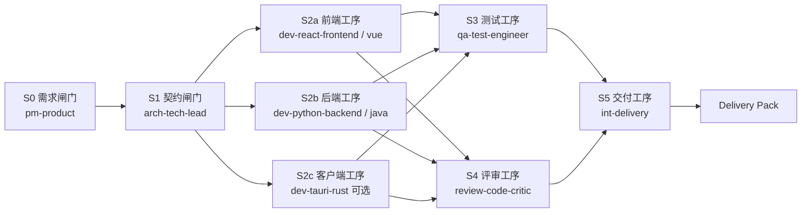

# 02 · 流水线案例：需求到发布标准流水线

> **协作模式：流水线（pipeline）** — 成员线性串流，前步产出喂后步输入；用连线（`depends_on`）表达依赖，角色由工序固定。  
> 版本：v1.0 · 2026-09-28  
> 适用：WorkDuo 小分队流水线模式（ReactFlow 画布编排）。  
> 共用资产（Skill/插件/KB/角色）见 [01-编排式案例](./01-编排式-软件开发团队智能体群设计.md)；本篇只写「工序化」差异。

---

## 1. 为什么这个场景用流水线

| 特征 | 是否匹配 |
|---|---|
| 每次迭代都走「需求→设计→实现→测试→发布」 | ✅ 工序稳定 |
| 每道工序输入/输出可文件化 | ✅ 可交接 |
| 希望无人值守/定时回归 | ✅ 可 cron / API |
| 不需要每天重新发明流程 | ✅ 画一次图反复跑 |
| 需要开放讨论才能定方案 | ❌ 先走群聊，再把决议当起点输入 |

**一句话**：编排式像「项目经理派活」，流水线像「工厂产线」；流程成熟后应沉淀到流水线。

---

## 2. 产线总览



> 画布操作：拖成员节点 → 句柄连线定 `depends_on`；`pipeline_order` 仅作线性兜底。无依赖的节点在 Wave 语义下可并行（设计目标）；现状若严格串行，则 S2a/S2b/S2c 顺序跑，时间更长但语义不变。

---

## 3. 工序卡（每站必须能交接）

### S0 需求闸门 · `pm-product`

| 项 | 内容 |
|---|---|
| 输入 | 原始需求 / 工单 / 用户原话 |
| 动作 | 澄清范围、写验收标准、标非目标 |
| 输出 | `docs/prd/<feature>.md` |
| 完成判据 | 含用户故事 + 可测验收项；「待确认」列表为空或显式保留 |
| 失败升档 | 范围冲突 → 标 `blocked`，转群聊（见 03）或人工 |

### S1 契约闸门 · `arch-tech-lead`

| 项 | 内容 |
|---|---|
| 输入 | S0 的 PRD 路径（Handoff） |
| 动作 | API/数据/命令契约、模块边界、风险 |
| 输出 | `docs/contracts/<feature>-api.md` + 任务清单 |
| 完成判据 | 契约字段命名统一；改动文件目标列表明确 |
| 拒绝下游 | 无契约不得进实现工序 |

### S2a 前端工序 · `dev-react-frontend` / `dev-vue-frontend`

| 项 | 内容 |
|---|---|
| 输入 | PRD + API 契约 |
| 输出 | UI 代码 + typecheck/build 结果 |
| 完成判据 | React：`plugin-ts-typecheck` 0 error；Vue：`plugin-vue-build` 0 error |
| 产物路径 | `src/pages/...` `src/components/...` 或 Vue `src/views/...` |

### S2b 后端工序 · `dev-python-backend` / `dev-java-backend`

| 项 | 内容 |
|---|---|
| 输入 | PRD + API 契约 |
| 输出 | 服务/脚本 + 测试摘要 |
| 完成判据 | Python：`plugin-pytest-runner`；Java：`plugin-java-build`（宿主 Maven/Gradle，无 JVM 沙箱） |
| 产物路径 | `src/**` `tests/**` 或 `src/main/java/**` |

### S2c 客户端工序 · `dev-tauri-rust`（可选）

| 项 | 内容 |
|---|---|
| 输入 | 契约（含 IPC/事件） |
| 输出 | Rust 改动 + `plugin-cargo-check`（宿主 cargo，**无 Rust 沙箱**） |
| 完成判据 | 命令/事件契约不破坏；消息序列不变量保持 |

### S3 测试工序 · `qa-test-engineer`

| 项 | 内容 |
|---|---|
| 输入 | 全部实现产物路径 + 验收标准 |
| 输出 | 用例集 + 测试报告 |
| 完成判据 | 每条验收有对应用例；含失败/边界；报告可导出 |
| 门禁 | 存在 Blocker 失败 → 不放行到 S5（评审可并行） |

### S4 评审工序 · `review-code-critic`

| 项 | 内容 |
|---|---|
| 输入 | diff/变更文件（只读） |
| 输出 | 分级评审意见（Blocker/Major/Minor/Nit） |
| 完成判据 | 四维清单过一遍；Blocker 清零才可标 green |
| **工具面** | **禁 write/execute**，只读 + 分析插件 |

### S5 交付工序 · `int-delivery`

| 项 | 内容 |
|---|---|
| 输入 | S3 报告 + S4 意见 + 全部产物 |
| 输出 | Delivery Pack（manifest/report/changes/tests/reviews） |
| 完成判据 | 与 PRD 验收对照表齐全；残留风险写明 |

---

## 4. 交接契约（流水线版）

流水线**没有 Leader 二次拆解**，交接完全由 `depends_on` / 文件约定决定：

```json
{
  "fromStation": "S1-contract",
  "toStation": "S2b-backend",
  "summary": "用户导出 API 契约已定稿",
  "artifactPaths": [
    "docs/prd/export-feature.md",
    "docs/contracts/export-api.md"
  ],
  "inputsRequired": ["acceptance[]", "apiContract"],
  "outputsExpected": ["src/api/export.py", "tests/test_export.py"],
  "acceptanceIds": ["AC-1", "AC-2"]
}
```

**硬约定**

1. 下游只认 `artifactPaths`，不认上工位聊天记录。  
2. 输出文件名可预期（进 `outputsExpected`），verifier 才能对账。  
3. 上工位失败 = 下游 `skipped` 或 `blocked`，禁止空转。

---

## 5. 与编排式的差异（装配层）

| 维度 | 流水线（本篇） | 编排式（01） |
|---|---|---|
| 角色选择 | UI 上流水线**角色由工序固定**（WORKER） | 可配 PM/CRITIC/INTEGRATOR 等角色包 |
| 谁拆任务 | **编队时画死** | 运行时主管 JSON 委派 |
| 依赖 | 连线 `depends_on` + 顺序 | 委派任务卡 / 波次 |
| 强项 | 可重复、可自动化、好审计 | 弹性、复杂交叉、人盯验收 |
| 弱项 | 需求一变就要改图 | 每次拆解质量不稳定 |

> 实操建议：Agent 人设仍用 01 的 8 岗（identifier 不变）；在流水线编队里**按工序挂载**，期望输出写进各站提示。若 UI 强制 WORKER，把「测试/评审/交付」职责写进对应成员的 systemPrompt + 工具面裁剪即可。

---

## 6. 建议成员挂载（流水线编队）

| 工序节点 | Agent | Skill | 关键插件 | 禁用 |
|---|---|---|---|---|
| S0 | `pm-product` | task-breakdown, test-case-design | md-toc, changelog-draft | 执行类 |
| S1 | `arch-tech-lead` | api-contract, task-breakdown | openapi-lint, sql-migrate-check | 部署类 |
| S2a | `dev-react-frontend` / `dev-vue-frontend` | eng-standards, api-contract | ts-typecheck 或 vue-build, diff-summary | 直写 DB |
| S2b | `dev-python-backend` / `dev-java-backend` | eng-standards, api-contract | pytest-runner 或 java-build, coverage-report | 外联 |
| S2c | `dev-tauri-rust` | eng-standards, api-contract | cargo-check, diff-summary | 高危 |
| S3 | `qa-test-engineer` | test-case-design, delivery-pack | pytest-runner, test-report-md | 业务 write |
| S4 | `review-code-critic` | code-review-checklist | diff-summary | **全部写/执行** |
| S5 | `int-delivery` | delivery-pack, task-breakdown | changelog-draft, test-report-md | 重写业务 |

可裁剪最小产线：**S0 → S2b → S3 → S5**（单后端需求）；或 **S1 → S2a → S3 → S5**（纯前端）。

---

## 7. 运行策略

| 策略 | 建议 |
|---|---|
| 计划审批 | 标准产线可 `never`（无人值守）；含发布用 `sensitive` |
| 超时 | 实现站 600s 级；测试站可更长 |
| 失败 | 该站 retry 有限次 → failed；下游 skip；S5 出「未交付」报告 |
| 预算 | 按站给 token 预算，防测试工序空转 |
| 定时 | 成熟后：每晚回归流水线（API/cron 触发） |
| 快照 | 每站前工作区快照，出错可回滚到该站 |

---

## 8. 门禁定义（发布绿线）

S5 放行前必须同时满足：

1. S3 测试报告：无 Blocker 失败。  
2. S4 评审：Blocker 清零（或有书面降级理由）。  
3. `expectedArtifacts` 与 manifest 文件名逐字一致。  
4. PRD 验收对照表每项为 Pass/Explicit Skip。  
5. 变更说明（changelog）存在。

任一失败 → 交付包标记 `not-ready`，附缺口清单。

---

## 9. 最小可跑示例：「导出按钮加统计字段」

```text
S0 pm-product
  in:  原始需求一句话
  out: docs/prd/export-stat.md

S1 arch-tech-lead
  in:  docs/prd/export-stat.md
  out: docs/contracts/export-stat-api.md

S2b dev-python-backend
  in:  上两份 + 契约
  out: src/**, tests/**, test_summary.json

S3 qa-test-engineer
  in:  产物路径 + AC 列表
  out: tests/reports/….md

S4 review-code-critic
  in:  变更文件列表
  out: reviews/….md

S5 int-delivery
  out: delivery/<date>-export-stat/{manifest.json, report.md, ...}
```

---

## 10. 验收清单（流水线级）

- [ ] 每站有明确输入/输出文件  
- [ ] 连线依赖无环  
- [ ] 下游失败策略定义（skip/blocked）  
- [ ] 测试与评审是独立工序（不与实现同站）  
- [ ] 交付包可导出且含证据  
- [ ] 同一编队可对第二个需求复用（只换输入）

---

**结语**：流水线的价值是「把聪明流程变成可靠产线」。先用编排式打样，稳定后固化为本篇的 S0–S5；用群聊处理站间争议，避免把讨论塞进产线节点烧 token。
