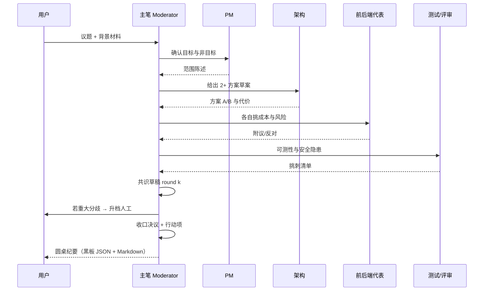

# 03 · 群聊案例：技术方案圆桌与评审

> **协作模式：群聊（chat）** — 共享黑板轮流发言，Moderator 收口；产出决议与行动项，不直接堆代码。  
> 版本：v1.0 · 2026-09-28  
> 适用：WorkDuo 小分队群聊模式（可配主笔/Moderator、maxRounds、consensusWindow）。  
> 共用角色/Skill/插件/KB 见 [01-编排式案例](./01-编排式-软件开发团队智能体群设计.md)。

---

## 1. 群聊在研发团队里的定位

| 群聊适合 | 群聊不适合 |
|---|---|
| 技术方案选型、架构决策（ADR） | 直接实现功能（走编排/流水线） |
| 需求澄清、范围谈判 | 长时间无人值守批处理 |
| 故障复盘（RCA）、质量门禁标准讨论 | 只要一串文件的文档生成 |
| 评审会：挑刺与共识 | 自由闲聊无收口 |

**产品机制对齐**

- 共享黑板轮流发言 → `board`  
- 主笔/Moderator 不参与主辩论，负责**提炼共识**  
- 结论必须结构化落下（决议 → 可转行动项）  
- 轮次有上限，防止空转烧 token  

> 设计中的 `chat_then_execute`：圆桌定完方案后，行动项注入编排/流水线执行。当前可手动接力。

---

## 2. 三种典型圆桌（套同一骨架）

| 场景 | 编队名 | 成员 | 收口物 |
|---|---|---|---|
| A. 技术方案评审 | `squad-chat-tech-review` | 架构 + 前端 + 后端 + 测试 + 主笔 | 方案决议 + 任务包 |
| B. 故障复盘 | `squad-chat-incident-rca` | 架构 + 相关开发 + 测试 + 主笔 | 根因 + 修复项 + 预防项 |
| C. 需求澄清圆桌 | `squad-chat-prd-clarify` | PM + 架构 + 测试 + 主笔 | 澄清后 PRD 要点 + 验收 |

下面以 **A. 技术方案评审** 为主展开，B/C 用差异表复用。

---

## 3. 圆桌角色（Chat 专用职责）

| 角色 | identifier | 发言重点 | 工具面 |
|---|---|---|---|
| **主笔 / Moderator** | `mod-tech-chair` | 控场、逼收敛、写决议 | 只读 + 写黑板摘要 |
| 产品经理 | `pm-product` | 目标、用户价值、非目标 | 文档读写 |
| 技术架构师 | `arch-tech-lead` | 方案、契约、代价 | 读 + 契约文档 |
| 前端代表 | `dev-react-frontend` | 交互/状态/规范成本 | 读 |
| 后端代表 | `dev-python-backend` | 接口/数据/性能 | 读 |
| 测试代表 | `qa-test-engineer` | 可测性、回归风险 | 读 |
| 评审/挑刺 | `review-code-critic` | 安全、维护性、反模式 | **只读** |

> 小圆桌可裁到 4 人：主笔 + 架构 + 一名开发 + 测试。大辩论再拉满。

---

## 4. 发言纪律（写进各成员系统提示）

1. **一轮只答本轮问题**，不复读全场。  
2. **观点必须带依据**：规范条目 / 性能数字 / 失败案例 / 文件路径。  
3. **禁止在群聊里写业务代码**（工具面已禁 write 业务）。  
4. **分歧要表态**：`同意 / 有条件同意 / 反对 + 理由 + 替代案`。  
5. **主笔每 N 轮发一次「共识草稿」**，逼大家点名赞成或反对。  
6. 超轮次预算仍不收敛 → 主笔升级「人工裁决」或缩小议题。

---

## 5. 黑板结构（决议可继承）

```json
{
  "topic": "导出功能：同步 vs 任务队列",
  "options": [
    { "id": "A", "desc": "同步导出", "pros": [], "cons": [] },
    { "id": "B", "desc": "队列异步", "pros": [], "cons": [] }
  ],
  "decisions": [
    { "id": "D1", "choice": "B", "reason": "大数据量必须可后台", "dissent": [] }
  ],
  "actionItems": [
    { "id": "A1", "ownerRole": "arch-tech-lead", "task": "补队列契约", "handoffTo": "pipeline-or-orchestrator" },
    { "id": "A2", "ownerRole": "qa-test-engineer", "task": "补回压用例", "handoffTo": "qa" }
  ],
  "risks": ["运维需监控队列堆积"],
  "openQuestions": ["失败重试策略？"]
}
```

**产品落点**：决议进 `board.decisions`；行动项进 `board.tasks`；可转 Wave/流水线（设计 §4.4.5 / Chat 2.0）。

---

## 6. 圆桌流程（建议脚本）



### 轮次模板

| 轮 | 问题 | 谁先说 |
|---|---|---|
| R1 | 目标/成功标准是什么？ | PM |
| R2 | 有哪些可行方案（≥2）？ | 架构 |
| R3 | 实现代价与副作用？ | 前后端 |
| R4 | 测试/安全/运维风险？ | 测试 + 评审 |
| R5 | 主笔出共识草稿，逐条表决 | 主笔 |
| R6 | 写决议与行动项 | 主笔 |

`maxRounds` 建议 6–8；`consensusWindow` 连续 2 轮无实质异议即收口。

---

## 7. 成员挂载（Chat 配置）

| Agent | Skill | 插件 | 禁用 |
|---|---|---|---|
| `mod-tech-chair` | task-breakdown, delivery-pack | md-toc | 业务写/执行 |
| `pm-product` | task-breakdown, test-case-design | md-toc | 执行 |
| `arch-tech-lead` | api-contract, code-review-checklist | openapi-lint, code-stats | 部署 |
| `dev-react-frontend` | eng-standards | diff-summary, code-stats | 大改代码 |
| `dev-python-backend` | eng-standards, api-contract | code-stats, diff-summary | 大改代码 |
| `qa-test-engineer` | test-case-design | test-report-md | 业务写 |
| `review-code-critic` | code-review-checklist | diff-summary | **全部写/执行** |

**主笔系统提示要点**

- 你不是专家夺麦，而是**收敛器**。  
- 每轮输出：已同意 / 仍分歧 / 需要谁补证据。  
- 结束必须输出：`decisions[] actionItems[] risks[] openQuestions[]`。  
- 行动项要能被下游 Agent 直接执行（含期望产物路径）。

**挑刺者（CRITIC）要点**

- 反对必须给替代案或降低风险的条件。  
- 允许「有条件同意」：条件写入 actionItems。

---

## 8. 议题输入模板（用户开聊前贴进任务）

```markdown
### 议题
导出功能采用同步还是异步任务队列？

### 背景
- 数据量：最多 10 万行
- 现状：单机桌面应用，已有 Python 沙箱

### 成功标准
- 30s 内用户可感知进度
- 失败可重试
- 不阻塞 UI

### 约束
- 本地优先，不强制云服务
- 遵循 WorkDuo 事件与任务终态铁律

### 预算
- 轮次 ≤ 6
- 重点：方案对比表 + 决议 + 行动项
```

---

## 9. 场景差异表

### B. 故障复盘 `squad-chat-incident-rca`

| 轮 | 问题 |
|---|---|
| R1 | 时间线（何时发现/恢复）？ |
| R2 | 直接原因 vs 根因（5 Whys）？ |
| R3 | 为什么没被测试/监控拦住？ |
| R4 | 短期修复 / 长期预防？ |
| R5 | 决议：修复项 owner + 完成定义 |

主笔收口：`rootCauses[] fixItems[] preventions[] owners[]`。

### C. 需求澄清 `squad-chat-prd-clarify`

| 轮 | 问题 |
|---|---|
| R1 | 用户是谁、要完成什么任务？ |
| R2 | 边界：做什么/不做什么？ |
| R3 | 验收怎样算过？ |
| R4 | 技术可行性红旗？ |
| R5 | 决议：PRD 修订点 + 待确认（升人工） |

主笔收口：`revisedPRDPoints[] acceptanceDraft[] openQuestions[]`。

---

## 10. 与生产模式的接力

```text
群聊（本篇）
  └─ decisions / actionItems
        ├─→ 编排式：主管把行动项拆成委派任务卡
        └─→ 流水线：行动项成为 S0 输入或改 S1 契约
```

**接力纪律**

1. 行动项带 `ownerRole` 与 `artifactPaths` 期望。  
2. 圆桌纪要归档到 `kb-adr` 或 `kb-product-prd`。  
3. 重大架构决议用记忆锚定（`category=architecture`）。  
4. 未收敛的 `openQuestions` 不得静默丢弃——进人工清单。

---

## 11. 防空转清单

| 风险 | 对策 |
|---|---|
| 各说各话 | 主笔每轮贴「问题编号」 |
| 假共识 | 要求 `同意/有条件/反对` 显式表态 |
| 论证没有 | 规则：无证据的断言降权或丢弃 |
| 轮次爆炸 | `maxRounds` + 超时升人工 |
| 只吵不做 | 禁止结束时无 actionItems |
| 评审变改代码 | CRITIC 工具面禁写 |

---

## 12. 验收清单（圆桌级）

- [ ] 议题含背景、成功标准、约束、预算  
- [ ] 至少 2 个方案被比较（纯澄清会可免）  
- [ ] 决议有理由与（如有）异议记录  
- [ ] 行动项可执行、可指派、可交接  
- [ ] 风险与 openQuestions 列出  
- [ ] 纪要落盘/进 KB，可被下一小分队引用  

---

## 13. 最小可跑示例（30 分钟圆桌）

**议题**：测试报告放 `tests/reports/` 还是统一 `delivery/`？

**成员**：主笔 + 架构 + 测试 + 后端（4 人）

**流程**：R1 约束 → R2 两案 → R3 代价 → R4 主笔草稿 → R5 决议

**收口示例**

```text
D1: 测试报告先落 tests/reports/，交付时由 int-delivery 收进 delivery pack
A1: int-delivery 更新 skill-delivery-pack 说明（产物路径）
A2: qa-test-engineer 报告文件名规范统一为 date-feature.md
Risks: 旧报告路径需迁移说明
```

---

**结语**：群聊小分队是研发团队的「会议室」，不是「流水线」。用主笔把讨论压成决议与行动项，再交给编排式/流水线去干活——吵得清楚，才做得干净。
