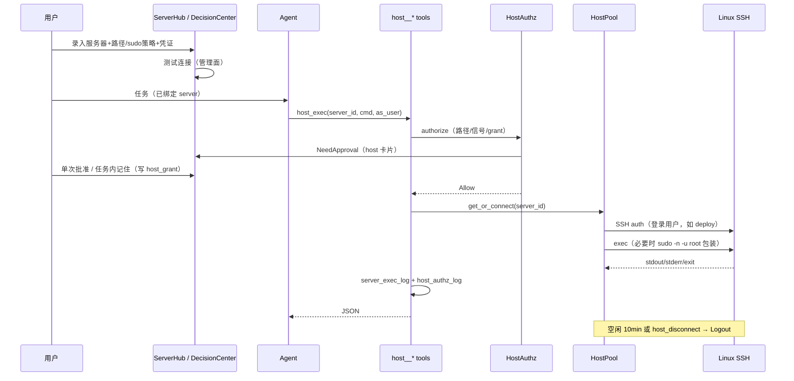

# 服务器托管（Host）设计方案

> 定位：百宝箱能力轴扩展。为 Agent 提供完整的远程 Linux 运维能力——对标 Xshell + Xftp（连接 / 终端命令 / 文件同步 / 断开）。  
> 边界：**独立模块，不修改 `native.rs`**；本机 `native__*` 行为零回归。  
> 形态：完整方案，一次设计到位；实现可按依赖序落地，架构不按「一期/二期」砍接口。  
> **本篇内含为托管量身定制的独立审批授权子系统（HostAuthz）**，与本地审批边界硬隔离，不另拆文档。

---

## 1. 产品定位

| 对比 | Xshell / Xftp | WorkDuo 服务器托管 |
|------|---------------|-------------------|
| 谁来操作 | 人敲键盘 | Agent 调工具 + 人审批 |
| 会话管理 | 手动连接/断开 | 平台连接池托管，超时自动 Logout |
| 文件传输 | Xftp 面板拖拽 | `host_upload` / `host_download` / `host_sync` |
| 安全边界 | 用户自觉 | **HostAuthz 独立授权域** + 路径白/黑名单 + 命令策略 + 审批门禁 + 审计 |

**能力模型（四族）：**

```text
Connection（连接） ──► Command（终端命令） ──► Logout（断开）
       │                      │
       │                      └── FTP 文件同步（上传 / 下载 / 同步 / 列目录）
       └── 管理面录入 + 运行时连接池（Agent 不每次手连）
```

> 协议层采用 **SFTP over SSH**（与 Xshell/Xftp 同一体验：同一 22 端口、同一密钥），**不做明文 FTP**。产品文案可叫「文件同步 / FTP」，实现走 SFTP。

---

## 2. 用户身份模型（登录不必是 root，同一 Session 内完成）

### 2.1 事实（SSH 协议）

```text
一次 SSH 连接 = 认证时绑死一个 OS 登录用户（server_host.user）
    │
    │   整个 session 内：exec / SFTP 都是该用户身份
    │   协议层无法中途「换用户重新登录」
    │
    └── 需要 root / 其他用户？
            └── 同一 session 内提权（sudo / su），不是第二次 SSH 登录
```

| 能力 | 同一 Session 内能否做到 | 说明 |
|------|-------------------------|------|
| 以 `deploy` 登录并一直用 `deploy` 干活 | **能** | 默认模型；路径白名单也按该用户可写范围配 |
| 连接后改用 root 重新 SSH 认证 | **不能** | 那是另一条连接；用 `host_connect` 另建或共存池 |
| 同一 session 内 `sudo` 到 root / `sudo -u www-data` | **能（可选）** | 须主机配置允许 + HostAuthz 升 L2；非交互 `sudo -n` |
| 同一 session 内 `su - otheruser` | **受限** | 通常要目标用户口令（交互式，默认不支持）；有免密 su 才可 `su -c` |

### 2.2 产品约定

1. **`user` = SSH 登录用户**，录入什么就是什么，**不假设 root**。测试连接后展示 `id` / `whoami`，让管理员看清真实身份与可写目录。  
2. **权限边界 = 该登录用户 + path_allow**，而不是 root 的磁盘视图。普通用户对 `/var/www` 无写权限时，工具应报「OS 权限不足」，而不是提升成 root 再试。  
3. **提权是一等、可关闭的策略**，不是让模型自己拼 `sudo`：  
   - `sudo_mode=none`：命令含 `sudo`/`su ` → Deny  
   - `sudo_mode=sudo_cmd`：仅允许 `sudo -n <cmd>` 且 cmd 命中提权命令白名单  
   - `sudo_mode=sudo_full`：允许 `sudo` 包装，一律 L2 审批，目标用户默认 `sudo_user`  
4. **结构化提权参数**：`host_exec.as_user`（`login` \| `root` \| 具体用户）：  
   - `login`（默认）= 不提权，纯登录用户  
   - 其他 = 运行时包装为 `sudo -n -u <as_user> -- …`，并强制 HostAuthz  
5. **文件工具与登录用户一致**：SFTP 不能越权成 root；root 文件须读写时走 `as_user=root` 的 `host_exec` + 审批。

### 2.3 同一 Session 完整登录链（示例）

```text
HostPool.get_or_connect(deploy@10.0.0.12)     ← Connection，用户=deploy
    └─ channel 1: host_exec("whoami")         → deploy
    └─ channel 2: host_upload(... as deploy)
    └─ channel 1: host_exec("systemctl reload nginx", as_user="root")
                    → 会话内 sudo -n -u root systemctl reload nginx
                    → HostAuthz L2 弹窗
    └─ host_disconnect                        ← Logout
```

始终是 **一条 SSH 连接**；提权发生在命令包装层，而不是「再登录 root」。

---

## 3. 信息架构

```text
顶栏
└── 百宝箱（下拉）
    ├── LLM
    ├── MCP
    ├── Skill
    ├── Plugin
    └── 服务器（新） ──► /server-hub

智能体工作室
└── 装配步骤增加「服务器」多选（可绑定多台，默认 Host 可指定）

设置 → 安全中心
└── 凭证保管策略（加密方式说明、清除凭证）
```

**Server Hub 页面（`/server-hub`）：**

- 列表卡片：名称、`user@host:port`、连接状态、标签、最近使用时间  
- 操作：新建 / 编辑 / 删除 / 测试连接 / 查看审计摘要  
- 详情：路径策略、sudo 策略、绑定智能体、最近执行与授权日志  

---

## 4. 数据模型

### 4.1 `server_host` — 服务器主表

| 字段 | 类型 | 说明 |
|------|------|------|
| `id` | TEXT PK | UUID |
| `name` | TEXT | 显示名，如「生产 Web-01」 |
| `host` | TEXT | IP 或域名 |
| `port` | INTEGER | 默认 22 |
| `user` | TEXT | **SSH 登录用户**（不必是 root，如 `deploy` / `app`） |
| `auth_type` | TEXT | `password` \| `private_key` \| `private_key_passphrase` |
| `credential_id` | TEXT | 指向凭证密文，**不落明文** |
| `path_allow` | JSON | 远端路径白名单，如 `["/var/www","/data/app"]`；空=不限制（不推荐） |
| `path_deny` | JSON | 黑名单，**优先于白名单** |
| `local_path_allow` | JSON | 本地侧路径白名单；默认=绑定工作空间 |
| `default_cwd` | TEXT | `host_exec` 默认工作目录，须落在 `path_allow` |
| `login_note` | TEXT | 登录身份备注 |
| `sudo_mode` | TEXT | `none`（默认）\| `sudo_cmd` \| `sudo_full` |
| `sudo_user` | TEXT | 提权目标，默认 `root` |
| `host_auto_mode` | TEXT | HostAuthz：`strict`（默认）\| `balanced` \| `auto` |
| `allow_grant_memory` | INTEGER | false=永远只允许单次批准 |
| `l3_policy` | TEXT | `reject` \| `single_shot` |
| `grant_bind_as_user` | INTEGER | 默认 true：grant 精确匹配 as_user |
| `tags` / `note` | JSON / TEXT | |
| `created_at` / `updated_at` / `last_used_at` | TEXT | |

### 4.2 `server_credential` — 凭证密文

| 字段 | 说明 |
|------|------|
| `id` | PK |
| `secret_type` | `password` \| `private_key` \| `private_key_passphrase` |
| `secret_enc` | AES-256-GCM 密文 |
| `hint` | 指纹展示（密钥 MD5 后 8 位 / 密码 `****`+末 2 位） |

主密钥优先 Windows DPAPI / Credential Manager。UI 与 Agent **均不可读出明文**。

### 4.3 `agent_server_ref` — 智能体绑定

`agent_id` + `server_id` + `role`（primary/secondary）+ `cwd_override`

### 4.4 `server_exec_log` — 执行审计

`server_id / agent_id / session_id / run_id / tool_name / argv / as_user / cwd / started_at / duration_ms / exit_code / bytes_in / bytes_out / approved / error`

只记「做了什么、结果如何」。

### 4.5 `host_grant` — Host 专用免弹授权（与 local grants 分表）

```text
HostGrant {
  grant_id,
  domain: "host",          // 写死防串域
  agent_id, server_id, action, as_user,
  risk_key,                // 如 host:rm_rf
  scope_digest,            // 规范化命令/路径摘要
  granted_by: "user"|"plan",
  granted_at, expires_at,  // run 结束强制过期
  max_uses, uses,
}
```

索引：`(run_id, agent_id, server_id, action, as_user, risk_key)`。

### 4.6 `host_authz_log` — 授权审计（与执行日志分表）

`run_id / session_id / agent_id / server_id / action / as_user / risk_level / risk_key / signals_json / decision / grant_id / request_digest / created_at`

`decision` ∈ `allow_auto | allow_grant | allow_user | allow_single | deny`。

---

## 5. 路径与命令策略

### 5.1 路径校验（文件工具必走）

```text
允许 ⇔ (命中 path_allow 或 allow 为空)
        ∧ (未命中 path_deny)          ← deny 优先
        ∧ 逻辑归一化后仍在允许前缀内   ← 防 ../ 逃逸
```

- 远端：POSIX 归一化，可选 SFTP `realpath` 二次确认。  
- 本地：约束在 `local_path_allow`。  
- 默认黑名单：`/etc`、`/root/.ssh`、`/boot`、`/proc`、`/sys`、`/dev`。

### 5.2 `host_exec` 命令策略

1. **`cwd` 强制**落在 `path_allow`。  
2. **`HOST_RISKY_SIGNALS`**（§7.4，**不与本地 `policy.rs` 混表**）。  
3. **提权信号**：`sudo_mode=none` 拒绝 `sudo`/`su`/`as_user≠login`；允许时 L2 + HostAuthz。  
4. **全量审计**进 `server_exec_log` + `host_authz_log`。

> SSH `exec` 无法 jail 用户权限。白名单约束的是文件工具与 cwd，不是 shell 全部能力。因此 `host_exec` 恒敏感，默认 RequireApproval。

---

## 6. 连接层（Connection / Logout）

### 6.1 连接池

```text
HostPool
  key: server_id
  value: SshSession { client, sftp, last_used, config, login_user }
```

| 行为 | 约定 |
|------|------|
| 懒连接 | 工具调用时自动 connect；`host_connect` 可预热/重连 |
| 保活 | TCP keepalive + 心跳 |
| 空闲超时 | 默认 10min 自动 Logout |
| 并发 | 单 server 默认 2 通道（exec + sftp） |
| 失败 | 结构化中文错误；连续失败 3 次熔断本 run 该主机 |

### 6.2 协议

- SSH：`russh` 或 `ssh2`，封装 `SshTransport` trait。  
- SFTP：同一连接上的 SFTP 子系统（**不要**明文 FTP 21）。  
- 无交互 PTY；`host_exec` 非交互、超时强杀（默认 60s，上限 300s）。

### 6.3 Logout

自动：空闲 / App 退出 / 池淘汰。工具：`host_disconnect(_all)`。优雅关闭 channel → TCP，写审计。

---

## 7. 独立审批授权子系统（HostAuthz，为托管量身定制）

> 本节与工具面同属一篇：授权审批是 Host 的组成部分，不是外挂通用件。

### 7.1 为什么必须与本地审批硬隔离

| 若混用现有审批边界 | 会出的问题 |
|--------------------|------------|
| grant_key 同池 | 本地批过写盘，可能被误配到远程路径连带放行 |
| 同一 `policy.rs` 信号表 | 本地 `.env` 与远端 `/etc` 风险级不同，却共享「记住」生命周期 |
| 同一任务内免弹 | 「本任务内记住」会把**本机文件**与**生产机命令**一起放行 |
| 审计混表 | 无法回答「这条生产变更谁批的、范围是什么」 |
| 风险模型不同 | 本地越界 vs 动生产机，爆炸半径差几个量级 |

**设计原则：**

1. **授权域隔离**：`domain=host` 的授权、策略、审计、记忆，不进入 `domain=local` 判定。  
2. **默认拒绝**：未绑定 / 无有效授权 / 命中策略未批 → 拒绝。  
3. **凭证永不进入授权链**。  
4. **审批 UI 可共用 DecisionCenter 壳，授权数据不共用**。

### 7.2 授权域模型

```text
┌─────────────────────────────────────────────┐
│           Approval UI（DecisionCenter）      │
│     统一挂起/恢复入口，卡片按 domain 分型     │
└──────────────────┬──────────────────────────┘
                   │
       ┌───────────┴───────────┐
       ▼                       ▼
┌──────────────┐        ┌──────────────────┐
│ domain=local │        │  domain=host     │
│ ApprovalMgr  │        │  HostAuthz       │
│ policy.rs    │        │  host_policy     │
│ grants_local │        │  host_grant      │
│ 轨迹/日志 A  │        │  host_authz_log  │
└──────────────┘        └──────────────────┘
        ✗ 禁止互相读写对方 grant / 策略 / 免弹
```

| 维度 | local（现状） | host（本方案） |
|------|---------------|----------------|
| 评估入口 | `ApprovalManager` + `policy::evaluate_edge` | `HostAuthz::authorize` |
| 授权池 | 任务级 grants | `host_grant`（独立表） |
| 风险信号 | `RISKY_SIGNALS` | `HOST_RISKY_SIGNALS` |
| 路径边界 | `PathGuard` + workspace | `path_allow` / `path_deny` |
| 操作类型 | Wrote/Deleted/Moved/Exec/Network | RemoteRead/Write/Delete/Exec/Sync |
| 免弹记忆 | 任务内 grants | 任务内仅同 agent+server+action+as_user+risk_key |
| 审计 | 轨迹 + session_tool_outputs | `host_authz_log` + `server_exec_log` |

### 7.3 核心概念

**HostPrincipal：** 授权绑定 `(agent_id, server_id, action, as_user)`，缺一不可。

- 换 Agent / 换主机 / 换 action / **换 as_user**（login vs root）均不互认。

**HostAction：**

```rust
pub enum HostAction {
    Connect, RemoteRead, RemoteWrite, RemoteDelete, RemoteExec, Disconnect,
}
```

**HostRiskLevel：**

| 级别 | 含义 | 默认策略 |
|------|------|----------|
| `L0` | 只读且未命中信号 | 自动 |
| `L1` | 可写/低危信号 | 弹窗；可「本任务内记住」 |
| `L2` | 高危/删目录/系统路径/提权/`delete_extraneous` | 强制弹窗；记住需二级确认 |
| `L3` | `rm -rf`/`mkfs`/写密钥/反弹 shell/磁盘设备/关机 | 仅单次批准或拒绝，禁止记住 |

**与 local grants 硬隔离：** 物理分表；key 强制 `host:` 前缀；run 结束各自清理；`planAutoApproveMode='never'` 只影响 local，host 按 `host_auto_mode`（默认 `strict`）。

### 7.4 `HOST_RISKY_SIGNALS`（与 local 信号表分家）

| risk_key | 匹配 | Level |
|----------|------|-------|
| `host:sys_ssh` | `authorized_keys`、`id_rsa`、`id_ed25519`、`.ssh/` | L2 |
| `host:sys_etc` | `/etc/`、`/boot/`、`/proc/`、`/sys/`、`/dev/` | L2 |
| `host:sys_root` | `/root` | L2 |
| `host:destruct` | `rm -rf`、`rm -fr`、`mkfs`、`dd if=`、`> /dev/sd` | L3 |
| `host:service` | `shutdown`、`reboot`、`systemctl stop`、`kill -9 1` | L2 |
| `host:pipe_shell` | `curl`\|`sh`、`wget`\|`sh`、`\| bash` | L3 |
| `host:perm` | `chmod 777`、`chown -r` | L2 |
| `host:net_out` | `bash -i`、`nc -e` | L3 |
| `host:sudo` | `as_user≠login` 或手拼 `sudo`/`su` | L2（`sudo_mode=none`→Deny） |
| `host:sudo_root` | `as_user=root` | L2，禁止与 login 共用 grant |
| `host:sync_del` | `delete_extraneous=true` | L2 |
| `host:cred_path` | 路径含 `credential`、`.env`、`.pem` | L2 |

禁止合并 local 的 `RISKY_SIGNALS`；同字面（如 `.env`）也必须以 `host:` 前缀重新声明。

### 7.5 `HostAuthz::authorize`（唯一入口）

所有 `host__*` 触网/触盘前必走：

```text
HostAuthz::authorize(request) -> Allow | Deny | NeedApproval
```

```rust
pub struct HostAuthzRequest {
    pub domain: HostDomain,          // 恒 host
    pub agent_id: String,
    pub session_id: String,
    pub run_id: String,
    pub server_id: String,
    pub action: HostAction,
    pub as_user: String,             // login | root | other
    pub remote_path: Option<String>,
    pub local_path: Option<String>,
    pub command: Option<String>,
    pub cwd: Option<String>,
    pub extra: HostExtra,
}
```

**判定顺序（短路）：**

```text
1. 绑定     agent 是否绑定 server_id？否 → Deny(NotBound)
2. 开关     主机启用？host_auto_mode？
3. 路径闸   remote/local 在 allow 且不在 deny？否 → Deny(PathDenied)
4. cwd 闸   host_exec 的 cwd ∈ path_allow？
5. 风险     host_policy::evaluate → (level, risk_key, signals[])
            · as_user≠login 先查 sudo_mode；none → Deny
            · 手拼 sudo/su → Deny，引导 as_user
6. 免弹     HostGrantStore 命中？
            （domain=host ∧ 同 agent+server+action+as_user+risk_key
              ∧ 未过期 ∧ uses<max ∧ scope_digest 覆盖）
7. 输出     L0→Allow(auto)；L1/L2→NeedApproval；L3→单次批准或 Deny
```

**绝不**调用 `policy::evaluate_edge`；**绝不**查询 local grants。

### 7.6 审批卡片（domain=host 专用）

```text
┌ Host 操作审批 ──────────────────────────────┐
│ 主机   web-01  (deploy@10.0.0.12:22)       │
│ 身份   login=deploy → as_user=root (sudo)  │
│ 操作   RemoteExec · L2 · signal sudo_root  │
│ 命令   systemctl reload nginx              │
│ CWD    /var/www/app                        │
│ 白名单 /var/www, /data/app                  │
│                                            │
│ [拒绝]  [单次批准]  [本任务内记住此风险]     │
│         L2「记住」需勾选确认知悉生产影响     │
└────────────────────────────────────────────┘
```

- 「本任务内记住」→ 写 `host_grant`，`run_id` 结束失效。  
- 「单次批准」→ 不写 grant。  
- 禁止展示/写入 local grant_key。

### 7.7 计划审批隔离

- 计划批准生成的 grants **只属于 local**。  
- Host 步骤不继承计划授权。  
- 若需计划级 Host 授权：`host_plan_grant`（`host:` 键），计划卡片**分栏**「本地敏感项 / 主机敏感项」，主机栏必须单独确认。

```text
计划批准
  ├─ local grants     ← 现有
  └─ host_plan_grant  ← 仅 host，键独立
```

### 7.8 生命周期

```text
run 开始 → HostGrantStore.open(run_id) 空池
  … NeedApproval → 单次批准（不写 grant） / 记住（写 host_grant）
  … Allow(grant) 免弹
run 结束 → HostGrantStore.close（清理 host_grant）；local grants 各自清理
连接池可保留；授权不留存
```

跨 run / 跨 Agent / 跨 as_user 一律不继承。默认不提供「本会话永久信任」。

### 7.9 与既有系统接缝（只接线，不混权）

| 接缝 | 允许 | 禁止 |
|------|------|------|
| DecisionCenter | host 卡片渲染、挂起/恢复事件 | host 请求写入 local grants |
| ToolRegistry | `host__*` 走 HostAuthz 挂起 | host 标成 local 可免弹 |
| `agent/policy.rs` | 无调用；可复制信号表 DSL 结构 | `evaluate_edge` / 读写 local grants |
| planner 大纲 | 绑定了主机才列 `host__*` | 把 local 通过写成 host 免审 |
| 小分队 | 成员各自 HostAuthz | 黑板记忆当授权依据 |

```rust
fn authz_domain(&self) -> AuthzDomain { AuthzDomain::Local } // 默认
// host__* 实现为 AuthzDomain::Host
```

调度器分流：`Local → ApprovalManager`，`Host → HostAuthz`，类型级杜绝串域。

---

## 8. Agent 工具契约（完整）

命名空间 `host__`；绑定了服务器才注册（提示与能力同源）。全部工具**无凭证入参**。

### 8.1 Connection 族

| 工具 | 权限 | 入参 | 说明 |
|------|------|------|------|
| `host_list_servers` | ReadSafe | — | 已绑定主机列表 |
| `host_connect` | ReadSafe | `server_id` | 连接/重连（通常自动） |
| `host_status` | ReadSafe | `server_id` | 连接状态/最近错误 |

`host_connect` 返回：`{ ok, server, login_user, os_hint, cwd_default, path_allow, sudo_mode }`

### 8.2 Command 族

#### `host_exec`（核心）

```json
{
  "name": "host_exec",
  "description": "在已连接服务器上执行非交互 shell 命令（Xshell 终端）。需审批。cwd 须在白名单；默认 60s 超时强杀（上限 300s）。禁止交互式 TTY 命令。禁止手拼 sudo/su，请用 as_user。",
  "parameters": {
    "type": "object",
    "properties": {
      "server_id": { "type": "string" },
      "command": { "type": "string" },
      "cwd": { "type": "string" },
      "timeout_sec": { "type": "number" },
      "as_user": {
        "type": "string",
        "description": "login（默认，SSH 登录用户）| root | 其他用户。非 login 走 sudo 策略包装并强制 HostAuthz。"
      },
      "fail_on_nonzero": { "type": "boolean", "description": "默认 true" }
    },
    "required": ["server_id", "command"]
  }
}
```

- `RequireApproval` → **HostAuthz**  
- 返回：`{ exit_code, stdout, stderr, elapsed_ms, server_id, cwd, as_user }`  
- Shell：远端 `/bin/bash -lc`，退化 `/bin/sh -c`

### 8.3 FTP / 文件同步族（对标 Xftp，协议 SFTP）

| 工具 | 权限 | 要点 |
|------|------|------|
| `host_list` | ReadSafe | 列远程目录 |
| `host_upload` | RequireApproval | 本地→远程；可递归 |
| `host_download` | RequireApproval | 远程→本地；可递归 |
| `host_sync` | RequireApproval | `direction`: upload/download/both；`delete_extraneous`；`exclude` |
| `host_mkdir` | RequireApproval | 建目录 |
| `host_remove` | RequireApproval | 删文件/目录（`recursive`） |

`host_sync` 在 `delete_extraneous=true` 时升 L2。下载进工作空间可登记产物画布。

### 8.4 Logout 族

| 工具 | 权限 | 说明 |
|------|------|------|
| `host_disconnect` | ReadSafe | 断开指定主机，幂等 |
| `host_disconnect_all` | ReadSafe | 全断 |

### 8.5 工具一览（12 个）

| 工具 | 族 | 权限 | 风险默认 |
|------|----|------|----------|
| `host_list_servers` | Connection | ReadSafe | L0 |
| `host_connect` | Connection | ReadSafe | L0 |
| `host_status` | Connection | ReadSafe | L0 |
| `host_exec` | Command | RequireApproval | L1+（按信号/ as_user） |
| `host_list` | FTP | ReadSafe | L0 |
| `host_upload` | FTP | RequireApproval | L1 |
| `host_download` | FTP | RequireApproval | L1 |
| `host_sync` | FTP | RequireApproval | L1/L2 |
| `host_mkdir` | FTP | RequireApproval | L1 |
| `host_remove` | FTP | RequireApproval | L2 |
| `host_disconnect` | Logout | ReadSafe | L0 |
| `host_disconnect_all` | Logout | ReadSafe | L0 |

---

## 9. 运行时架构（独立于 native）

```text
src-tauri/src/host/
  mod.rs              // register_host_tools
  types.rs            // ServerHost / HostBinding / HostAction / HostError
  credential.rs       // AES-GCM、hint
  policy.rs           // 路径 allow/deny + HOST_RISKY_SIGNALS（禁委托 agent/policy.rs）
  authz.rs            // HostAuthz::authorize + HostGrantStore
  authz_log.rs        // host_authz_log
  pool.rs             // HostPool：懒连接/保活/空闲 Logout
  transport.rs        // trait SshTransport
  transport_russh.rs
  exec.rs             // host_exec + as_user 包装 + 超时强杀
  sftp.rs             // list/upload/download/sync/mkdir/remove
  tools.rs            // 12 个 AgentTool（authz_domain=Host）
  audit.rs            // server_exec_log
  commands.rs         // Tauri：CRUD / test_connection / logs
```

**前端：**

```text
src/pages/server-hub/           // 列表/表单/详情/测试连接
src/core/mapper/server-mapper.ts
Agent 装配向导「服务器」步
DecisionCenter：domain=host 卡片（含 as_user / 风险标签）
```

### 9.1 注册入口

```rust
pub fn register_host_tools(
    registry: &mut ToolRegistry,
    app: &AppHandle,
    bindings: Vec<HostBinding>,
) {
    if bindings.is_empty() { return; }
    // 注册 12 个 host__*；内部持有 Arc<HostPool> + Arc<HostAuthz>
}
```

在单 Agent `run_task` / `load_squad` 组装 registry 时调用；**零改动 `native.rs`**。

---

## 10. 执行时序



---

## 11. 错误与拒绝语义

| 码 | 模型可见要点 |
|----|----------------|
| `NotBound` | 未绑定该主机 |
| `PathDenied` / `CwdDenied` | 不在白名单/命中黑名单，给出合法根 |
| `SudoDenied` | `sudo_mode=none` 或禁止手拼 sudo，引导 `as_user` |
| `RiskL3` | 须单次批准或被策略拒绝 |
| `GrantExpired` | 免弹过期，需重新审批 |
| `HostAutoStrict` | 严格模式不能自动执行 |
| `Cancelled` | 用户拒绝 |
| 认证/网络/超时/非 0 / SFTP | 对齐 native 闭环风格的中文结构化错误 |

拒绝与错误**不含**凭证、密钥路径、完整环境变量。

---

## 12. UI 规格要点

1. ServerHub 卡片风格对齐 skill-hub / mcp-hub。  
2. 表单 Tab：连接信息 / 路径与 sudo 策略 / 凭证（保存后只显示 hint）。  
3. 测试连接：`connect + whoami + pwd + uname`，展示真实登录用户与延迟。  
4. Agent 装配：多选主机 + primary / default cwd。  
5. Host 审批卡片：主机、登录用户、`as_user`、命令全文、cwd、风险标签。  
6. 轨迹行：`host__*` 对齐 ToolStepLine。  
7. 记忆 / 知识库 / 小分队模块不在本方案内改动。

---

## 13. 验收清单（DoD）

**产品与工具面**

- [ ] 百宝箱「服务器」CRUD + 测试连接  
- [ ] 凭证密文存储，UI/API/Agent 不可导出明文  
- [ ] 绑定主机后 12 个 `host__*`；未绑定 0 个  
- [ ] `host_exec` 超时强杀，审计 100%  
- [ ] 文件族白/黑名单生效，`../` 无法逃逸  
- [ ] `host_sync` 三向 + exclude + 可选 delete_extraneous  
- [ ] 空闲 Logout + 手动 `host_disconnect`  
- [ ] 非 root 登录全流程（connect/exec/SFTP/logout）  
- [ ] `sudo_mode=none` 拒绝提权；允许时走 `as_user` + L2  
- [ ] `native.rs` 零修改，本机回归通过  
- [ ] Windows 宿主 → Linux E2E：exec + 上传 + 下载 + 同步 + 断开  

**HostAuthz 独立授权域**

- [ ] `host_grant` 与 local grants 分表，key 均带 `host:`  
- [ ] local「记住」不能放行 `host__*`；host「记住」不能放行 `native__*`  
- [ ] 计划批准默认不覆盖 Host；`host_plan_grant` 须分栏单独确认  
- [ ] L3 禁止「记住」，仅单次或拒绝  
- [ ] `host_authz_log` / `server_exec_log` 分表可追责  
- [ ] 审批卡片与日志无凭证明文  
- [ ] `AuthzDomain::Host` 代码路径无法落入 local grants 写入  
- [ ] 换 Agent / 主机 / run / as_user 授权互不继承  
- [ ] 双域并发时 grant 池互不污染  

---

## 14. 明确不做

| 不做 | 原因 |
|------|------|
| 明文 FTP/FTPS 21 端口 | SFTP over SSH 即 Xftp 体验 |
| 交互式 PTY（vim/top） | 无法可靠审批与截断 |
| 跳板机 ProxyJump | 另议；`transport` 留扩展点 |
| Windows Server / WinRM | 本期 Linux SSH |
| 远端 micromamba / bun 沙箱 | 远端用系统命令即可 |
| 改造 `native.rs` | 本机零回归 |
| Agent 读写凭证 / 改安全配置 | 管理面专属 |
| 远端强制 jail | SSH 做不到；策略+审批+审计替代 |
| 与 local 共用 grant/信号表 | 交叉放行 |
| 计划批准一键通吃 Host+Local | 必须分确认 |
| 跨 run/Agent/as_user 信任 | 手滑即后门 |
| 协议层中途换 SSH 用户 | 只能同 session sudo，或另建连接 |
| 提示词代替 HostAuthz | 必被绕过 |

---

## 15. 与原始三接口的对应

| 原始定义 | 本方案落点 | 调整点 |
|----------|------------|--------|
| 1. Connection（用户/密码密钥/Host+port/白黑名单） | 管理面录入 + 连接池 + `host_connect` | 登录用户≠root；Agent 只见 `server_id` |
| 2. Command | `host_exec`（+ `as_user` 提权） | 指令归指令；cwd/信号/HostAuthz |
| 2b. FTP 同步文件 | upload/download/sync/list/mkdir/remove | 协议 SFTP，粒度对齐 Xftp |
| 3. Logout | 自动超时 + `host_disconnect(_all)` | 不指望模型记得关 |
| （新增）审批授权 | **HostAuthz 独立授权域（§7）** | 为托管量身定制，与本地硬隔离 |

Agent 拿到的是完整 **Xshell（终端）+ Xftp（文件）+ 会话管理 + 独立授权**，与 `native__*` 平行、互不污染。

---

## 16. 实现依赖序（完整交付，非产品分期）

1. DDL（`server_host` / `server_credential` / `agent_server_ref` / `server_exec_log` / `host_grant` / `host_authz_log`）+ mapper  
2. `credential.rs` + ServerHub CRUD / 测试连接  
3. `transport` + `pool` + Connection/Logout 工具  
4. `exec.rs` + `host_exec`（含 `as_user`）  
5. `sftp.rs` 文件族 6 工具  
6. Agent 装配 + `register_host_tools`  
7. **HostAuthz + host_grant + HOST_RISKY_SIGNALS + host_authz_log**（与 4–5 联调）  
8. E2E：§13 清单全绿  

—— 接口与授权一次定齐，实现按依赖序推进。
