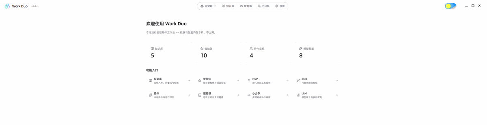

<div align="center">

# WorkDuo

**A local-first AI agent workbench — model integration, agent orchestration, multi-agent collaboration, and sandboxed execution in one desktop app**

English | [简体中文](README.md)

[](LICENSE)
[](https://tauri.app)
[](https://tauri.app)
[](https://react.dev)
[](https://www.rust-lang.org)

</div>

> **Your data and artifacts stay on your machine; inference runs through cloud APIs.** No backend to deploy — clone and run.

<!-- TODO: Main interface screenshot — save to docs/images/screenshot.png (~1200px wide), then uncomment -->
<!--  -->

## Features

- **Visual agent orchestration** — Create agents through a 7-step wizard, with live intent classification, planning DAG, tool traces, and artifacts during execution. DAG nodes are draggable and zoomable, and you can branch and re-run from any step.
- **Multi-agent collaboration** — Three execution modes (group chat / pipeline / orchestrator), with artifacts passed one-way through per-member inboxes. Three official squad templates work out of the box.
- **Built-in MCP Server** — Exposes 98 MCP tools that external clients such as Claude Code and Cursor can connect to, **driving every module through real UI permissions** (an external agent's actions produce exactly the same side effects as your own clicks).
- **Skill & plugin ecosystem** — Skills turn "model improvisation" into reusable workflows, with optional bundled script tools; local plugins can be registered as atomic tools.
- **Dual sandbox runtimes** — Ships Micromamba (Python) and Bun (JS). Network is disabled and the filesystem is bounded by default, so user scripts run with zero environment setup.
- **Long-term memory** — A memory palace UI with automatic recall and anchoring. Capability is controlled at the ability layer (off / active / forced) rather than by prompt wording alone.

## Tech Stack

| Layer | Technology |
|---|---|
| Desktop shell | [Tauri 2](https://tauri.app) (Rust 2021 + tokio) |
| Frontend | [React 19](https://react.dev) + TypeScript 5.8 + Vite 7 + React Router 7 |
| UI | [Ant Design 5](https://ant.design) (via a unified wrapper layer) + Sass design tokens + lucide-react |
| Data | SQLite (`workduo.db`, 40 tables) + LanceDB (vector search) |
| Runtimes | [Bun](https://bun.sh) 1.4 (JS) + [Micromamba](https://mamba.readthedocs.io) (Python) |
| Servers | russh / russh-sftp (SSH and SFTP, cross-platform remote management) |
| Credentials | OS credential manager (keyring) + AES-256-GCM + HMAC-SHA256 |

## Quick Start

### Requirements

| Dependency | Version |
|---|---|
| Node.js | ≥ 20 |
| Rust | ≥ 1.77 (Edition 2021) |
| pnpm | ≥ 8 (recommended) |

**System dependencies**

- **Windows**: [Microsoft C++ Build Tools](https://visualstudio.microsoft.com/visual-cpp-build-tools/) required (the WebView2 runtime is usually preinstalled)
- **macOS**: Xcode Command Line Tools — `xcode-select --install`
- **Linux**:

  ```bash
  sudo apt install libwebkit2gtk-4.1-dev libappindicator3-dev librsvg2-dev patchelf
  ```

### Install and Run

```bash
git clone https://github.com/workduoagent/work-duo.git
cd work-duo
pnpm install          # or npm install
pnpm tauri dev        # start dev mode (frontend + Rust integrated)
```

On first launch, the app creates the database, initializes 40 tables, and prepares the required runtimes.

> **Clone is slow?** The repo contains about **370 MB** of prebuilt runtime binaries (10 sidecars covering all three platforms). Consider a shallow clone:
>
> ```bash
> git clone --depth 1 https://github.com/workduoagent/work-duo.git
> ```

### Other Common Commands

| Command | Description |
|---|---|
| `pnpm tauri dev` | Dev mode (integrated frontend + backend — **the only way to actually invoke the engine**) |
| `pnpm dev` | Frontend only via Vite (degrades gracefully without Tauri; SQLite falls back to browser storage) |
| `pnpm typecheck` | TypeScript type check |
| `pnpm test` | Frontend unit tests |
| `pnpm lint` | ESLint |
| `cargo test --manifest-path src-tauri/Cargo.toml` | Backend tests |

## Build

```bash
pnpm tauri build
```

Artifact locations:

| Platform | Path |
|---|---|
| Windows | `src-tauri/target/release/bundle/msi/`, `nsis/` |
| macOS | `src-tauri/target/release/bundle/dmg/`, `app/` |
| Linux | `src-tauri/target/release/bundle/deb/`, `rpm/`, `AppImage/` |

> Cross-platform packaging must run on the matching OS: macOS `.app` / `.dmg` can only be built on macOS.

## Project Structure

```text
work-duo/
├── src/                      # Frontend source (React + TS)
│   ├── pages/                # Feature pages (agents / squads / models / knowledge / MCP / skills …)
│   ├── components/ui/        # Unified component layer (Ant Design wrapper; raw usage forbidden)
│   ├── core/                 # Core layer (routing / data access / domain types / IPC bridge)
│   └── assets/sql/           # Single source of truth for database DDL
├── src-tauri/
│   ├── src/
│   │   ├── agent/            # Agent engine (intent → planning → execution pipeline)
│   │   ├── host/             # Server hosting (SSH / SFTP)
│   │   ├── mcp_server.rs     # Built-in MCP Server
│   │   └── fs_helper.rs      # Path boundary validation primitive
│   ├── binaries/             # Prebuilt sidecars (Bun / Micromamba, ~370 MB)
│   └── tauri.conf.json       # Tauri configuration and CSP
├── docs/                     # Architecture documentation
├── public/                   # Static assets
└── package.json
```

For the full architecture walkthrough, see **[docs/ARCHITECTURE.md](docs/ARCHITECTURE.md)**.

## Configuration

No `.env` required. Application settings live in the SQLite `app_config` table and can be managed visually from the Settings page.

Common settings:

| Key | Description | Default |
|---|---|---|
| `workspace_path` | Agent workspace directory (one of the sandbox-writable roots) | `$HOME/work-duo-workspace` |
| `skill_path` | Root directory for skill packages | `$APPDATA/.skills` |
| `knowledge_base_path` | Root directory for the knowledge-base file tree | `$APPDATA/knowledge` |
| `mcp_bind_addr` | Built-in MCP Server bind address (`0.0.0.0` for LAN access, `127.0.0.1` for local only) | `0.0.0.0` |
| `mcp_local_trust` | Allow credential-free access to the MCP Server from localhost | `true` |

### Environment Variables

| Variable | Description |
|---|---|
| `WD_LLM_RPM` | LLM request rate limit |
| `WD_RUN_MAX_SECS` | Wall-clock limit for a single task (seconds) |
| `WD_SUBTASK_MAX_ITERATIONS` | Max tool rounds per subtask |
| `WD_SANDBOX_NET` | Set to `on` to allow sandbox network access (disabled by default) |
| `WD_SANDBOX_FS` | Set to `off` to disable filesystem boundaries (bounded by default) |

> ⚠️ The last two are debug escape hatches — enabling them **always writes an audit event at startup**.

## FAQ

**Q: The clone is slow / the repo is huge?**
A: The repo ships about 370 MB of prebuilt runtimes (10 sidecars). Use `git clone --depth 1`.

**Q: Linux build fails with a missing `webkit2gtk`?**
A: Install the system dependencies listed above. On Ubuntu 24.04+ you need `libwebkit2gtk-4.1-dev` (not `4.0`).

**Q: Port 18755 (MCP Server) is already in use?**
A: Change the port via `mcp_bind_addr` in Settings, or stop the conflicting process.

**Q: MCP client returns 401?**
A: Start device pairing from Settings → Security Center first, then complete it with the pairing code. A presented-but-mismatched credential is rejected outright and never falls back to local trust.

**Q: Why can't my sandbox script reach the network or open files?**
A: That is the **default** — the sandbox is network-isolated with a bounded filesystem (workspace and temp directories only). For debugging, `WD_SANDBOX_NET=on` / `WD_SANDBOX_FS=off` are available, but they leave audit traces.

**Q: My Rust changes have no effect?**
A: Rust changes require an app restart. In dev mode, wait for `tauri dev` to finish recompiling.

**Q: Bun fails to start on Windows with a `JSError`?**
A: Windows resource paths carry a `\\?\` prefix that must be normalized before being passed to Bun subprocesses. The project handles this; be aware of it when invoking Bun manually.

**Q: Where can I find implementation details?**
A: See [`docs/ARCHITECTURE.md`](docs/ARCHITECTURE.md) and the code comments.

## Roadmap

- [x] Full single-agent loop (intent → planning → execution → verification → delivery)
- [x] Multi-agent collaboration (squads: three modes + handoff inboxes + role packs)
- [x] Built-in MCP Server (98 tools, UI-level permissions)
- [x] Dual sandbox runtimes and security guards
- [ ] In-app internationalization (i18n)
- [ ] More ecosystem integrations

## Contributing

Issues and PRs are welcome. Please read first:

- [CONTRIBUTING.md](CONTRIBUTING.md) — commit conventions and collaboration workflow
- [docs/ARCHITECTURE.md](docs/ARCHITECTURE.md) — architecture overview; understand module boundaries before changing code

## License

[MIT](LICENSE) © WorkDuoAgent

## Acknowledgements

- [Tauri](https://tauri.app) — cross-platform desktop shell
- [React](https://react.dev) · [Vite](https://vitejs.dev) — frontend framework and build tooling
- [Ant Design](https://ant.design) — UI component library
- [Bun](https://bun.sh) — JS runtime
- [Micromamba](https://mamba.readthedocs.io) — Python environment management
- [LanceDB](https://lancedb.com) — vector store
- [russh](https://github.com/Eugeny/russh) — pure-Rust SSH implementation

## Contact

- Repository: [github.com/workduoagent/work-duo](https://github.com/workduoagent/work-duo)
- Issues: [GitHub Issues](https://github.com/workduoagent/work-duo/issues)
