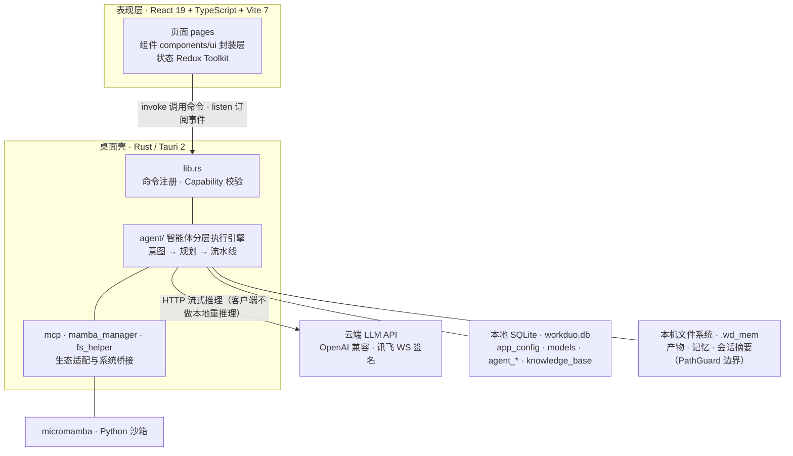
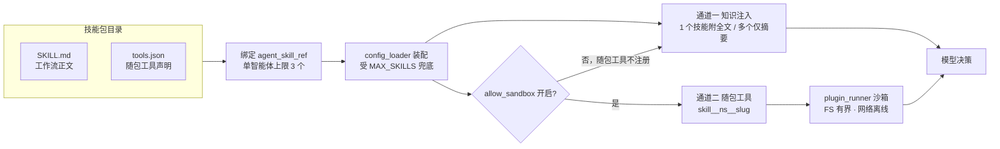

# Work Duo

> 一个基于 **Tauri 2 + React 19** 的桌面端「智能体（Agent）工作台」。把 LLM 模型管理、智能体编排、MCP / Skill 生态、知识库、Python 沙箱与长期记忆沉淀整合在同一个本地优先（local-first）的客户端里——**所有推理走云端 API，所有数据与产物留在本机**。

---

## 一、项目架构与技术栈

### 1.1 总体架构



### 1.2 技术栈总览

| 层 | 技术 | 说明 |
|---|---|---|
| 前端框架 | React 19 + TypeScript + Vite 7 | UI = antd v5（经 `@/components/ui` 封装，禁裸用）；样式 = Sass（仅用 `var(--color-*)` 设计令牌） |
| 图标 | lucide-react | 全量图标；模型厂商 logo 在 `src/assets/images` |
| 状态管理 | Redux Toolkit + react-redux | 全局主题/配置/记忆等切片 |
| 路由 | react-router-dom v7（HashRouter） | 见 `src/core/router/paths.ts` |
| 编辑器 | Monaco（本地 AMD 加载） | 代码编辑、JSON 配置 |
| 文档阅读 | pdfjs + @react-pdf-viewer、docx-preview、react-reader(EPUB)、video.js + wavesurfer、xlsx + ag-grid、react-markdown + katex + mermaid | 多格式内容查看器 |
| 桌面壳 | Tauri 2 | Rust 二进制 IPC；窗口/对话框/文件系统/SQL/Shell 插件 |
| 后端语言 | Rust 2021 + tokio | 异步运行时 |
| 数据访问 | sqlx 0.8（sqlite + runtime-tokio）+ tauri-plugin-sql | 经 `tauri_plugin_sql::DbInstances` 取连接池 |
| HTTP/CORS | tauri-plugin-http + reqwest | 云端 LLM 调用（绕浏览器 CORS） |
| 沙箱 | micromamba（sidecar 子进程） | Python 运行环境，白名单包管理 |
| 构建 | pnpm（前端）/ cargo（后端） | 前端只跑 `npm run typecheck`，不手动 `vite build` |

### 1.3 关键架构决策（红线）

1. **客户端不做本地重推理**：LLM / embedding / 重排一律走云端 API；本地只做编排、调用、持久化。
2. **能力层单一事实源**：工具是否可用由 `register_native_tools` 的集合决定，并同时驱动 system_prompt 分支；仅写在 prompt 里的约束会被模型绕过。
3. **沙箱隔离**：原生命令（文件读写、命令执行）受 `PathGuard` 沙箱边界约束；沙箱开启时宿主命令（git/npm/curl）不可注册，避免模型逃逸到系统。
4. **事件驱动**：引擎每轮只发 1 次流式 `call_llm_stream`，聚合为 `StreamOutcome` 经 Tauri 事件推给前端；无 tool_calls 即终态，有则进入「思考面板」。
5. **消息序列不变量**：每条 `tool_call.id` 必有对应结果；发送前与落库前各调一次 `sanitize_message_sequence` 自检自愈，否则网关 400「tool id not found」。

---

## 二、项目目录设计

### 2.1 顶层目录

| 路径 | 说明 |
|---|---|
| `src/` | 前端源码（React/TS） |
| `src-tauri/` | Rust 后端（Tauri 2 应用） |
| `docs/` | 架构与方案文档（`Agent引擎架构与执行逻辑.md`、`Work_Duo_Agent_Runtime_2.0_架构优化方案.md`、`WorkDuo_Agent_UI_优化与创新方案（K3）.md`） |
| `前端开发规范.md` | 前端 UI/工程铁律（设计令牌、表单、命名等），新页面必读 |
| `Agent流程设计.md` | Agent 流程早期设计稿 |
| `vite.config.ts` / `tsconfig.json` | 前端构建与类型配置 |
| `package.json` / `pnpm-lock.yaml` | 前端依赖（依赖只写此处，安装由你 `pnpm i`） |

### 2.2 前端 `src/` 结构（按职责）

| 目录 | 说明 |
|---|---|
| `src/App.tsx` `main.tsx` | 应用根、Redux Provider、路由挂载 |
| `src/pages/` | **业务页面**（每个功能一个目录，见 §三） |
| `src/components/` | 共享组件：`ui`（antd 封装层）、`layout`（TopBar/AppLayout）、`markdown`、`code-editor`(Monaco)、`MultiFileViewer`、`flow`、`export`、`model`、`scenario`、`icons` |
| `src/core/` | 核心层：`router`（路由/paths）、`db`（SqlService）、`mapper`（14 张表的 TS 访问层，禁组件直写 SQL）、`ipc`（commands 封装）、`file`（各配置序列化）、`agent`（chat.ts 会话桥接）、`config`、`contexts`、`store`（Redux） |
| `src/hooks/` | 公共 hooks（主题、`useTauriEvent`） |
| `src/utils/` | 工具（格式化、日志、模型测试、滚动条） |
| `src/types/` | `core.d.ts`（领域类型）、`database.d.ts`（DB Row 类型） |
| `src/assets/` | `sql/`（init.sql + updater.sql，DDL 双轨幂等）、`images/`（厂商 logo）、`animations/` |

### 2.3 后端 `src-tauri/src/agent/` 模块（引擎分层）

引擎已按职责分层（`src-tauri/src/agent/`），下表为当前真实结构：

| 位置 | 文件 | 职责 |
|---|---|---|
| 根 | `commands.rs` | 所有 `#[tauri::command]` 入口（运行任务 / 审批 / 取消 / 记忆 / 附件分片 / 归档） |
| 根 | `delivery.rs` | 结果投递与回复落库 |
| 根 | `events.rs` `types.rs` `mod.rs` | 前后端事件契约、领域类型、模块装配 |
| **`engine/`** | `runtime.rs` | 调度核心：组装 ToolRegistry（原生 + 插件 + Skill + MCP）、驱动三段式链路、Token 窗口裁剪、取消信号链、强制档记忆沉淀 |
| | `config_loader.rs` | **运行时配置装配**：读 `agent_info` 及其 `*_ref` 关联，绑定模型 / 技能 / MCP / 插件 / 知识库；`MAX_SKILLS=3` 等配额在此兜底 |
| | `intent.rs` | 意图分流（规则短路 + LLM 轻量分类，失败降级 COMPOSITE） |
| | `planner.rs` | DAG 规划（`temperature=0` 确定性，≤5 步，失败降级单任务） |
| | `pipeline.rs` | 微 ReAct 执行、子任务轮次预算、熔断、**技能知识注入 `build_skill_guidance`** |
| | `tools.rs` `tool_round.rs` `policy.rs` `protocol.rs` | 工具契约（AgentTool / ToolError / PermissionLevel / ToolBehavior）、轮次分级、危险信号策略、协议定义 |
| | `llm.rs` `token_estimate.rs` `graph.rs` `round_compactor.rs` `simple_chat.rs` `verifier.rs` `context.rs` | LLM 网关、Token 估算、知识图谱、上下文压缩、直答快路径、结果校验、上下文类型 |
| **`plugins/`** | `skill_adapter.rs` | 技能 → 引擎的适配层（`SkillToolWrapper`） |
| | `skill_tools.rs` | **技能随包工具**：解析 `tools.json` → 注册 `skill__{ns}__{slug}`，执行走插件沙箱 |
| | `plugin_adapter.rs` `plugin_runner.rs` `plugin_commands.rs` | 本地插件装配、脚本沙箱执行内核（脚本须定义 `run(args)`，运行壳由 Runner 拼装，自动注入 FS / 网络守卫）、插件管理命令 |
| | `mcp_adapter.rs` | MCP 工具 → AgentTool 适配 |
| **`hitl/`** | `approval.rs` `plan_approval.rs` `choice.rs` `recovery.rs` | 高危操作审批、计划门禁、向用户提问、失败自愈 / 恢复建议（oneshot 通道零死锁） |
| **`knowledge/`** | `memory.rs` `wd_mem.rs` `knowledge.rs` `embedding.rs` `vector_store.rs` | 长期记忆（召回 / 锚定 / 热力图）、工作区 `.wd_mem/` 双轨、知识库检索、向量适配 |
| **`artifact/`** | `artifacts.rs` `artifact_index.rs` | 产物归档、索引与读取 |
| **`squad/`** | `squad_orchestrator.rs` `squad_scheduler.rs` `squad_api_server.rs` `config.rs` | 智能体分组协作：编排、调度、外部 API、编队配置 |

其余后端：`lib.rs`（入口 / 命令注册）、`mcp.rs`（MCP 客户端，接入外部 Server）、`mcp_server.rs`（**内建 MCP Server**，暴露本机工具面）、`mcp_oauth.rs`、`mamba_manager.rs`（Python 环境）、`bun_manager.rs`（JS 运行时）、`sandbox_audit.rs`、`logging.rs`（本地日期滚动）、`fs_helper.rs`（路径规范化）、`net.rs`、`ws_snapshot.rs`、`main.rs`、`build.rs`。

> 历史上曾含 `native.rs`（原生工具集中实现），现已拆分进 `engine/tools.rs` 体系与 `plugins/`。文档若仍见此文件名，请以当前目录为准。

---

## 三、导航与核心功能

> 状态图例：**【已落地】** 可用 / **【占位】** UI 骨架未实现。

### 3.0 导航地图

**顶栏（一级标签栏 + 百宝箱下拉）**

| 顶栏项 | 类型 | 跳转到 |
|---|---|---|
| 百宝箱 | 分组（下拉） | LLM（`/model-settings`）、MCP（`/mcp-hub`）、Skill（`/skill-hub`） |
| 知识库 | 一级 | `/knowledge` |
| 智能体 | 一级 | `/agent-studio` |
| 小分队 | 一级 | `/squads-workspace`（占位） |
| 设置 | 一级 | `/settings` |

**设置页左侧栏（分区切换）**：系统设置 / **记忆宫殿** / 安全中心 / 关于我们 /（沙箱环境 → Python）。

> 顶栏为纯 HTML 实现（不依赖 UI 库），选中滑块令牌化、明暗主题均可读；百宝箱用顶部下拉而非原地钻取变形，避免窄空间内剧烈闪动。

### 3.1 模型管理（LLM，`/model-settings`）【已落地】
- **功能**：配置 LLM 接入（OpenAI 兼容 API + 讯飞 iflytek WS 签名三件套），管理厂商、密钥、默认模型与参数。
- **技术**：`@tauri-apps/plugin-http` 绕 CORS 调云端；`src/core/model/iflytek.ts` 签名；`model-mapper.ts` 持久化到 `models` 表（含 `category` 固定枚举，不进 scenario_category）。

### 3.2 MCP 中心（`/mcp-hub`）【已落地】
- **功能**：管理 MCP 服务器连接，浏览其工具定义（`mcp_tool_definition`），同步并在智能体中调用。
- **技术**：`mcp.rs` 的 `sync_mcp_tools` / `call_mcp_tool`（HTTP/SSE 通路，不引 stdio 子进程）；`mcp-mapper.ts` 持久化。

### 3.3 Skill 中心（`/skill-hub`）【已落地】
- **功能**：技能（可复用工作流包）的注册管理台——创建 / 编辑 / 删除 / 启停 / 文件树浏览 / 导入导出 ZIP，挂载到智能体后驱动其在特定领域按既定流程工作。
- **技术**：`skill-mapper.ts` + `skillFs.ts`（落盘先行再入库）；`skill_info` 表（`identifier` 唯一约束）；`skill_adapter.rs` / `skill_tools.rs` 负责引擎侧装配。
- **完整能力说明见 §四**（双通道能力、包规范、配额与优先级、安全模型、随包工具契约）。

### 3.4 知识库（`/knowledge`）【已落地】
- **功能**：知识库条目 + 文件树，多格式内容查看（PDF/图片/Word/EPUB/音视频/表格）。
- **技术**：`MultiFileViewer` 聚合 pdfjs/docx-preview/react-reader/video.js+wavesurfer/xlsx+ag-grid；`knowledge-mapper.ts` 持久化到 `knowledge_base` + `knowledge_asset`。
- **说明**：向量化已移除，客户端不跑本地重推理；检索走云端。

### 3.5 智能体工作室（`/agent-studio`）【已落地 · 核心】
- **功能**：4 步向导创建智能体（基础/模型/MCP/Skill）→ 进入会话运行。运行期支持工具轨迹、规划 DAG、产物画布、分支重跑、审批通知、失败恢复面板。
- **引擎（后端）**：意图分流 → DAG 规划 → 微 ReAct 流水线（`run_agent_task` → `runtime::run_task`）。每轮单流式 LLM、事件推送、无进展熔断、取消信号贯穿。
- **技术**：`useAgentSession.ts` 桥接命令与事件；`TracePanel` / `PlanToolTimeline` / `ToolStepCard` / `ArtifactCanvas` / `ApprovalNotify` / `RecoveryPanel` 渲染引擎事件；会话落 `agent_conversation_session` / `agent_conversation_round`（含 `raw_messages_json`）。
- **使用**：创建智能体 → 「进入会话」→ 输入任务 → 看工具轨迹与产物；高危工具弹审批。

#### 记忆模式开关（创建/编辑智能体时设置，`agent_info.memory_mode`）
三级开关，默认 **关闭**——粒度落在智能体，兼容老数据（存量列缺省回落 `off`）。差异均落在**能力层**（遵循 §1.3 红线），不是纯提示：

| 档位 | 行为 | 能力层 | 提示层 | 流水线末 |
|---|---|---|---|---|
| **关闭（off，默认）** | 完全不记忆 | 不注册 anchor 工具 | 不注入沉淀引导 | 不沉淀 |
| **主动（active）** | 模型自主决定 | 注册 `native__anchor_memory` 工具 | 注入「用原生工具沉淀可复用信息」引导 | 不强制 |
| **强制（forced）** | 每次任务必沉淀 | 注册工具 + 引导 | 同主动 | 引擎级 `forced_memory_settle` 直接落库（确定性，不依赖模型听话） |

### 3.6 智能体编队（`/squads-workspace`）【占位】
- 多智能体协作空间，目前仅骨架，未实现。

### 3.7 Python 沙箱（`/sandbox/python`）【已落地】
- **功能**：在隔离 micromamba 环境运行 Python 脚本，白名单装包、失败自愈（ModuleNotFoundError → `micromamba install` 重试）。
- **技术**：`mamba_manager.rs` sidecar（`shell:allow-execute` 仅放行 `binaries/micromamba`）；`native__run_python_sandbox` 支持 `code` 直传（内部落盘 `.wd_mem/scripts/`，过 PathGuard）。

### 3.8 记忆宫殿（设置 → 记忆宫殿 Tab）【已落地】
- **功能**：智能体「长期记忆」管理台。卡片网格 + GitHub 式召回热力图 + 搜索/分类过滤 + 锚定/编辑/删除 + 详情抽屉；并支持智能体在对话中自动锚定（`native__anchor_memory` 原生工具，ReadSafe 无感沉淀）。
- **技术**：`agent_memories` + `agent_memory_events` 双表；`memory.rs` 含 top-5 自动召回注入 `load_config` 系统提示；`agent-memory-recalled` / `agent-context-compacted` / `agent-memory-anchored` 事件驱动 UI 刷新；非 Tauri 走 mock 回退。
- **实时刷新（已落地）**：锚定（手动按钮或智能体自动沉淀）经 `memory::anchor_memory` 汇流后发射 `agent-memory-anchored`，记忆宫殿页面订阅后**实时 upsert 卡片，无需重开页面**。
- **区分**：「手动锚定」`anchored=true`（钉住）；「自动/强制沉淀」`anchored=false`（仅参与 ref_count 排序）。

### 3.9 运行期可视化能力【已落地】
- **轨迹视图（§3.1）**：智能体会话内完整渲染「意图分类 → 分层思考 → 规划 DAG → 工具时间轴」（`TracePanel` + `useAgentSession` 已接 `intent_classified` / `thinking_chunk` / `plan_branch_generated`）。
- **产物画布（§3.2）**：`ArtifactCanvas` 支持节点拖拽/缩放、点击看产物、`read_artifact` 预览；右键「从此步骤分支」→ 对比横幅 → 「应用分支」**实际重跑**（`run_agent_task` 带 `plan_override` + `pre_completed` + `initial_context`，head 步骤标记完成、仅跑 tail 新分支）。
- **上下文压缩**：`round_compactor.rs` 长会话摘要，发 `agent-context-compacted` 事件（记忆宫殿侧栏呈现轮数/省下 token）。
- **产物归档**：`artifacts.rs` + `native__archive_artifact` → `.wd_mem/artifacts/`。

### 3.10 审批与恢复【已落地】
- **功能**：高危原生工具（如 execute_command）触发 `approval.rs` 人机审批；`recovery.rs` 给出失败恢复建议，前端 `ApprovalNotify` / `RecoveryPanel` 交互。
- **技术**：oneshot 通道零死锁挂起；`submit_approval_decision` / `resolve_subtask` 等命令。

### 3.11 设置（`/settings`）【已落地】
- 左侧分区：系统设置 / **记忆宫殿** / 安全中心 / 关于我们；「沙箱环境」分组含「Python」子项。
- 记忆宫殿 Tab 已完全接管原「记忆存储」（旧休眠功能已清除，记忆能力由 §3.8 的 `agent_memories` 表提供）。

---

## 四、技能（Skill）能力体系

> 本章是 §3.3 Skill 中心的完整展开。技能是 WorkDuo 里**把「模型临场发挥」收敛为「可复用既定流程」**的机制。

### 4.1 什么是技能

一个技能包 = **一份 `SKILL.md` 契约** + 可选资源目录 + 可选随包工具声明。挂载到智能体后，该领域的任务会按技能写明的工作流（Workflow）与质量门禁执行，而不是每轮让模型凭通用经验现写文件。

它与相邻概念的分工：

| 概念 | 定位 | 载体 | 是否可带本机脚本 |
|---|---|---|---|
| **技能 Skill** | 领域**工作流知识**（怎么做一件事） | `<identifier>/SKILL.md` | 可（`tools.json` → 跑 python / bun 脚本） |
| **MCP** | 外部**服务工具**（调别人的能力） | 远端 / 本地 MCP Server | 否（由 Server 决定） |
| **插件 Plugin** | 用户自写的**原子工具** | `user_plugin_tool` 表 + 脚本 | 是（原生） |
| **记忆 Memory** | 长期**事实沉淀** | `agent_memories` 表 | 否 |

一句话区分：**技能管流程，MCP 管接口，插件管单个动作，记忆管结论。**

### 4.2 能力双通道

技能在同一个包内提供两种能力形态，独立可选、互不依赖：

| 通道 | 触发物 | 生效机制 | 引擎侧代码 |
|---|---|---|---|
| **① 知识注入**（默认，无门槛） | `SKILL.md` 正文 | 由 `build_skill_guidance` 拼进子任务 user 消息：**列出每个技能的「名称 + 描述」；仅当只挂 1 个技能时附其 SKILL.md 全文**；总预算 2000 字符，超出按字符截断 | `agent/engine/pipeline.rs::build_skill_guidance` |
| **② 随包工具**（可选） | 包根 `tools.json` | 声明的每个工具动态注册为 `skill__{包目录名}__{工具slug}`，与原生工具同表参与模型决策 | `agent/plugins/skill_tools.rs::register_skill_tools` |

设计取舍记录（为什么不是「注册成工具再调一次拿正文」）：早期实现把技能注册为 `skill__{id}` 工具、靠模型主动调用换取正文（见 `skill_adapter.rs` 中保留的 `SkillToolWrapper` impl）。实测这条路多一次工具往返且依赖模型是否愿意调用，已改为**直接 prompt 注入**，行为更可控。旧实现标记 `#[allow(dead_code)]` 保留备用，不再注册。

> 注入文本明确要求「不要调用任何 `skill__` 前缀的工具」——即通道①与通道②分流：知识走 prompt，动作走工具，不让模型混淆。

下图是两条通道从技能包到模型决策的完整链路：



> 「否」分支的含义：未开启沙箱时**随包工具整条通道不注册**，但 SKILL.md 的知识注入**照常生效**——因此技能的最低能力始终可用，不受开关影响。

### 4.3 技能包目录规范

```text
<skill_path>/<identifier>/          # 根由 app_config.skill_path 决定，默认 $APPDATA/.skills
├── SKILL.md                        # 【核心】技能契约正文，落库 skill_info.skill_markdown
├── tools.json                      # 【可选】随包工具声明清单
├── logo.*                          # 【可选】卡片图标
├── references/                     # 【可选】规范文档，供 SKILL.md 指引模型去读
└── scripts/                        # 【可选】脚手架 / 工具脚本，多为 tools.json 的执行目标
```

**`SKILL.md` vs `instruction` 是两个独立字段，勿混用**：

| 字段 | 写盘 | 引擎是否读取 | 用途 |
|---|---|---|---|
| `skill_markdown` | 落盘为 `<identifier>/SKILL.md` | **是**（注入 prompt） | 技能真正的工作流正文 |
| `instruction` | **不写盘**，仅入库 | 仅作为 `description` 为空时的回退 | 可选的补充说明；导入流程始终置空 |

### 4.4 绑定关系、配额与优先级

技能通过 `agent_skill_ref` 挂到智能体，`load_config` 装配时受以下约束（单一事实源：`agent/engine/config_loader.rs`）：

| 约束 | 取值 | 兜底行为 |
|---|---|---|
| 单智能体技能数 | **≤ 3**（`MAX_SKILLS`） | 超出部分不再并入工具集，静态绑定优先 |
| 单技能包工具数 | **≤ 8**（`MAX_TOOLS_PER_SKILL`） | 剩余项忽略并告警 |
| 单工具超时 | 声明值 clamp 到 **1~300 秒**，缺省 60 | 超时按执行失败处理并附 traceback |
| 脚本执行前置 | 智能体须 `allow_sandbox = 1` | 未开启则**整个随包工具通道不注册**（知识注入不受影响） |

**运行时动态调整**（会话级，不写库）：

- 对话中 `@` 提及某个**未绑定**技能 → 走 `enabled_skill_ids` 临时并入本轮；
- `disabled_skill_ids` 临时剔除某个已绑定技能；
- 两者同时命中同一技能时 **`enabled` 优先**（显式 @ 覆盖临时移除）；
- 均为每轮临时生效，静态绑定配置不被篡改。

### 4.5 随包工具契约（`tools.json`）

```json
{
  "tools": [
    {
      "name": "setup_project",
      "description": "初始化项目脚手架（规划器与执行模型都依赖它决策，必填）",
      "runtime": "python",
      "script": "tools/setup_project.py",
      "parameters": { "type": "object", "properties": {}, "required": [] },
      "timeout_sec": 60,
      "sensitive": false,
      "dependencies": []
    }
  ]
}
```

| 字段 | 约束 |
|---|---|
| `name` | 必填，`[a-z0-9_-]+`；同包内重名后者跳过 |
| `description` | 必填非空（模型据此选型） |
| `runtime` | `python` \| `bun`，其它值整项拒绝 |
| `script` | 必填；相对包根的正斜杠路径，**禁 `..`、绝对路径、反斜杠** |
| `parameters` | 必须是 `type: "object"` 的 JSON Schema，缺省空 object |
| `sensitive` | **缺省即 `true`** → 触发人机审批；显式 `false` 才降级无感 |

**解析容错原则**：`tools.json` 缺失 = 纯知识包（静默，零影响）；文件非法或单项校验失败 = **跳过该项并记 warn，绝不阻断任务启动**。坏包不会拖垮整条流水线。

### 4.6 安全模型

技能包可能来自第三方渠道，随包脚本本质是**在本机执行外来代码**，因此采用「默认收紧 + 声明降级 + 沙箱兜底」三层：

1. **权限默认收紧**：`sensitive` 缺省 `true` → `RequireApproval`，调用前弹人机审批；包作者显式声明低风险才降级 `ReadSafe`。
2. **路径双保险**：解析期校验脚本为包内相对路径；执行前再 `canonicalize` 根目录与脚本，断言脚本落在包内，防符号链接与拼接逃逸。
3. **共享插件沙箱**：执行复用 `plugin_runner::run_plugin`（与插件同一套底线），自动注入文件系统有界守卫 + 网络离线守卫；工具行为标注为 `exec` 类，纳入策略层危险信号扫描（入参含命令 / 路径字面量时评估更严）。

> 结论：技能与插件共享同一执行底线，仅分发载体不同——**会审批、会越界拦截、会走沙箱**。

### 4.7 技能的信息来源三个入口

管理入口有两个，**副作用完全一致**（同一个 handler），任选其一：

| 入口 | 路径 | 适用 |
|---|---|---|
| **UI** | 设置 → 技能中心（`/skill-hub`）：卡片网格 + 分类过滤 + 搜索 + 分页（12/页）、启停开关、详情抽屉、文件树、导入 / 导出 ZIP | 人工管理 |
| **MCP 工具** | 10 个 `skill_*` 工具经 `mcp:intent` 派发到前端同一 handler，走完整 Tauri 链路 | 外部编程工具 / Agent 自动化 |

两者共用**同一份导入契约**（UI 弹窗与 `skill_import` 走同一套解析逻辑）：接收 ZIP base64 或文件数组，`SKILL.md` 归入 `skillMarkdown`、`logo.*` 归包根目录——用于迁移与团队分发。

`skill_*` MCP 工具清单：

| 工具 | 作用 |
|---|---|
| `skill_list` | 枚举全部技能（本模块唯一枚举入口，无入参），返回 `{count, rows}` |
| `skill_get` | 按 id 查单个技能（含 `skillMarkdown` 正文与 `path`） |
| `skill_upsert` | 创建 / 编辑并落盘（支持 `scripts[]` / `resources[]`），落盘先行再入库 |
| `skill_delete` | 真实删除（删库行 + 删磁盘目录），**不可逆** |
| `skill_set_status` | 启用 / 禁用（对应卡片右上角开关） |
| `skill_list_files` | 列技能目录文件树（目录优先、同名排序） |
| `skill_read_file` / `skill_write_file` | 读写技能目录内文本文件（读返回 base64） |
| `skill_export` | 打包整个技能目录为 ZIP（base64），用于备份 / 分享 |
| `skill_import` | 导入技能（ZIP 或文件数组），`SKILL.md` 归入 `skillMarkdown`、`logo.*` 归根目录 |

### 4.8 内置技能包：`workduo-mcp`

仓库自带一份生产级技能样本，位于 `.workspace/.sys_tool/workduo-mcp/`：

| 项 | 内容 |
|---|---|
| `SKILL.md` | 约 456 行的完整集成指南：WorkDuo 自身作为标准 MCP Server（`http://127.0.0.1:18755/mcp`，Streamable HTTP），供外部编程工具接入后 **UI 级**驱动全模块 |
| `scripts/` | 一套 MCP 驱动脚本与专用探针脚本（详见 §4.10） |
| 覆盖模块 | Agent 对话链路（意图 → 规划 → 工具 → 回复）、本地插件、知识库、记忆宫殿、技能中心、服务器托管、智能体小分队 |

它的核心价值是**「UI 级真实链路」**：MCP 工具经 Tauri 事件派发到前端**与界面按钮同一个** handler，副作用与真人点击完全一致，且全量落 `workduo.db` 可在界面抽查——因此同一份工具面既能人工操作，也能被外部 Agent 用于自动化生态迭代。

> 该文件是此技能的**单一事实源**；分发到客户端目录时请整体覆盖同步，避免文档与工具面错位。

### 4.9 写好一个技能的实践要点

1. **工作流要具体到动作序列**，不要写「你是一个专业的 XX 专家」——模型不会因此改变行为方式。
2. **写明质量门禁**（依赖版本固定、构建必须通过、测试必须通过），并要求模型在交付前自查，而不是写完即宣称完成。
3. **`description` 是模型的选型依据**，一句话说清「什么场景下该选我」，比长正文更重要。
4. **需要本机动作时优先 `tools.json`**，把确定性步骤固化成脚本，而非让模型临时拼命令行。
5. **资源走 `references/` 分包**，正文只留索引，控制注入 token 消耗（预算 2000 字符起）。
6. **重度依赖长正文的技能尽量单独挂载**——挂载 1 个技能时才注入 SKILL.md **全文**，挂载 2~3 个时只注入「名称 + 描述」**摘要**（见 §4.2）。若多个技能常同时使用，务必把关键约束压进 `description`。

### 4.10 技能相关的评测与门禁脚本

位于 `.workspace/.sys_tool/workduo-mcp/scripts/`，直连内建 MCP Server，**只做参数编排与断言**；发现能力缺口应回流到 MCP 工具层修补，而非绕过 MCP 自写替代实现。

| 类别 | 脚本 | 用途 |
|---|---|---|
| 标准库 | `agent_task_driver.mjs` | MCP 客户端、终态轮询（三类挂起自动应答）、轨迹解包、增量日志、启动组装 |
| 审计 / 评分 | `agent_e2e_audit.mjs` | 全模块四阶段评分审计（100 分制），报告写 `e2e_audit_report.json` |
| 定向探针 | `agent_intent_probe.mjs` / `composite_hang_probe.mjs` / `failure_cleanup_probe.mjs` / `failure_suite_runner.mjs` / `tool_contract_probe.mjs` | 意图快路径、复合任务挂起诊断（区分「慢」与「死」）、失败收尾、故障注入套件、工具契约边界防御 |
| 编排 / 门禁 | `l2_eval_harness.mjs` / `squad_eval_harness.mjs` / `release_gate.mjs` | 能力矩阵测评、智能体分组协作回归、发布门禁 |
| 脚本范式 | `plugin.python.template.py` / `plugin.bun.template.ts` / `plugin.xlsx_writer.template.py` / `plugin.chart_png.template.py` / `seeds/` | 插件与评测样例的可复用骨架 |

其中三项已接入 npm scripts（见 §五）：`npm run release:gate`、`npm run squad:eval`、`npm run squad:gate`。

> **慢 ≠ 死**：判据应是「无产出静默时长」而非总墙钟耗时。同一复合任务在不同模型上实测可差 6 倍以上，任何过紧的终态等待阈值都会把正常任务误判为挂死。

---

## 五、开发与构建（铁律）

| 命令 | 用途 |
|---|---|
| `npm run typecheck` | 前端类型检查（**唯一允许的前端校验**，禁手动 `vite build`） |
| `npm run tauri` | 启动 Tauri 开发（前端 + Rust 联调，invoke 才连后端） |
| `npm run dev` | 仅前端 Vite（非 Tauri 回退，记忆/智能体走 mock） |
| cargo check（指定工具链） | 后端类型检查：`RUSTUP_HOME=/d/Rust/rustup CARGO_HOME=/d/envs/Rust/.cargo RUSTUP_TOOLCHAIN=stable-x86_64-pc-windows-msvc /d/envs/Rust/.cargo/bin/cargo check` |

**强制约定**（详见 `前端开发规范.md`）：
- 依赖只写 `package.json`，安装由你 `pnpm i`（AI 不自己装）。
- `src/` 删除/改名通常被沙箱 EPERM 拦截，只能新建合规位置 + 改 import，旧文件你手动删。
- DDL 双轨：`init.sql`（首启幂等）+ `updater.sql`（存量库 ALTER 补齐），二者同步。
- 前端只用 `var(--color-*)`，禁 hex/px 字面量；表单 `autoComplete="off"`；文案禁「中文(English)」混排。
- 全局消息统一 `useNotify()`，禁静态 `import { message }`。

---

> 本文档依据当前代码实际状态梳理（2026-10-02 复核）。「技能能力」一章（§四）对应 `.workspace/.sys_tool/workduo-mcp/SKILL.md`、`src-tauri/src/agent/plugins/skill_{adapter,tools}.rs`、`src-tauri/src/agent/engine/config_loader.rs` 的当前实现。具体实现细节以 `src/`、`src-tauri/`、`docs/`、`前端开发规范.md` 为准。
