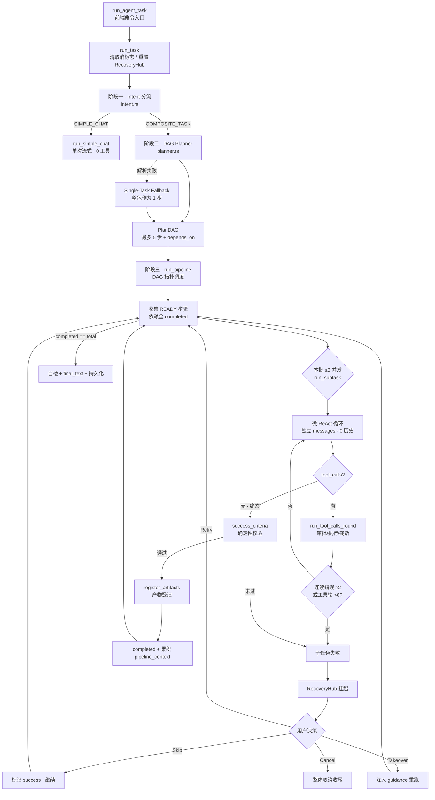

已完整梳理 `src-tauri/src/agent` 的三层流水线架构，并核对了 ReAct 主路径上的逻辑闭环。结论先说：**架构分层清晰，但有几处会真实卡死或误判的漏洞**。

---

## 整体架构（三层流水线）



---

## 逻辑漏洞清单（按严重程度）

### P0 · 会卡死 / 数据错误

**1. 审批挂起无超时，且「停止」无法唤醒** 【✅ 已修复 2026-09-10】

> 修复方案（落地）：`approval.rs` 新增 `cancel_all()`（清空 pending Map → drop 全部 Sender）；`runtime.rs` 把 `rx.await` 包进 `tokio::time::timeout(300s, rx)`，三态 `Ok(Ok)=前端决策` / `Ok(Err)=停止 drop Sender→"任务已取消，审批通道关闭"` / `Err=超时→"审批超时，已自动拒绝"`；`cancel_agent_task` 顺序补 `runtime.approval.cancel_all()`。唤醒路径收敛为两条（前端 submit / cancel_all），无 `select!` 第三条半吊子通路。`cargo check` 通过。

`runtime.rs:537` 的 `rx.await` 是无超时的 oneshot 等待：

```537:545:src-tauri/src/agent/runtime.rs
            let approval_outcome: ApprovalOutcome = match rx.await {
                Ok(o) => o,
                Err(_) => {
                    approval.cancel(&approval_id).await;
                    ApprovalOutcome {
                        approved: false,
                        reason: Some("审批超时，已自动拒绝".into()),
                    }
                }
            };
```

而 `cancel_agent_task` 只置位 `cancel_flag` 和 `recovery.cancel()`，**没有 resolve/cancel 挂起的审批**：

```148:155:src-tauri/src/agent/commands.rs
pub async fn cancel_agent_task(runtime: State<'_, AgentRuntime>) -> Result<(), String> {
    runtime
        .cancel_flag
        .store(true, std::sync::atomic::Ordering::SeqCst);
    // 若后台流水线正挂在恢复等待上，同步唤醒（否则取消信号无法跳出 wait 挂起）。
    runtime.recovery.cancel();
```

结果：用户不点审批弹窗 → 任务永久挂起；点了「停止」也弹不出来。
建议：给 `rx.await` 包 `tokio::time::timeout`，并在 `cancel_agent_task` 里批量 `cancel` 所有 pending approval。

**2. 无并发互斥，新任务会清掉旧任务的取消标志** ✅ **已修复 2026-09-10**

`run_agent_task` 直接 `spawn`，没有 running 锁。`run_task` 开头无条件：

```78:80:src-tauri/src/agent/runtime.rs
        self.cancel_flag.store(false, Ordering::SeqCst);
        // 新一轮开始：清空前一轮可能残留的恢复挂起态
        self.recovery.reset();
```

连点两次运行 → 两条流水线并发，共享 `cancel_flag` / `RecoveryHub` / `ApprovalManager`；第二次启动会把第一次的取消信号清掉，恢复面板也会被 `reset()` 抹掉。
建议：加 `AtomicBool` running 标志，或用 `Mutex` 串行化 `run_task`。

> **修复说明**：`AgentRuntime` 新增 `running: Arc<AtomicBool>` 字段（初始化为 `false`）。`run_task` 开头用 `compare_exchange(false, true)` 抢占互斥锁——已被占用则 `tracing::warn` 后直接忽略本次重复启动（不碰 `cancel_flag`/`recovery`，杜绝双流水线互清）；抢占成功则创建 `RunningGuard`（`Drop` 守卫），在**任何出口**（正常/取消/异常/panic）自动复位 `running`，不会把后续任务永久挡在门外。注：Rust 不允许在 `impl` 块内定义 `struct`/`impl`，`RunningGuard` 已移到模块作用域。`cargo check` 通过（EXIT=0）。
>
> **二次 refinement（2026-09-10，UX 修正）**：原互斥检查在 `run_task`（spawn 之后），导致前端 `run_agent_task` 永远先 `Ok(())`、重复启动被静默忽略，用户看不到「已有任务在运行」。已将主闸门上移到 `run_agent_task`（spawn 前）：新增 `AgentRuntime::try_acquire_run_lock()`（返回 `Option<RunningGuard>`），抢占失败同步 `Err("已有任务正在运行，请先等待其完成或点击停止。")`，前端立即可见；`run_task` 内保留兜底——`running==true`（上游已持锁）为正常路径不重复抢，`running==false` 被其他路径直接调用时才补抢，真正并发冲突才忽略。`RunningGuard` 改为持有 `Arc<AtomicBool>`（可跨 `'static` spawn 闭包移动），`pub(crate)` 可见以跨模块持有。cargo check 通过。
>
> **前端配套（2026-09-10）**：`useAgentSession.run` 的 catch 分支针对该 `Err` 做**专用显式提示**——`modal.warning({ title: '已有任务在运行', content: 后端精确文案, okText: '我知道了' })`，不走通用 toast 错误；且并发互斥拦截时**不清 `isRunning`**（原任务仍在跑，误清会让输入框被错误解锁、停止按钮消失，属隐性 bug）。其他启动失败仍保持原 `setRunning(false)` + 状态文本提示。`npm run typecheck` 通过。
>
> **质量复核二次修正（2026-09-10，第三方评测点出的两处）**：
> - **问题 1 · `run_task` 兜底与注释不符（中）**：原兜底是 `if !running.load()` 再 `compare_exchange`，但 `load()==true` 无法区分「锁是上游 spawn guard 持有的」还是「别人持有的」——若另有一路径直接调 `run_task` 且锁被他人持有，会落到 `if` 内、并发跑，与注释「真正并发冲突则忽略」矛盾（隐式假设非保证）。按方案 A 删除 `run_task` 整段兜底，互斥唯一真源收敛到 `run_agent_task` 一处闸门；并在 `run_task` 文档注释写明「仅允许由 `run_agent_task` 在持有锁后调用」。删除前已 grep 确认 `.run_task()` 唯一调用点在 `commands.rs::run_agent_task` spawn 内（`squad_orchestrator.rs`/`types.rs` 仅注释），无绕过闸门风险。
> - **问题 2 · 抢锁在 `load_config` 之后（中低）**：连点会白打一遍 DB。已将 `try_acquire_run_lock()` 上移到 `load_config` 之前——第二次连点立刻 `Err`，零 DB 开销；若 `load_config` 失败，`guard` 随 `?` 提前 return 自动 Drop，锁正确释放。`running` 字段注释同步澄清「唯一真源在 run_agent_task，run_task 不再补抢」。cargo check 通过。

---

### P1 · 熔断失效 / 状态误判

**3. 连续错误熔断只统计 `InvalidArgs`** ✅ **已修复 2026-09-10**

```607:612:src-tauri/src/agent/runtime.rs
            Err(ToolError::ExecutionFailed(m)) | Err(ToolError::PermissionDenied(m)) => {
                // 真实执行失败 / 权限被拒：同样计入连续错误序列，驱动 pipeline 熔断。
                // 注：审批「用户拒绝」走上方 L573 的 `continue`，不经过此分支，不会被误熔断。
                iter_had_error = true;
                ("failed".into(), truncate_tool_output(m.as_str()))
            }
```

> **修复说明**：原 `ExecutionFailed` / `PermissionDenied` 分支既不置 `had_error` 也不置 `had_success`，导致 `pipeline.rs` 的 `consecutive_errors` 熔断计数恒不变（只对 `InvalidArgs` 有效）。已在两分支补 `iter_had_error = true`，真实执行失败现可正确驱动「连续 2 轮工具全失败即判子任务受阻」熔断。边界已验证：`run_tool_calls_round` 中审批「用户拒绝执行」走 L573 `continue` 提前返回，不进入此 `match`，故不会被误计入连续错误（呼应 P0-1 审批拒绝语义）。`cargo check` 通过（EXIT=0）。

**4. Skip 被写成 success=true，污染最终报告与依赖方** ✅ **已修复 2026-09-10**

> **修复说明**：`SubTaskOutput` 新增正交字段 `skipped: bool`（`types.rs`），与 `success` 解耦。所有非跳过构造点显式置 `skipped: false`（取消/失败/终态/超轮/连续错误共 7 处），仅用户 `Skip` 与「恢复次数达上限自动跳过」两处置 `skipped: true`。由此：
> - `final_text` 回顾中跳过步改用 `⏭️ 步骤 N「title」：summary（已跳过）` 单独标注，不再与真实成功混用 `✅`；标题行同步带出「其中 N 步被跳过」；
> - `selfcheck` 自检把「真实闭环数」(`success && !skipped`) 与「跳过数」(`skipped`) 分开统计，跳过不再被算作成功闭环污染结论。
> 依赖方放行逻辑不变（跳过仍 `completed.insert` 解除下游阻塞），仅报告与计数变诚实。`cargo check` 通过（EXIT=0）。

```227:238:src-tauri/src/agent/pipeline.rs
                RecoveryDecision::Skip => {
                    let skipped = SubTaskOutput {
                        ...
                        success: true,   // ← 跳过却记成功（修复前）
```

最终回顾里会出现「✅ 步骤 N（已跳过）」，且依赖该步的后续步骤会拿到空产物继续跑。若确实需要「跳过即放行」，建议至少在 `final_text` 和 `selfcheck` 里单独统计跳过数，不要和真正闭环混在一起。

**5. 并行失败只恢复第一个，其余静默重跑** ✅ **已修复 2026-09-10**

> **修复说明**：恢复分支由「只取 `failures.into_iter().next()`（第一个）」改为 `for (i, out) in failures.into_iter()`，**批内每个失败步都逐一呈现恢复面板**（前端依次处理；`RecoveryHub` 单 `pending`/`decision` 配对，`request`→`wait` 每轮独立清空，顺序驱动安全）。同时引入 `retry_counts: HashMap<task_id, usize>` 与常量 `MAX_TASK_RECOVERY_ATTEMPTS = 3`：同一步骤进入恢复块累计超 3 次后**自动跳过**（`emit_status` 提示「恢复次数已达上限，自动跳过」）以打破无人值守 / 同因持续失败的无限重试循环。跳过步按 P1-4 规则走 `skipped: true`，不再污染报告。`cargo check` 通过（EXIT=0）。

```206:207:src-tauri/src/agent/pipeline.rs
        if let Some((i, out)) = failures.into_iter().next() {
```

同批 3 步全失败时，只弹一个恢复面板；用户处理完第一个后，其余两个会在下一轮被无差别重新拾起——若失败原因相同，会形成「弹窗 → 处理 → 再失败 → 再弹」的循环，且没有 per-task 重试上限。

---

### P2 · 设计取舍上的风险

| 点 | 说明 |
|---|---|
| 子任务无会话历史 | `run_subtask` 只用 `system_prompt + 当前任务 + pipeline_context`，不调 `build_context_messages`。多轮对话里的用户偏好、上一轮结论对工具型任务不可见（简单对话路径有历史）。 |
| 意图关键词过宽 | `生成/分析/检查/数据` 等词会把「帮我生成一句祝福」也判成 COMPOSITE_TASK，白白走规划链。 |
| 恢复无次数上限 | Retry/Takeover 由用户驱动可无限重试；无人值守场景（squad schedule）可能卡在某步反复弹窗。 |
| 并行步骤同时要审批 | 3 个并行子任务都调敏感工具时，前端会同时收到多个 `awaiting_approval`，需确认 UI 是否支持。 |

---

## 设计上做得好的地方

- 意图 → 策略固化进 `auto_tool_exec_mode`，高风险强制覆盖自动执行
- 微 ReAct 隔离上下文 + 工具结果 in-flight 压缩，控 token
- `sanitize_message_sequence` 在每轮发送前补齐 tool 配对，防 HTTP 400
- 规划 JSON 解析失败有 Single-Task Fallback，不崩流水线
- 取消在「轮次边界 / SSE chunk / HTTP 发起前」三层检查，避免重复计费
- `success_criteria` 做确定性 L0/L1 校验，不信任模型自报成功

---

如需我直接改代码，建议优先做这三项：**审批超时 + cancel 唤醒审批**、**running 互斥**、**ExecutionFailed 计入连续错误**。要动手的话告诉我优先顺序。

---

## P2 改动落地（2026-09-10 已完成，`cargo check` EXIT=0，零警告）

> 顺序 P2-4 → P2-3 → P2-2 → P2-1，均按「P2 改动边界说明」实施，单 Agent 手动路径行为完全不变。

### P2-4 · 并行动态降级 ✅
- `pipeline.rs::run_pipeline` 开头按 `cfg.auto_tool_exec_mode` 计算 `max_parallel`：自动模式=`MAX_PARALLEL_SUBTASKS`(3)，审批模式=1（串行），避免审批模式弹窗风暴。
- `cfg` 已是意图层覆盖后的最终值（高风险任务被 `effective_auto_exec` 压回 `false`→自动串行），pipeline 内**不重判 intent**。
- 批次 `take(MAX_PARALLEL_SUBTASKS)` 改为 `take(max_parallel)`。前端零改动。
- 验证：关自动执行→分 3 批各 1 个；开自动→1 批 3 个并行；高风险 prompt 被 Intent 层压回串行。

### P2-3 · 模式感知恢复 ✅
- `run_pipeline` 增加 `unattended: bool` 入参（默认手动=false）。`recovery.wait(cancel)` 在 `unattended` 时用 `tokio::time::timeout(120s, ...)` 包裹；超时→自动 `Cancel` 整条流水线并写 `emit_status`/日志，防无人值守死锁。
- 超时**只包 `recovery.wait()`**，不包子任务执行；`recovery.rs` 的 `RecoveryHub` 保持纯状态机未改；`retry_counts` 仍局部变量。
- `runtime.rs::run_task` 调 `run_pipeline` 恒传 `false`（单 Agent 手动路径行为不变）。
- `squad_orchestrator.rs`：新增 `unattended = matches!(execution_mode, "schedule" | "api")`，经 `run_pipeline_node` → `run_member_subtask` 透传到 `run_pipeline`；manual 恒 false。
- 验证：Manual 失败永久等待（不变）；Schedule 失败 120s 无响应自动取消不卡死；单步失败 3 次仍自动跳过（P1-5 已落地）。

### P2-2 · 意图词表分层 ✅
- `intent.rs`：原 `COMPOSITE_HINTS` 拆为 `STRONG_TOOL_HINTS`（强工具信号，短路→COMPOSITE）与 `WEAK_TASK_HINTS`（弱任务信号，不短路）。
- `classify_intent`：短路 1 改为「`len≤20 && 无强信号 && 无弱信号`」才判 SIMPLE（含弱信号短消息如「帮我分析一下」仍走 LLM）；短路 2 仅 `STRONG` 触发 COMPOSITE。
- `RISK_HINTS`/`profile`/`enrich`/`fallback`/LLM 解析全部未动。
- 验证：「帮我生成一句生日祝福」→ 走 LLM（不再白走规划）；「帮我写一个 Python 脚本抓取数据」→ STRONG 命中直 COMPOSITE；「删除这个文件」→ STRONG+RISK 强制审批。

### P2-1 · 滚动摘要注入子任务 ✅
- `context.rs` 新增 `pub(crate) async fn load_session_background(app, cfg) -> Option<String>`：只读①滚动摘要（复用 `build_context_messages` 读取逻辑，工程绑定优先 `.wd_mem/sessions/{id}.summary.md` 回退 DB `summary`）②最近 1~2 条 `user_question`（`round_index>last_compact` 取最新两条）；超 800 字符截断；`session_id=None`（squad 成员路径）返回 `None`。
- `pipeline.rs`：`run_pipeline` 开头**仅读一次** DB 调 `load_session_background`，结果作为 `&str` 传给每个 `run_subtask`；`run_subtask` 在 user 消息「当前任务目标」前插入 `【会话背景摘要】` 段，为空则跳过（保持现状格式）。**不进 system_prompt**。
- 验证：有 summary 时子任务 user 消息含背景段；无 summary/squad(session_id=None) 零变化不 panic。

### 改动文件清单
`pipeline.rs`（P2-4/3/1）、`runtime.rs`（P2-3 一行级）、`squad_orchestrator.rs`（P2-3 透传链路）、`intent.rs`（P2-2 词表）、`context.rs`（P2-1 新增函数）。`types.rs`/`commands.rs`/`recovery.rs`/`approval.rs` 未动。

---

## 遗留问题二次修复（2026-09-10，按用户「两处问题逐点边界」）

### 问题 1 · 无人值守超时文案误导 ✅
- `pipeline.rs`：`PipelineResult` 新增 `pub cancel_reason: Option<String>`。约定：`None`=用户主动停止（文案「任务已被用户取消」）；`Some(reason)`=系统自动取消（当前仅无人值守恢复超时）。6 处构造点全部补齐该字段（缺一处编译不过）：循环边界取消(L138)/子任务取消(L208)/恢复面板用户取消(L360) 均 `None`；死锁(L168)/成功(L430) 因不涉及取消也补 `None`（结构体需值）；超时(L302) 置 `Some("无人值守模式步骤 N「xxx」恢复等待超时，已自动取消任务")`。
- `runtime.rs`：`if result.cancelled` 分支不再写死「任务已被用户取消」，改为按 `result.cancel_reason` 分流——`None`→原文案，`Some(r)`→`format!("⛔ {r}")`。`emit_task_done`/`return` 逻辑不变，**不改 `cancelled=true` 跳过 round 持久化的语义**，前端零改动。
- `squad_orchestrator.rs`（可选优化已做）：`run_member_subtask` 的 `if result.cancelled` 把 `cancel_reason` 并入错误串（`Err("子任务被取消：{r}")` / `Err("子任务被取消")`）。
- 验证预期：Manual 点停止→「⛔ 任务已被用户取消」；Schedule 子任务失败 120s 无响应→「⛔ 无人值守模式步骤 N「xxx」恢复等待超时，已自动取消任务」；死锁走 `cancelled=false` 分支不经此文案。

### 问题 2 · 超时后 RecoveryHub 残留 pending ✅
- `pipeline.rs`：无人值守超时 `Err(_)` 分支在 `return PipelineResult` **之前**调 `recovery.reset()`（清 `pending`+`decision`）。timeout drop 掉 `wait()` Future 时 `wait` 内部清 pending 的代码无机会执行，原会遗留挂起态导致前端恢复面板不收起；`reset()` 复用既有方法，无需改 `recovery.rs`。顺序：`emit_status` → `recovery.reset()` → `return`。用户主动取消路径 `wait()` 内部已清 pending（L104），无需重复。
- 验证预期：Schedule 触发超时后日志 `recovery` 挂起项被清空；紧接着启动新任务不再见残留恢复面板事件。

### 改动文件清单
`pipeline.rs`（cancel_reason 字段 + 6 处构造点 + 超时 reset）、`runtime.rs`（cancelled 文案分流）、`squad_orchestrator.rs`（错误串带 cancel_reason）。`recovery.rs`/`events.rs`/前端 未动。`cargo check` EXIT=0 零警告。

Transport error (GET https://github.com/BurntSushi/ripgrep/releases/download/15.1.0/ripgrep-15.1.0-x86_64-pc-windows-msvc.zip)

Transport error (GET https://github.com/BurntSushi/ripgrep/releases/download/15.1.0/ripgrep-15.1.0-x86_64-pc-windows-msvc.zip)