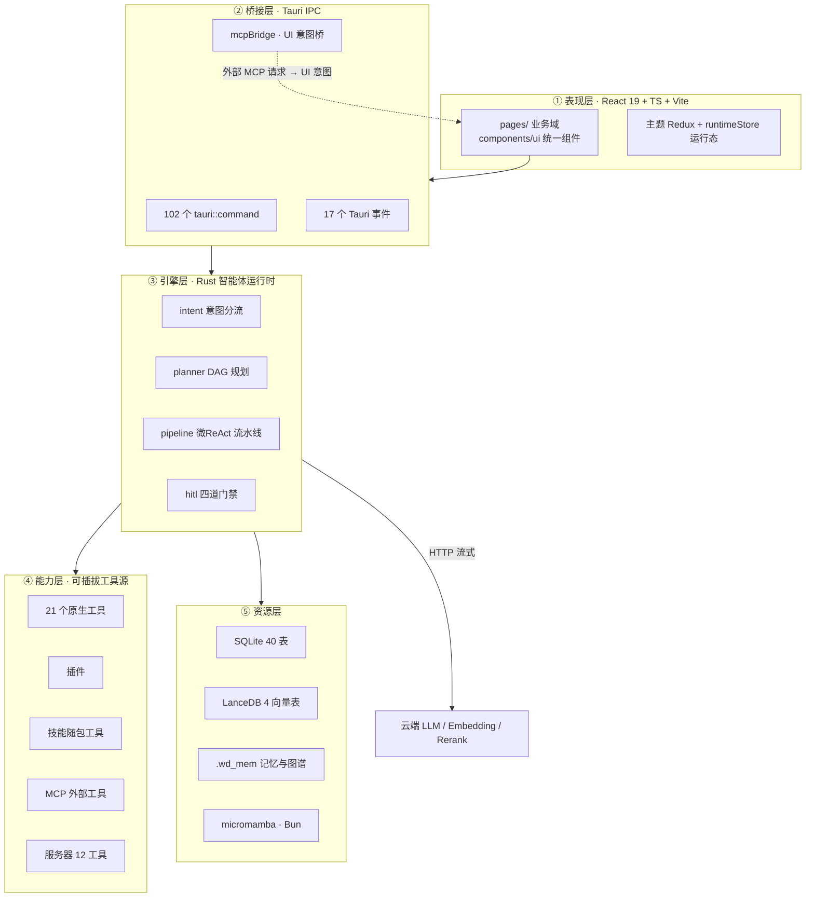
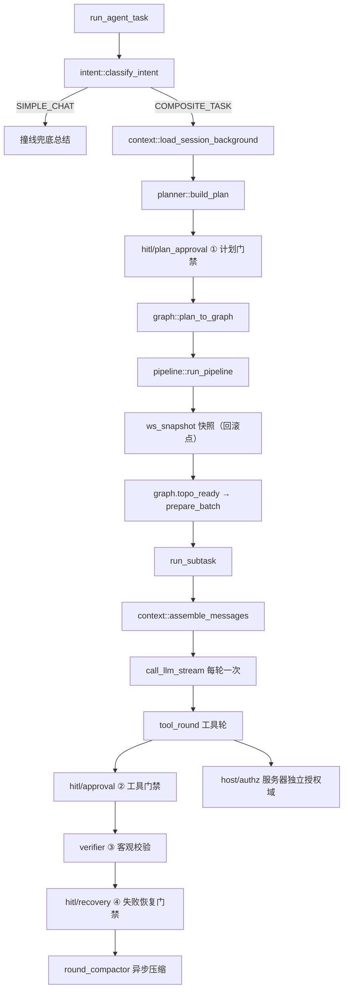

# WorkDuo 架构说明

本文档说明 WorkDuo 的分层架构、模块边界与关键设计决策。**所有数字以代码为准**——若发现文档与代码不符，以代码为准并请修正文档。

> 只想跑起来请看 [README.md](../README.md)；想改代码前请先读完本文。

---

## 目录

1. [总体架构](#1总体架构)
2. [前端分层](#2前端分层)
3. [后端分层](#3后端分层)
4. [智能体引擎](#4智能体引擎)
5. [能力源与工具契约](#5能力源与工具契约)
6. [人机门禁（HITL）](#6人机门禁hitl)
7. [安全架构](#7安全架构)
8. [数据层](#8数据层)
9. [内建 MCP Server](#9内建-mcp-server)
10. [代码规模与现状](#10代码规模与现状)

---

## 1. 总体架构



### 关键设计决策

**① 能力层是工具的唯一事实源。** 工具能否使用由 `register_native_tools()` 的注册集合决定，**同一集合**驱动 system_prompt 分支。仅写在提示词里的约束会被模型无视——沙箱开启时不是「提示模型你没有 `execute_command`」，而是根本不注册它。

**② Rust 只读业务表，写入全在前端。** 业务CRUD 一律走 `src/core/mapper/*` 的 TS 层，Rust 侧仅 `SELECT`（见 `config_loader.rs` 读 `agent_info`）。避免双写通道。

**③ 事件驱动，前端只订阅不轮询。** 引擎每轮只发一次流式 LLM 调用，聚合为 `StreamOutcome` 后经 Tauri 事件推送，`runtimeStore` 按 `sessionId` 隔离写入。

**④ 消息序列不变量。** 每条 `tool_call.id` 必有对应结果；发送前与落库前各调一次 `sanitize_message_sequence` 自检自愈，否则网关直接 400。

**⑤ 失败降级不阻塞主流程。** 向量库失败降级关键词重排、镜像源失败换源重试、审计写入失败静默跳过、planner JSON 解析失败降级单任务。**任何辅助设施都不能让用户任务失败。**

---

## 2. 前端分层

`src/` 共 321 个文件（127 `.ts` + 116 `.tsx` + 50 `.scss` + 资产）。

```text
src/
├── main.tsx / App.tsx          入口：Provider 嵌套 → RouterProvider
├── pages/                      ① 业务层
│   ├── agent-studio/           智能体全链路（列表 / 7 步向导 / 会话 / 运行态）
│   ├── squads-workspace/       小分队协作车间
│   ├── skill-hub/              技能管理台
│   ├── mcp/                    MCP 接入管理 + 工具试跑
│   ├── knowledge/              知识库 + 多格式预览
│   ├── sandbox/                Python / Node 运行时管理
│   ├── plugins/                脚本插件中心
│   ├── model-settings/         模型接入中心
│   ├── settings/               设置中心（含内嵌页）
│   ├── memory-palace/          记忆宫殿
│   ├── server-hub/             服务器托管
│   └── dashboard/              首页概览
│
├── components/                 ② 共享组件层
│   ├── ui/                     统一组件（禁裸用 antd）
│   │   └── pixel-agent/        像素风智能体形象系统（纯 SVG）
│   ├── MultiFileViewer/        多格式查看器（按扩展名分发）
│   ├── markdown/               Markdown 渲染 + mermaid/echarts 分发
│   ├── code-editor/            Monaco 懒加载包装层
│   └── layout/ model/ scenario/ export/ flow/ icons/
│
├── core/                       ③ 核心能力层
│   ├── router/                 HashRouter（19 条路由）
│   ├── mapper/                 ★ 数据访问唯一入口
│   ├── db/                     连接单例 + SQL 切分 + 批量操作
│   ├── file/                   领域类型 + 落盘助手 + 路径守卫
│   ├── contexts/               ThemeProvider / InitProvider
│   ├── store/                  Redux 单 slice（仅主题）
│   └── mcpBridge.ts            UI 意图桥
│
├── hooks/ utils/ types/ styles/ assets/
```

### 分层铁律

- **组件禁止直写 SQL** —— 一律经 `core/mapper/*`
- **Ant Design 必须经 `@/components/ui`** 封装
- **消息提示必须走 `useNotify()`** —— 禁静态 `import { message }`
- **Sass 只用 `var(--color-*)` 设计令牌** —— 禁 hex 与 px 字面量
- **事件订阅统一走 `useTauriEvent`** —— handler 存 ref，避免重渲染重建监听导致泄漏
- **HashRouter** —— Tauri `tauri://` 协议无 SPA fallback

### 状态管理实况

Redux 只承载**主题**（唯一 slice `themeSlice`）。智能体与小分队的运行态走自建的 `runtimeStore`（`useSyncExternalStore` + 按 `sessionId` 隔离的 Map）。

### 数据访问

`core/mapper/` 28 个文件分两类：

| 类别 | 说明 |
|---|---|
| **直写 SQL** | `agent-mapper`、`agent-session-mapper`、`squad-mapper`、`knowledge-mapper`、`mcp-mapper`、`skill-mapper`、`plugin-mapper` 等 |
| **经 Rust 命令** | `server-mapper`（需AES-GCM 加密 + SSH 探测）、`mcp-connection`（纯网络）、`sandbox-mapper`、`bun-mapper` |

---

## 3. 后端分层

`src-tauri/src/` 共 **81 文件 / 50,016 行**。

| 模块 | 行数 | 职责 |
|---|---:|---|
| `agent/` | ~34,800 | 智能体运行时（见 §4） |
| `host/` | ~3,000 | 服务器托管（SSH / SFTP） |
| `mcp_server.rs` | 2,641 | **内建 MCP Server**（98 工具，见 §9） |
| `mamba_manager.rs` | 1,666 | Python 运行时（micromamba sidecar） |
| `bun_manager.rs` | 937 | JS/Bun 运行时（单一运行时模型） |
| `mcp_oauth.rs` | 914 | MCP OAuth2 + PKCE(S256) |
| `mcp.rs` | 565 | MCP 客户端（调外部 MCP） |
| `fs_helper.rs` | 414 | **路径边界原语**（见 §7） |
| `script_cancel.rs` | 403 | 脚本取消 + 进程树终止 |
| `fs_scope_grant.rs` | 390 | 持久目录授权（HMAC 签名） |
| `logging.rs` | 327 | 统一日志（**按本地日期滚动**） |
| `sandbox_audit.rs` | 224 | 沙箱审计（observe-only） |
| `ws_snapshot.rs` | 163 | 工作空间快照 / 回滚 |
| `net.rs` | 120 | 网络出口代理策略 |

---

## 4. 智能体引擎

### 模块结构

```text
agent/
├── commands.rs                Tauri 命令入口
├── events.rs                  事件发射总线 + per-run 轨迹缓冲
├── delivery.rs                任务交付包导出
│
├── engine/                    ★ 执行引擎
│   ├── runtime.rs             ReAct 调度总入口
│   ├── intent.rs              ① 意图分流
│   ├── planner.rs             ② DAG 规划（temperature=0）
│   ├── pipeline.rs            ③ 微ReAct 流水线
│   ├── context.rs             上下文装配（读路径）
│   ├── round_compactor.rs     滚动压缩（写路径，异步）
│   ├── graph.rs               KnowledgeGraph 统一实体图
│   ├── llm.rs                 LLM 网关
│   ├── tool_round.rs          工具轮执行回路
│   ├── verifier.rs            客观校验 L0 / L1
│   ├── policy.rs              风险策略（最小黑名单）
│   ├── config_loader.rs       运行配置装配
│   └── native/                21 个原生工具实现
│
├── hitl/                      四道人工门禁
├── knowledge/                 知识与记忆（RAG / 向量 / 记忆宫殿）
├── artifact/                  产物登记与索引
├── plugins/                   扩展生态适配
└── squad/                     小分队多智能体编排
```

### 主链路



### 五个设计要点

**① 超时判据是「无产出静默时长」，不是总耗时。** 同一任务在不同模型上实测差异可达 6~15 倍，任何过紧的总墙钟阈值都会把正常任务误判为挂死。三层超时：调用级 180s + 收尾30s + run级兜底。

**② 熔断必须过客观校验。** `command_succeeded` 是运行类判定的唯一真相源，**降级项不计入客观证据**。

**③ 收尾清单无效，改落盘时机才有效。** 曾用「结束前检查产物清单」兜底，实测失败率不降；改为「骨架先行 + 增量回写」后，12 个原本失败的用例全部转正。

**④ 熔断不能吞掉修复型重试。** 曾因「强制总结暂定完成」把有文件写入的失败重试判为完成——这是引擎的真实根因，教训已固化为回归测试。

**⑤ DAg 依赖必须确认 id 同命名空间。** 曾两处同源断裂：字段名读写不一致（`dependsOn` vs `depends_on`），以及 deps 存planner 层 `task_id`（「t1」）却直接查内部节点 id 表（「n_…」）恒miss。凡「按 id 查状态」必先确认两侧 id 同一命名空间。

---

## 5. 能力源与工具契约

所有工具统一收敛为 `AgentTool` trait，共享同一权限分级与审批管道：

| 源 | 工具名形态 | 数量 | 适配层 |
|---|---|---:|---|
| **原生** | `native__<tool>` | 21 | `engine/native/` |
| **插件** | `custom__<identifier>` | 动态 | `plugins/plugin_adapter.rs` |
| **技能随包工具** | `skill__<ns>__<slug>` | 动态（≤8/包） | `plugins/skill_tools.rs` |
| **MCP 外部** | `mcp__<srv>__<tool>` | 动态 | `plugins/mcp_adapter.rs` |
| **服务器** | `host__*` | 12 | `host/tools.rs` |

### 权限分级

| 级别 | 行为 |
|---|---|
| `ReadSafe` | 直接执行 |
| `RequireApproval` | 挂起等人机审批 |

**插件权限恒为 `RequireApproval`** —— 用户本机任意代码默认高敏。

### 技能双通道

| 通道 | 触发物 | 机制 |
|---|---|---|
| **① 知识注入**（默认） | `SKILL.md` | 拼进子任务 user 消息；**仅挂 1 个技能时附全文**，多个只给摘要（2000 字符预算） |
| **② 随包工具**（可选） | `tools.json` | 动态注册 `skill__{ns}__{slug}` |

配额：单智能体技能数 ≤ 3，单包工具 ≤ 8，单工具超时 clamp 1~300s（缺省 60）。随包工具通道要求智能体 `allow_sandbox=1`。

---

## 6. 人机门禁（HITL）

四道门禁，各含 `pending + decision + Notify/oneshot` 三件套，**挂起用 oneshot 通道零死锁**：

| 门禁 | 触发 | 可选决策 |
|---|---|---|
| **计划门禁** `plan_approval` | DAG 规划完成后 | Approve / Reject / Revise / Cancel |
| **工具门禁** `approval` | 高危工具调用前 | 批准 / 拒绝 |
| **方案选择** `choice` | `native__ask_user_choice` | 多选一 |
| **失败恢复** `recovery` | 子任务失败后 | Retry / Skip / Takeover / Cancel |

### 防疲劳设计

风险策略评估**前移到计划审批**：批准计划 = **一次授权整计划敏感清单**写入 grants，执行期只拦「计划外变更」。`never` 全自动档 = 零打断，但高敏工具调用仍留痕于轨迹。

### 风险策略：最小黑名单

**绝不维护「安全路径白名单」**（放行走「工作空间内 && 未命中信号」），只维护 4 类极小风险信号集：

| 类 | 信号 |
|---|---|
| `credential` | `.env` · `id_rsa` · `.pem` · `credentials` |
| `ci` | `.github/workflows` · `.gitlab-ci` · `jenkinsfile` |
| `lock` | `package-lock.json` · `yarn.lock` · `pnpm-lock.yaml` · `cargo.lock` |
| `sys` | 系统目录（**仅执行期按真实路径判定**） |

### 服务器独立授权域

服务器操作**绝不**调用本地域策略、**绝不**读写本地的 grants 表。判定顺序：绑定 → 路径/cwd 闸 → sudo 策略 → `HOST_RISKY_SIGNALS` → `host_grant` 免弹 → 级别门禁。

---

## 7. 安全架构

**六层防御纵深：边界 →沙箱 → 门禁 → 凭证 → 网络 → 审计。**

核心哲学：**能力层收敛（不给）优于提示词约束（求模型不）。**

### 7.1 文件与路径边界

模块化的安全底线是**唯一原语** `fs_helper::ensure_path_in_roots`，被脚本命令、服务器工具、ZIP 解包、知识库文件树全部复用：

```rust
// ① canonicalize + 逻辑折叠 .. / .
// ② 对最深已存在祖先 canonicalize，接回不存在的尾部
// ③ 组件级拆分比对——禁字符串前缀比对
// ④ 命中返回规范化路径，下游以真实路径执行 IO
```

**为什么必须组件级比对**：字符串前缀比对会把 `D:/proj_secret/x` 误判为在 `D:/proj` 内（`base` 放行 `base_secret`）。`Path::starts_with` 按组件比较，天然免疫。

**PathGuard 双层 + TOCTOU 二次确认**：`check()` 做存在性检查与逻辑折叠，`verify_opened(fd)` 在 Unix 用 `/proc/self/fd/<fd>` 解析真实路径（可捕获 symlink 替换），Windows 对路径重解析比对。

### 7.2 双层沙箱守卫

用户脚本**一律注入守卫**，环境管理与依赖安装走放行通道。

**Python 侧 `sitecustomize.py`**（解释器启动时自动 import，早于一切用户 import）：

- **网络默认关** —— 替换 `socket.socket` 为可继承的类（标准库 `ssl.py` 会继承它，替换成普通函数会让 import 期TypeError；**实例化时才 raise**）+ 拦 `create_connection` / `getaddrinfo`。同时注入指向 discard 端口的代理 env，遵守代理的库立即失败，raw socket 由补丁兜底
- **文件系统有界** —— 白名单 = 工作空间 + `%TEMP%`，**写操作才校验、读不限**。patch 面覆盖 `builtins.open`（写模式）/ `os` / `shutil` / `pathlib.Path` / `tarfile.extractall` / `zipfile.extractall`。因是**运行时拦截**，`exec`/`eval` 动态构造的调用同样被覆盖

**JS/Bun 侧 `guard.js`**（`bun --preload`注入）：patch `fs` 三形态 + `fs.open` + `globalThis.fetch` / `WebSocket` / `net` / `tls` / `dgram` / `dns` / `Bun` 原生 API。

**超时杀进程树**：`taskkill /T /F` 杀整个进程树（`pip install` 会拉子进程），再 `child.kill()` 兜底。

**逃生阀**（启动必留痕）：`WD_SANDBOX_NET=on` / `WD_SANDBOX_FS=off`。非默认态启动必写审计事件。

### 7.3凭证保护

| 凭证 | 保护方式 |
|---|---|
| 服务器密码 / SSH 私钥 / passphrase | **AES-256-GCM**（`v1:base64(nonce‖ct)`），主密钥存 **OS 凭据管理器**（keyring）；`secret_hint` 只回打码指纹 |
| fs scope 签名密钥 | keyring 独立条目 + HMAC-SHA256 |
| MCP 设备令牌 | **服务端只存 SHA-256 哈希**，明文仅 `/pair` 返回一次 |

### 7.4 SSRF 防御

自定义 `reqwest::dns::Resolve`（`SsrfSafeResolver`）——**在连接前拦截 DNS 解析结果，含重定向跃点，无 TOCTOU 窗口**：

| 协议 | 拦截网段 |
|---|---|
| IPv4 | `0.0.0.0/8` `10/8` `127/8` `169.254/16`（云元数据）`172.16/12` `192.168/16` `100.64/10`（CGNAT）`224-239/4` |
| IPv6 | `::1` `::` `fc00::/7`（ULA）`fe80::/10`（链路本地）`ff00::/8` |

用 `octets()` 位运算，不依赖可能未稳定的 `is_private` / `is_reserved`。**即使主机白名单为空，内网 / 云元数据 / 环回仍被拦截。**

**出口代理策略**（`net.rs`）：统一出口，避免各调用点各自建 client 沿用系统代理（开VPN 时本机模型会被劫持返回 502）。模式：`direct`（`.no_proxy()`）/ `manual` / `system`。

### 7.5 MCP 信任协议

```
请求 → Authorization: Bearer <device_token>
     ├─ sha256(token) 命中 mcp_paired_device → 放行
     └─ 不命中 → 直接拒（不回退本机信任）
无凭证 → 带Origin（浏览器页面）→ 403
       → 回环 + mcp_local_trust → 放行
       → 其余 → 401
```

关键属性：服务端**只存令牌哈希**；**带 Origin 一律403**（防浏览器 CSRF）；`is_loopback` 取 `stream.peer_addr()`，**不可伪造**。

### 7.6 Tauri 权限与CSP

| 权限 | scope |
|---|---|
| `shell:allow-execute` | **仅 2 个 sidecar**：`binaries/micromamba` · `binaries/bun` |
| `sql:allow-execute` | **仅 1 个库**：`sqlite:workduo.db` |
| `fs:*`（9 项） | `$占位符/**` 形式（如 `$HOME`、`$DOCUMENT`、`$TEMP`、`$RESOURCE`） |
| `http:default` | `https://*:*` + `http://*:*` |

生产 CSP 已收紧：`object-src 'none'`、`script-src 'self'`、无 `unsafe-eval`；仅 `style-src` 因 CSS-in-JS 保留 `unsafe-inline`。

> **需要理解的认知**：`fs` 权限没有裸 `**`。Tauri 2 靠权限 scope 授权，**不设通配就无法让 Agent 在用户选定目录工作**（导出目录 / 工程目录 / 四个数据目录均为任意绝对路径）。**CSP 与 fs scope 是两件事**——前者与权限无关。

### 7.7 沙箱审计（observe-only）

哲学：审计是安全**观测**面，执行行为保持原样。事件类型：`script_features`（三维信号静态扫描：网络 / fs 出界 / 进程派生）、`dep_install`、`escape-valve`。

落盘按**本地日期**分文件，每行一条 JSON；**写入失败静默**（审计不阻塞主流程）。

---

## 8. 数据层

### DDL 单一事实源

| 文件 | 说明 |
|---|---|
| `src/assets/sql/init.sql` | 全部建表语句，头部 `-- SCHEMA_VERSION: 41` |
| `src/assets/sql/updater.sql` | v1 → v41 迁移段落 |

**迁移机制**：按 `PRAGMA user_version` 与 `init.sql` 头部版本号判版本 → 幂等重放对应段落 → 成功才封版，**失败不封版、下次启动重试**。

> ⚠️ **DDL 变更必查 mapper 三要素**：查询语句、写入语句、类型定义。改表结构不查 mapper 是本项目历史高频故障源。

### 40 张表（按域）

| 域 | 表 |
|---|---|
| 系统 | `app_config`（KV，含 `first_load`） |
| 模型 / 技能 / 场景 | `models` · `skill_info` · `scenario_category` |
| MCP | `mcp_info` · `mcp_paired_device` · `mcp_tool_definition` · `fs_scope_grant` |
| 智能体主档 | `agent_info` + 4 张关联表（mcp/skill/kb/server ref） |
| 知识库 | `knowledge_base` · `knowledge_asset` |
| 工程会话 | `agent_project` · `agent_conversation_session` · `agent_conversation_round` · `artifacts` |
| 记忆 | `agent_memories` · `agent_memory_events` · `agent_memory_candidates` |
| 小分队 | `agent_squad` · member · session · round · chat_config · handoff · decision · inject · memory |
| 插件 | `user_plugin_tool` · `agent_plugin_ref` · `plugin_run_log` |
| 服务器 | `server_host` · `server_credential` · `server_exec_log` · `host_grant` · `host_authz_log` |
| 追踪 | `agent_run_trace` |

### 文件系统资产

| 路径 | 内容 |
|---|---|
| `.wd_mem/` | 运行时状态唯一载体：`graph/{nodes.jsonl, edges.jsonl}` · `artifacts/` · `scripts/` · `MEMORY.md` · `sessions/` |
| `<skill_path>/<identifier>/` | 技能包 |
| `<kb_path>/` | 知识库文件树 |
| `<workspace>/` | Agent 工作空间（沙箱可写目录之一） |

### 日志

| 文件 | 内容 |
|---|---|
| `logs/workduo.log.YYYY-MM-DD.log` | 统一日志（Rust + 前端汇入同一份） |
| `logs/sandbox-audit.YYYY-MM-DD.log` | 沙箱审计（独立文件便于查阅） |

> **必须按本地日期滚动**：`logging.rs::LocalDailyWriter` 按 `chrono::Local` 校验切文件。**禁改回 `tracing_appender::Rotation::DAILY`** —— 它按 UTC 命名，与本地时间戳错位 8 小时，导致每日本地 00:00~08:00 的日志读不到。

---

## 9. 内建 MCP Server

WorkDuo 自身即**标准 MCP Server**，无需外部 sidecar。

| 项 | 值 |
|---|---|
| 端点 | `POST http://<bind>:18755/mcp`（Streamable HTTP JSON-RPC 2.0） |
| 默认监听 | `0.0.0.0:18755`（设 `127.0.0.1` 改回环） |
| 配对端点 | `POST /pair`（**唯一免鉴权入口**，2 分钟窗口 / 5 次上限） |
| 心跳 | `GET /mcp`（SSE） |
| 协议版本 | `2024-11-05` |

### 98 个工具的三层分类

| 层 | 数量 | 派发方式 |
|---|---:|---|
| **引擎层** | 15 | Rust 直调（运行 / 状态 / 等待 / 审批 / 取消 / 日志 / 轨迹 / 快照回滚） |
| **模块发现层** | 7 | 只读 SQL（模型 / 技能 / MCP / 工具 / 插件 / 知识库 / 场景枚举） |
| **UI 意图层** | 76 | Tauri 事件 → 前端 `mcpBridge` → **与界面按钮同一个 handler** |

**UI 意图桥是能力放大器**：MCP 工具经事件派发到前端与界面按钮**完全同一个 handler**，副作用与真人点击一致，且全量落库可在界面抽查。同一份工具面既能人工操作，也能被外部 Agent 用于自动化。

---

## 10. 代码规模与现状

| 指标 | 数值 |
|---|---|
| Rust | 81 文件 / **50,016 行**（`agent/` 占约 70%） |
| └ 测试 | **250 个 `#[test]`** + 19 个 `#[tokio::test]` |
| 前端 `src/` | **321 文件**（127 ts + 116 tsx + 50 scss） |
| └ 测试 | **27 个测试文件** |
| Tauri 命令 | **102 个** |
| MCP 工具 | **98 个** |
| 原生工具 | **21 个** |
| Tauri 事件 | **17 个** |
| 数据库表 | **40 张** + LanceDB 4 张向量表 |

### 已知技术债

| 项 | 说明 |
|---|---|
| `squad_orchestrator.rs` | 全项目最大文件，拆分优先级低但测试密度可提升 |
| `mcp_server.rs` | 98 个工具定义集中在单文件 |
| `utils/modelTest.ts` | 厂商适配全靠 if-else，新模型接入需手工加分支 |
| MCP OAuth token / `models.api_key` | **明文存储**（AES-GCM 仅用于服务器凭证），后续应统一 |
| symlink TOCTOU | Windows 缺 `GetFinalPathNameByHandleW`，退化为路径重解析比对 |
| Bun 网络守卫状态字段 | 能力已补齐，但 `bunNetworkIsolated` 标注未同步 |

### 验证状态

- **已覆盖**：Rust 250 单元测试；前端 Vitest；`tsc --noEmit` 与 ESLint 零error；MCP 98 工具经前端真实 handler 全链路通
- **待补**：系统化UI 回归（真机挂载不白屏 + 无 console error）。前端日志目前只在业务代码手动调用 `logBridge.fe.*`，不捕获 console 与未捕获异常

---

## 维护本文档

所有数字与结构**以代码为准**。修改架构时同步更新本文档，并在提交信息中说明变更。
