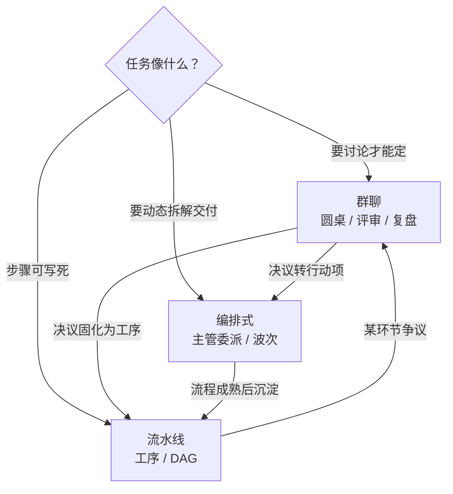

# Agent 案例指导

> 面向 WorkDuo「智能体 / 小分队」的**可落地角色编队案例集**。  
> 每个案例都按产品现有三种协作模式写清：成员怎么组、工具面怎么裁、产物怎么交、如何验收。

---

## 一、目录结构

| 文件 | 协作模式 | 一句话场景 | 产出 |
|---|---|---|---|
| [01-编排式-软件开发团队智能体群设计.md](./01-编排式-软件开发团队智能体群设计.md) | **编排式** | 复杂功能/迭代：主管拆解 → 多角色并行生产 → 汇总交付 | 代码 + 测试 + 评审 + 交付包 |
| [02-流水线-需求到发布标准流水线.md](./02-流水线-需求到发布标准流水线.md) | **流水线** | 固定工序：需求→设计→实现→测试→发布，前步产出喂后步 | 可回归的标准交付链 |
| [03-群聊-技术方案圆桌与评审.md](./03-群聊-技术方案圆桌与评审.md) | **群聊** | 决策/评审/复盘：共享黑板辩论，Moderator 收口 | 决议 + 行动项 + 风险清单 |
| [assets/](./assets/README.md) | 资产包 | Skill 设计稿 + 插件脚本（按 identifier 命名） | 可导入 WorkDuo |

---

## 二、三种模式怎么选（对齐产品语义）

WorkDuo 小分队（`/squads-workspace`）协作模式三选一：

| 模式 | 产品定义 | 适用问题 | 不适用 |
|---|---|---|---|
| **编排式** `orchestrator` | 主管拆解委派成员，逐子任务执行后汇总 | 目标明确但步骤需动态拆解；多角色交叉；要「有人对结果负责」 | 流程死板、只走一遍的简单流水 |
| **流水线** `pipeline` | 成员线性串流（`pipeline_order`）+ 连线依赖（`depends_on`），前步产出喂后步 | 工序固定、输入输出清晰；可重复的标准交付；批处理 | 需要频繁讨论/拍板的开放问题 |
| **群聊** `chat` | 共享黑板轮流发言，Moderator 收口 | 技术方案评审、架构决策、故障复盘、需求澄清 | 直接写代码、要落文件产物的生产任务 |

### 选型口诀

1. **先能吵清楚吗？** 不能 → 群聊先议，再决定走编排还是流水线。  
2. **步骤十年不变吗？** 是 → 流水线（可 cron、可 API 无人值守）。  
3. **要不要有人拆活、盯验收？** 要 → 编排式（主管 + 角色包 + Handoff）。

> 进阶：设计里的「链式 `chat_then_execute`」= 先群聊定方案，再转编排/流水线生产。当前 UI 三模式下，可手动「先跑群聊小分队 → 把决议贴进编排/流水线任务」。

---

## 三、案例共用的底层约定

| 项 | 约定 |
|---|---|
| 角色差异 | **工具面 allow/deny + 期望产物**，不靠 prompt 空谈 |
| 能力事实源 | 注册表（原生 + Skill + 插件）决定能做什么 |
| 交接 | 摘要 + 产物路径（HandoffBundle），不传聊天全文 |
| 验收 | `expectedArtifacts` + 测试/评审证据，禁止「做了活不交件」 |
| 数据 | 本机工作区 / KB / 记忆；本地优先 |
| Skill 挂载 | 每成员 ≤3 |
| 插件挂载 | 每成员 ≤10 |
| MCP | 轻量预留，默认可不挂 |

---

## 四、快速对照：同一支团队，三种编法

以「给 WorkDuo 加一个批量导出功能」为例：

| | 编排式 | 流水线 | 群聊 |
|---|---|---|---|
| 谁定范围 | 主管（或 PM 成员）拆解 | 起点节点 = PRD 校验工序 | 圆桌争论出范围与非目标 |
| 谁写码 | 前端/后端按委派并行 | 「实现」工序固定 Worker | 不写码，只定方案 |
| 谁挡质量 | 测试 + 评审角色 | 测试工序 / 评审工序 | CRITIC 在黑板上挑刺 |
| 结束形态 | Delivery Pack | 末道工序产出报告 | 决议 JSON + 行动项列表 |
| 可重复性 | 中（每次主管重拆） | 高（画一次图反复跑） | 低（每次议题不同） |

---

## 五、落地顺序建议

1. 先读 **01 编排式**（角色最全，Skill/插件/KB 都在这里定义；含 Java/Vue 与宿主工具链说明）。  
2. 从 **assets/** 导入 Skill（`skill-*.md`）与插件（`plugin-*.py/ts`）。  
3. 再读 **02 流水线**（把成熟工序固化成线，降本提效）。  
4. 用 **03 群聊** 处理方案分歧、事故复盘、需求打架。  
5. 回到 Agent 工作台：建 Skill/插件/KB → 建 Agent → 建小分队 → 小需求闭环验收。

---

## 六、命名与索引

| identifier 前缀 | 含义 |
|---|---|
| `pm-*` `arch-*` `dev-*` `qa-*` `review-*` `int-*` | 研发角色 |
| `skill-*` | 技能包 |
| `plugin-*` | 本地插件（FaaS） |
| `kb-*` | 知识库 |

详细字段与系统提示见各案例正文；产品机制以 `docs/小分队完整设计方案-*.md` 为准，本目录是**场景化装配指导**，不替代引擎设计。
