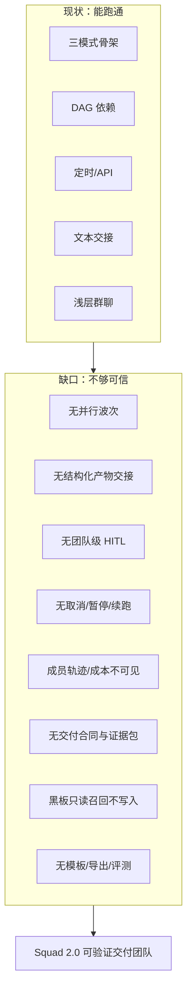
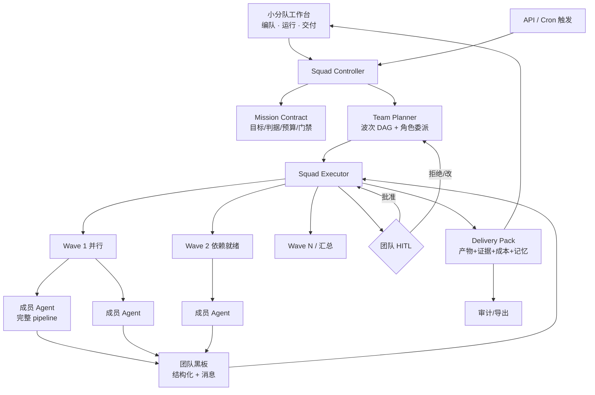
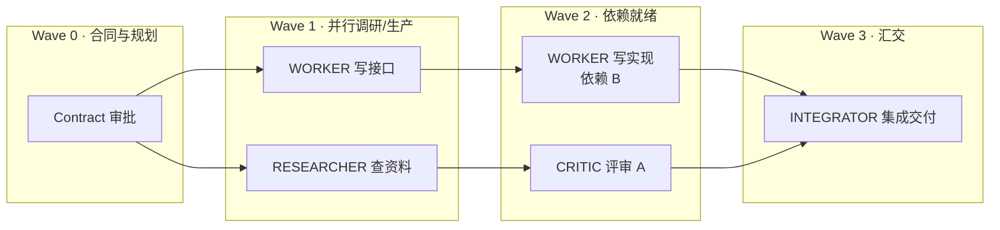
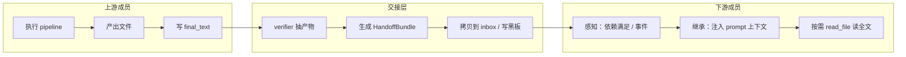
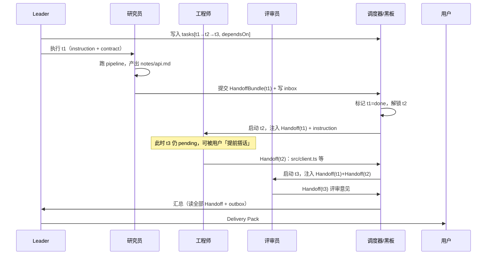
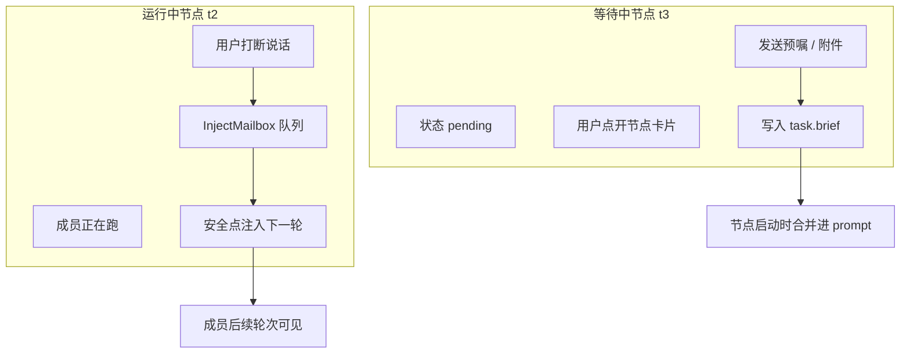

# WorkDuo 小分队（Squad）完整设计方案

> 版本：2026-09-27 **v1.4**（v1.3 + 代码基线核对修订：09-27 单 Agent 侧 30+ 提交后全量扫描，前置兑现/编号顺延/复用资产入册 **+ §7 UI 界面详设**）· 状态：设计定稿（可直接拆任务实施）  
> 基线：现有 `agent/squad/` 三件（`squad_orchestrator.rs` 约 1004 行 + `squad_scheduler.rs` + `squad_api_server.rs`）+ 6 张 `agent_squad*` 表 + `squads-workspace` 前端（约 1947 行）+ Pixel Agent 模块  
> 战略对齐：可治理的本地智能体工作台——小分队不是「多个 Agent 聊天」，而是 **可验证的微型交付团队**  
> 路径约定（v1.2）：Rust 已按域分组（`agent/engine|hitl|knowledge|artifact|plugins|squad/`）；本方案**新建文件一律落 `agent/squad/`**，对 engine 只做挂钩点改动。

---

## 0.a v1.4 基线核对（2026-09-27 深夜代码扫描）——今日改动对本方案的影响

> 背景：09-27 单 Agent 侧完成 30+ 提交（S1 前端 hook 化 / S12 收官 / D4 交付包导出+事件级分叉 / SFTP 真机修复 / 附件注入三层修复 / 格式化问答两层修复）。本节逐条核对方案的前置与假设，**含硬性勘误**。

### A. 前置条件兑现情况（对 §11 Phase 路线的直接影响）

| 方案前置 | v1.3 状态 | 现状 | 影响 |
|---|---|---|---|
| §4.2 S6 前置：capability_outline 从 ToolRegistry 派生 | 待交付 | **✅ 已合入**（planner_digest，2026-09-26） | Phase S2「角色工具面」可直接开工，无前置阻塞 |
| §4.11 前置：run_subtask 还 S2 债（抽构造函数） | 待交付 | **✅ 已还**（e7baaa2，2026-09-26） | InjectMailbox 消费点可安全动工 |
| 取消穿线依赖：P0-4 call_llm 第 4 参 | 依赖 | **✅ 已修复** | Phase S0 取消穿线 = 4 处机械接线（orchestrator 334/407/863/931 实测仍传 None） |
| §6 useTauriEvent「零消费者 hook，顺势收编」 | 未收编 | **✅ 已收编为统一入口**（新增 enabled 参数；4 文件 7 监听迁移；squads 记忆弹窗已迁移） | Phase S0-S3 前端订阅一律走它，无需再「顺势」 |
| 成员纯文本步骤（CRITIC/MODERATOR/summary 类输出）的校验风险 | 未暴露 | **✅ 已修复（两层）**：零工具调用+零文件落盘+工具流类判据 → 按自报闭环，不再重试烧预算 | 评审/汇总类角色的成员步骤可在 pipeline 正常闭环——**无需为评审角色单独改 verifier** |
| 成员/复合任务附件注入 | 未覆盖 | **✅ 已修复（三层）**：pipeline 子任务装配调 inject_attachments + dataUrl 来源链 + data_url 可选化 | §4.1 Contract.context.attachments 的契约现在真实可用 |
| 单 Agent 交付包参考实现 | 无 | **✅ 新增 `agent/delivery.rs`**（manifest/trajectory/approvals/sources/report.md + artifacts 收集，构建器纯函数+单测） | §4.8 squad_pack 直接复用其结构与模式 |

### B. 编号与基线勘误（硬性）

| 项 | v1.3 记载 | 实测/修正 |
|---|---|---|
| DDL 增量编号 | 「当前 schema v30，本方案增量记 v31」 | **v32 已被 `agent_run_trace`（D4）占用——本方案增量顺延为 v33**（§5 已改） |
| MCP 工具基线 | §8「83 工具纪律」 | **现为 84**（server-host 域入列后）；squad 工具入列时同步 release gate 基线 |
| load_squad 位置 | §1.1「commands.rs」 | **`agent/squad/config.rs`**（S3 拆分后） |
| squads-workspace 行数 | 1959 | 1947（部分迁 ui 层后） |
| orchestrator 行数 | ~1000/1001 | 1004 |
| 快照列表排序 | 未记载 | **旧→新排序**（E9-3 用例首跑误败实锤）——§4.8 rollback.snapshotId 消费方必须按 stamp 降序取最新 |

### C. 今日新增的可复用资产（原「新建」项降级为「复用/扩展」）

| 方案原计划 | 现状 | 调整 |
|---|---|---|
| §4.8 squad_pack（新建） | `agent/delivery.rs` 已实现单 Agent 版（manifest 结构、从轨迹事件抽产物、报告 builder 纯函数+单测） | squad_pack **复用 delivery.rs 的收集与构建模式**，差异仅=多成员聚合维度 |
| §4.7 observer 数据源 | per-run trace 已持久化（v32 表）+ `agent_get_run_history` 按 session/agent 查询 | memberStats/成本汇总可从归档轨迹聚合，不必自建事件管道 |
| §4.10 Retry-from | 单 Agent 新增事件级分叉（分叉点进展摘要+续跑指令，原会话续跑） | squad Retry-from 可选提供「事件级续跑」语义（与 plan_override 并列） |
| §10 squad_eval_harness | capability-v2 套件（55 例）lib 模式已验证（withAgent/drive/断言纪律） | 复用 v2 caplib；**断言纪律：扫工具调用 args，不扫转录全文**（转录 grep 会把注入内容误计为越界——X10-1 首跑教训） |

### D. 新增设计约束（今日缺陷教训）

1. **模型顺从度依赖要标注**：M5-2/B6-5 实测——模型在简单对话路径可能不调用锚定/KB 检索工具（M5-1 同场通过证明链路健康）。squad 的 S-MEM-1（记忆沉淀）与 L3 注入设计，需假设「模型可能不调工具」，关键沉淀走 **forced settle（引擎强制）** 而非模型自觉（§4.5 已有 forced_memory_settle squad 版，保持并前置到成员终态）。
2. **窗口分级**：重任务 480s 实测不够收尾，capability-v2 默认已调 600s——squad 成员节点超时三层（调用 180s / 节点 / session）建议节点级取 600s 级。
3. **服务器/文件域已真机验证**：host 域工具（含审批卡真机挂起）可用——若角色工具面纳入 host 类工具（如运维角色），执行面已被验证。

---

## 0. 一句话定义

> **小分队 = 一支可编排、可审计、可验收的本地 AI 交付小组。**  
> 输入一份任务合同（Mission Contract），输出一份带证据链的交付包（Delivery Pack）。

与竞品差异：

| 产品 | 多 Agent 形态 | WorkDuo 小分队的不同 |
|---|---|---|
| Codex / Claude Code | 子代理并行写码，黑盒汇合 | **团队过程可见 + 结果可验收** |
| WorkBuddy | 专家中心 + 多 Agent 办公 | **本地数据主权 + HITL 门禁 + 成本可核算** |
| DeepSeek Harness | 可插件化的委派/子代理 | **从编队到交付的产品闭环，而非框架原语** |
| ZCode 类 | TS 可编程工作流 | **声明式编队 + 图形化，业务角色也能编** |

---

## 1. 现状盘点（诚实基线）

### 1.1 已有资产（可复用，不重写）

| 层 | 资产 | 位置 | 成熟度 |
|---|---|---|---|
| 数据 | 6 表：`agent_squad` / `_member` / `_chat_config` / `_session` / `_round` / `_memory` | `init.sql` + `updater.sql` | ★★★★ |
| 加载 | `load_squad`：成员人设注入、全局 MCP、团队记忆召回 | `agent/squad/config.rs`（S3 拆分后） | ★★★★ |
| 编排式 | Leader 拆解 JSON 委派 → 串行执行 → 汇总 | `squad_orchestrator.rs` | ★★★☆ |
| 流水线 | `pipeline_order` 线性 + `depends_on` DAG（Kahn + 环检测） | 同上 | ★★★★ |
| 群聊 | 共享黑板轮流发言 + Moderator 收口 | 同上 | ★★☆（浅） |
| 隔离 | 成员私有工作区 `{root}/{agent_id}` 或 `.wd_mem/squads/...` | `squad_member_workspace` | ★★★★ |
| 调度 | cron 定时（手写 5 字段）+ HTTP API 触发 | `squad_scheduler` / `squad_api_server` | ★★★☆ |
| 记忆 | 团队黑板 + 成员个人，锚定/列表/删除 | `memory.rs` | ★★★☆ |
| 事件 | `agent-squad-session-started/round/done` + 记忆锚定 | `events.rs` | ★★★☆ |
| 前端 | 卡片列表、编辑 Modal、ReactFlow DAG、运行控制台、历史、记忆面板 | `squads-workspace/` | ★★★☆ |
| 外部 | 无人值守（schedule/api）恢复超时自动取消 | P2-3 | ★★★☆ |

### 1.2 关键缺口（本方案要补的）



| # | 缺口 | 后果 | 严重度 |
|---|---|---|---|
| G1 | 编排式严格串行 | 3 专家变 3 倍时延，不像团队 | P0 |
| G2 | 交接=拼字符串 | 产物丢失/截断/不可 diff | P0 |
| G3 | 无 squad 级计划审批/检查点 | 多 Agent 失控风险放大 | P0 |
| G4 | 不能取消/暂停 | 长任务与调度场景不可运营 | P0 |
| G5 | 成员 tool_trace / token 不透出 | 无法审计、无法核算成本 | P1 |
| G6 | 无 Contract/DeliveryPack | 与单 Agent 差异化叙事落空 | P1 |
| G7 | 团队记忆只在启动注入 | 运行中学不到经验 | P1 |
| G8 | 无模板与评测 | 无法沉淀场景包、无法回归 | P2 |
| G9 | 群聊固定轮次、无工具、无共识收敛 | 浪费 token、难出交付物 | P1 |
| G10 | 已知 bug：`squad_orchestrator` LLM 信封解析 | 轻则空输出 | P0 修 |
| G11 | 节点不可对话/打断 | 人无法在过程中纠偏，体验像死流水线 | P1 |
| G12 | 像素形象未进小分队运行态 | 丢掉已有差异化视觉资产 | P2 |

---

## 2. 设计原则（红线）

1. **单 Agent 是原子能力，小分队是编排**——成员执行仍走 `planner + pipeline`，不另起一套 ReAct。  
2. **能力层单一事实源**——工具是否可用仍由 `register_native_tools` + Skill/MCP 注册决定；角色差异通过「工具面裁剪」而非 prompt 空谈。  
3. **可观测优先于智能**——先保证每一步有事件、有终态、有成本，再谈更聪明的编排。  
4. **交接必须结构化**——文本只能是摘要，产物走 Artifact 协议（文件 + 元数据）。  
5. **HITL 分层**——计划审批、敏感工具、失败升档、交付确认，四级可配，与单 Agent 审批链打通。  
6. **本地优先**——会话、黑板、产物、成本账全落本机；API 触发只开环回。  
7. **失败必须有终态**——继承单 Agent「终态铁律」：不挂死、不丢锁、不残留孤儿 run。  
8. **数据交接结构化**——Agent 间传 HandoffBundle，不传聊天全文（见 4.4）。  
9. **人可随时说话**——预嘱 + 打断说话进审计链，不破坏消息序列不变量（见 4.11）。  
10. **形象即状态**——像素小人动效与运行状态同源，是可观测性不是装饰（见 4.12）。

---

## 3. 目标架构

### 3.1 总览



### 3.2 模块落位（对照现有文件）

| 模块 | 职责 | 新建/改造 | 对应文件 |
|---|---|---|---|
| `squad_contract` | 任务合同解析/生成/校验 | **新建** | `agent/squad/squad_contract.rs` |
| `squad_planner` | 波次 DAG、委派、并行度 | **新建**（从 orchestrator 拆出） | `agent/squad/squad_planner.rs` |
| `squad_executor` | 波次调度、成员生命周期、重试/熔断 | **改造** | `agent/squad/squad_orchestrator.rs` → 拆 |
| `squad_blackboard` | 结构化黑板（状态/产物/消息） | **新建** | `agent/squad/squad_blackboard.rs` |
| `squad_handoff` | 产物交接协议 | **新建** | 并入 blackboard / artifacts |
| `squad_hitl` | 计划门禁、检查点、升档 | **新建** | 复用 `agent/hitl/approval.rs` 通道 |
| `squad_observer` | 成员 run 事件汇聚、成本汇总 | **新建** | `agent/squad/squad_observer.rs` |
| `squad_pack` | 交付包组装 | **新建** | 对齐 `agent/artifact/artifacts.rs` |
| 既有 | 调度/API/记忆/类型/事件 | 扩展字段 | `agent/squad/squad_scheduler` · `squad_api_server` / `knowledge/memory` / `types` / `events` |

---

## 4. 核心设计

### 4.1 Mission Contract（任务合同）——小分队的输入契约

**问题**：现在 `run_squad_task(prompt)` 只有一句自然语言，委派质量全靠模型自觉。  
**设计**：任务进入小分队时编译为 **Contract**；没有 Contract 时由 Leader 自动起草并（可选）提交人审。

```ts
interface MissionContract {
  missionId: string
  squadId: string
  goal: string                    // 用户原话 / 整理后的目标
  deliverables: DeliverableSpec[] // 期望产物（路径/类型/命名）
  acceptance: AcceptanceSpec      // 客观判据：文件存在/命令/断言/人工确认
  budget: {
    maxWallMs?: number            // 总墙钟
    maxPromptTokens?: number      // 全队 token 预算
    maxMemberRetries: number      // 默认 3
  }
  constraints: {
    workspaceMode: 'isolated' | 'shared' | 'hybrid'  // 见 4.4
    toolPolicy?: 'inherit' | 'strict' | 'per-role'
    hitlMode: 'never' | 'plan-only' | 'checkpoints' | 'always'
  }
  context?: {
    attachments?: string[]        // 输入文件
    knowledgeBaseIds?: string[]
    priorSessionId?: string
  }
}
```

**产物**：
- 无 Contract 时：Leader `plan_squad_delegation` 升级为「起草 Contract + 委派计划」，输出 JSON 同时含 `contract` 与 `tasks[]`。
- `hitlMode ≠ never` 时：Contract 进入 **计划审批卡**（复用单 Agent `plan_approval` 形态）。

**验收**：任一 squad 任务可在 UI 看到 Contract 卡；`hitlMode=plan-only` 下未批准不执行。

---

### 4.2 角色系统（Role System）——从「人设字符串」到「能力画像」

**问题**：现在角色只是 `role: string` + `persona_override` 文本，工具面全员相同。  
**设计**：角色 = **人设 + 工具面 + 职责约束 + 交接契约**。

```ts
interface SquadRoleProfile {
  id: string                      // 'worker' | 'critic' | 'reviewer' | 'integrator' | custom
  label: string                   // 展示名
  personaTemplate: string         // 注入 system_prompt
  toolProfile: {
    mode: 'inherit' | 'allowlist' | 'denylist'
    nativeTools?: string[]        // 如 ['read_file','write_file','run_python_sandbox']
    mcpTools?: string[]
    skillIds?: string[]
  }
  canHandoffTo: string[]          // 允许交接给谁（角色 id）
  expectedOutput: 'artifact' | 'review' | 'decision' | 'summary'
}
```

**内置角色包（首发 5 个）**：

| 角色 | 职责 | 工具面 | 期望输出 |
|---|---|---|---|
| **RESEARCHER** | 调研/检索/资料整理 | kb_search, http(白名单), read, write | 调研笔记 artifact |
| **WORKER** | 执行生产（码/数据/文档） | 全量执行类 + sandbox | 产物文件 |
| **CRITIC** | 评审挑刺 | read, kb_search（禁写工作区） | 评审意见 |
| **INTEGRATOR** | 汇总合并交付 | read/write 全区（shared 模式） | 最终交付物 |
| **MODERATOR** | 群聊主持/共识收敛 | 读 + 总结类 | 决议/汇总 |

**实现要点**：
- `load_squad`（`agent/squad/config.rs`）组装 registry 时按 `toolProfile` **过滤工具**（能力层，不是 prompt）。
- **能力大纲必须从实际 registry 派生（⚠️ v1.2 核对发现，S6 前置）**：`engine/planner.rs::capability_outline(cfg)` 目前只看配置、不看裁剪后的 registry——CRITIC 被裁掉 `write` 后大纲仍宣称可写，委派任务会直接失败。这是「提示与能力同源」债（台账 S6）在多 Agent 下的放大实例（每成员一份工具面）。要求：`capability_outline` 改为接收 `&ToolRegistry`、从 `tool_definition()` 生成；**此项列为 Phase S2「角色工具面」的前置依赖，建议先行独立交付**。【✅ 已兑现 2026-09-26：planner_digest 合入，前置解除——Phase S2 可直接开工】
- CRITIC 默认 `write` 拒绝——防止「评审员改代码」角色越界。
- 角色配置进 `agent_squad_member.role_profile_json`（新列）或复用 `persona_override` 升级为 JSON。

---

### 4.3 Team Planner：波次执行图（Wave DAG）——从串行到并行波

**问题**：编排式 for 循环串行；流水线 DAG 有拓扑但无并行（逐个 await）。  
**设计**：统一为 **有向图 + 波次（Wave）调度**。



**执行语义**：
1. 每个节点 = 一次 `run_member_subtask`（完整 pipeline，带 `run_id`）。  
2. **同一 Wave 内无依赖节点并行**（`tokio::join!` / `FuturesUnordered`），并发上限可配（默认 3，继承单 Agent 经验）。  
3. 节点完成后写 **结构化黑板**（见 4.5），下游节点输入 = 其依赖节点的 `HandoffBundle`（不是整段 final_text 硬拼）。  
4. 失败：重试 `maxMemberRetries` → 仍败则 **降级**（跳过/改派/升 HITL），绝不静默吞掉。  
5. 与现有 `build_dag_plan` 兼容：`depends_on` 仍可用；编排式的「委派 JSON」升级为带 `dependsOn[]` 的任务卡。

**委派 JSON 升级格式**：

```json
{
  "contract": { "...": "MissionContract 子集" },
  "tasks": [
    {
      "id": "t1",
      "title": "检索 API 文档",
      "assigneeRole": "RESEARCHER",
      "instruction": "...",
      "dependsOn": [],
      "expectedArtifacts": ["notes/api.md"],
      "handoffSchema": "research_notes"
    },
    {
      "id": "t2",
      "title": "实现客户端",
      "assigneeRole": "WORKER",
      "dependsOn": ["t1"],
      "expectedArtifacts": ["src/client.ts", "tests/client.test.ts"]
    }
  ]
}
```

---

### 4.4 多 Agent 数据传递总则（三模式通用）

**一句话**：Agent 之间不传「聊天记录全文」，传 **交接包（HandoffBundle）**——摘要 + 产物索引 + 未决点；全文留在磁盘，下游按需 `read_file`。



**四条铁律**：
1. **产物落盘优先**——交付物必须是文件（或明确 text 节），禁止「只活在 final_text 里」。  
2. **摘要进 prompt，全文在磁盘**——防 token 爆炸，且可审计、可 diff。  
3. **下游感知靠调度器，不靠模型自觉**——依赖满足才 `started`，Handoff 写入才解锁。  
4. **兼容旧路径**——无 Handoff 时回退现状「final_text 折叠进 prompt」。

---

### 4.4.1 工作区三模式（数据住在哪）

| 模式 | 成员工作区 | 交接方式 | 适用 |
|---|---|---|---|
| **isolated** | 各自 `{root}/{agent_id}` | HandoffBundle → 拷贝到交接箱 | 强隔离、防互相踩踏 |
| **shared** | 共享 `{root}/shared` | 直接读写共享区 + 黑板登记路径 | 单仓库紧耦合 |
| **hybrid（推荐）** | 私有工作区 + `{root}/shared/inbox` | 发布/订阅产物 | 多数协作 |

目录约定（hybrid）：

```
{workspace_root}/
├── shared/
│   ├── inbox/{taskId}/          # 上游交出的产物（只读给下游）
│   ├── outbox/                  # 汇总/最终交付
│   └── notes/                   # 黑板便签文件（可选）
├── {agentA}/                    # A 的私有工作区
├── {agentB}/
└── .squad/
    ├── contract.json
    ├── board.json
    └── handoffs/{taskId}.json
```

---

### 4.4.2 HandoffBundle（结构化交接包）

```ts
interface HandoffBundle {
  fromAgentId: string
  fromRole: string
  taskId: string
  status: 'ok' | 'partial' | 'failed'
  summary: string                 // ≤800 字，给人和下游看的「结论 + 做了什么」
  artifacts: Array<{
    path: string                  // 相对路径（inbox 内 / 私有区内）
    kind: 'file' | 'dir' | 'text'
    bytes?: number
    sha256?: string
    preview?: string              // 文本前 2KB clip
    label?: string                // 人类可读名，如「API 设计稿」
  }>
  metrics?: { promptTokens?: number; outputTokens?: number; durationMs?: number; toolCalls?: number }
  openQuestions?: string[]        // 下游必须知道的未决点
  schemaHint?: string             // 交接契约名，如 'research_notes' | 'api_spec' | 'code_bundle'
}
```

**生成时机**：成员 `run_member_subtask` 终态时强制产出（verifier 从工作区扫描 + final_text 抽取）；失败也产出 `status:failed` + 错误摘要，**不允许静默消失**。

**下游 prompt 注入模板**（只注入这个，不注入全文）：

```
## 上游交接（来自 {role}·{agentName}，任务 {taskId}）
状态：{status}
摘要：
{summary}

可用产物（需要全文请用 read_file 读路径）：
- [API 设计稿] shared/inbox/t1/api-spec.md （12KB）
- [数据样例] shared/inbox/t1/sample.json （2KB）

未决点：
- {openQuestions[0]}

请基于以上交接继续你的任务；若交接不足，先读文件或在黑板标注缺口，不要臆造。
```

---

### 4.4.3 编排式（Orchestrator）：上游走完，下游如何感知并继承

**场景**：Leader 拆 3 个子任务——研究员查资料 → 工程师写接口 → 评审员挑刺。



**感知机制（调度器做，不是模型做）**：
1. 任务图写入 `board.tasks`：`t1.running → t1.done` 后，扫描 `dependsOn` 含 t1 的节点。  
2. 依赖全满足 → 入队 → 发 `agent-squad-member-started`。  
3. **模型侧**只看到「你被启动了 + 上游交接注入」，不需要自己轮询。

**继承内容（三层）**：
| 层 | 内容 | 注入位置 |
|---|---|---|
| L1 指令 | Leader 给的 `instruction` | user 消息主体 |
| L2 交接 | 上游 Handoff 摘要 + 产物路径列表 | user 消息「上游交接」段 |
| L3 约束 | Contract 的 deliverables / 预算 / 禁改清单 | system 或 user 约束段 |
| （按需）L4 全文 | 某个产物全文 | 不注入，成员自己 `read_file` |

**具体例子（编排式）**：

> 任务：「调研三家竞品定价并出对比表」  
> t1 研究员 → `notes/pricing.md` + `data/pricing.csv`  
> t2 分析师（dependsOn: t1）

t2 启动时收到的 prompt（示意）：

```
你的任务：生成定价对比表 report/pricing-table.md 与 chart.png

## 上游交接（来自 研究员·小研，任务 t1）
状态：ok
摘要：已抓取 A/B/C 三家公开定价页，清洗为 CSV（12 行），关键结论：B 有免费档、A 按席位、C 按量…
可用产物：
- [调研笔记] shared/inbox/t1/notes/pricing.md （8KB）
- [清洗数据] shared/inbox/t1/data/pricing.csv （2KB）
未决点：
- C 企业版价格页需登录，暂用第三方转载，置信度中

请生成对比表；不确定处标注来源与置信度。
```

t2 工作区内可直接：
```
read_file  {workspace_root}/shared/inbox/t1/data/pricing.csv
read_file  {workspace_root}/shared/inbox/t1/notes/pricing.md
```
写完自己的 `report/` 后再交 Handoff(t2)。

---

### 4.4.4 流水线 / DAG：前步产出如何喂后步

**与编排式的差别**：流水线**没有 Leader 二次拆解**，依赖关系是编队时画好的；交接「谁给谁」由 `depends_on` / `pipeline_order` 决定。

| 子模式 | 上游 → 下游 | 感知 | 继承 |
|---|---|---|---|
| **线性**（无 depends_on） | 第 i-1 步 → 第 i 步 | 顺序 await，前步 done 才跑下一步 | 前步 Handoff（多步时累计摘要） |
| **DAG**（有 depends_on） | 全部直接上游 | 拓扑就绪才入队（可并行） | **每个直接上游一个 Handoff**，按 role 分组注入 |

**线性例子**（数据管道）：

```
采集员 → 清洗员 → 报表员
```

清洗员启动时注入：
```
## 上游交接（来自 采集员，任务 n1）
摘要：拉取 GitHub releases 20 条，原始 JSON 已落 raw/releases.json
产物：shared/inbox/n1/raw/releases.json
请清洗去重后输出 clean/releases.csv，并保留原始行号映射。
```

**DAG 例子**（全栈）：

```
前端 ──┐
       ├──→ 集成员 ──→ 评审员
后端 ──┘
```

集成员启动时注入两份 Handoff：
```
## 上游交接 1/2（来自 前端·小前，任务 t-fe）
产物：shared/inbox/t-fe/src/**、preview 截图路径
## 上游交接 2/2（来自 后端·小后，任务 t-be）
产物：shared/inbox/t-be/src/api/**、openapi.yaml
请合并为可运行 monorepo，冲突以 openapi.yaml 为准，并写集成说明。
```

**实现要点**（对齐现有 `build_dag_plan`）：
- 现状：`upstream final_text` 字符串 join 后折叠进 prompt → **升级为多个 Handoff 段落**。  
- 现状：线性「之前所有节点产出」→ **升级为仅直接上游**（减少噪声；可选「传递闭包摘要」配置）。  
- 末序/汇点产出 Handoff 进 `shared/outbox/`，供 Delivery Pack 打包。

---

### 4.4.5 群聊（Chat）：观点如何「传递」并变成可继承数据

群聊不走「文件交接」主路径，走 **黑板（Blackboard）**；但结论必须**结构化落下**，才能被后续生产波继承。

| 阶段 | 数据形态 | 谁写入 | 下游怎么用 |
|---|---|---|---|
| 发言轮 | L1 消息流（round） | 各成员 | 仅上下文窗口内可见（裁剪） |
| 共识/分歧 | L2 决策卡 `decision` | Moderator / 系统抽取 | 下一轮 system 注入「已达成共识」 |
| 行动项 | `board.tasks` 新任务 | Moderator 汇总时生成 | **可转 Wave 执行**（chat → orchestrator） |
| 交付草案 | `shared/outbox/draft.md` | 汇总主笔 | 集成/生产成员继承 |

**群聊 → 生产继承例子**：

```
圆桌：3 人讨论「周报模板该不该带风险栏」
  → Moderator 产出决议：
      decisions: [{kind:'scope', text:'保留风险栏，用三级色标'}]
      tasks: [{id:'a1', assignee:'WORKER', instruction:'按决议改模板'}]
  → 若 squad 协作模式为链式（`chat_then_execute`，见 §7.1；⚠️ 与工作区 `workspaceMode: 'hybrid'` 是两个概念，勿混用），a1 进入编排/流水线执行
  → WORKER 启动时注入：
      ## 圆桌决议
      - 保留风险栏，三级色标
      ## 草案
      shared/outbox/draft.md
```

**Chat 内数据传递约束**：
- 黑板只保留「近 N 轮 + 决策摘要」，避免越聊越贵。  
- 成员发言可 @产物路径，Moderator 把高频引用路径收进 `artifactsIndex`。  
- 禁止把整份黑板当 Handoff 传给生产成员——只传 **决议 + 行动项 + 指定草案路径**。

---

### 4.4.6 三模式数据传递对照总表

| 维度 | 编排式 | 流水线/DAG | 群聊 |
|---|---|---|---|
| 主载体 | HandoffBundle | HandoffBundle | 黑板消息 + 决策卡 |
| 感知方式 | 调度器解锁 dependsOn | 拓扑就绪 / 顺序 await | 轮次驱动 |
| 继承进 prompt | instruction + N 个上游 Handoff | 直接上游 Handoff（线性可累计） | 决议 + 近期黑板裁剪 |
| 全文获取 | `read_file` inbox | 同左 | 一般不需要；草案落盘后 read |
| 失败传递 | failed Handoff + 重试/改派 | failed Handoff，下游可「带缺口继续」或等修复 | 发言失败记 round，不堵轮 |
| 最终汇聚 | Leader 读全部 Handoff + outbox | 汇点 Handoff / outbox | 汇总主笔决议 |
| 并行 | Wave 内并行 | DAG 同层并行 | 同轮多成员发言（伪并行/可真并行） |

---

### 4.4.7 交接失败与降级

| 情况 | 行为 |
|---|---|
| 上游 failed Handoff | 下游若 `dependsOn` 硬依赖 → 不启动，走改派/升 HITL；软依赖 → 启动并标注缺口 |
| Handoff 缺产物但 final_text 有内容 | verifier 兜底抽文本为 `kind:text` 产物 |
| 下游读不到 inbox 路径 | 自动重试拷贝；仍失败 → 黑板标 `handoff_broken`，任务升档 |
| 旧数据无 Handoff | 回退文本折叠（现状行为），UI 标「兼容模式」 |

---

### 4.5 团队黑板 2.0（Structured Blackboard）——从聊天记录到共享状态

**问题**：`agent_squad_round` 只是发言流水；`agent_squad_memory` 只在启动时召回。  
**设计**：黑板 = **三层**：

| 层 | 内容 | 存储 | 写入时机 |
|---|---|---|---|
| L1 消息流 | 发言/委派/系统/汇总 | `agent_squad_round`（既有） | 实时 |
| L2 状态板 | 任务状态、产物索引、决策、风险 | **新表** `agent_squad_board` 或 JSON 列 | 节点完成/决策时 |
| L3 长期记忆 | 可复用经验/约束/偏好 | `agent_squad_memory`（既有） | 任务结束强制沉淀 / 运行中主动锚定 |

**L2 状态板条目（JSON）**：

```ts
interface BoardState {
  missionId: string
  tasks: Record<string, {
    status: 'pending' | 'running' | 'done' | 'failed' | 'skipped'
    assignee?: string
    handoffId?: string   // ⚠️ v1.2：只存 agent_squad_handoff 表外键，不内联整个 bundle（防双源漂移，见 §5 单源约定）
  }>
  decisions: Array<{ at: number; by: string; text: string; kind: 'plan' | 'risk' | 'scope' }>
  risks: string[]
  artifactsIndex: string[]        // 全队产物总目录
}
```

**并发写约定（⚠️ v1.2 核对增补：单写者）**：
- `board_json` 的唯一写者是 **Squad Executor**（调度协程）；Wave 内并行成员不直接 UPDATE session 行（读-改-写会丢更新）。
- 成员工具（`squad__post_note` / `squad__pin_decision`）经内部 channel/事件发给 Executor 代写；Executor 串行 apply 后再发前端事件。
- 表级数据（handoff / decision / inject）可各自独立插入（SQLite 串行写安全），board 只存引用与状态。

**运行中记忆写入（补 G7）**：
- 注册原生工具 `squad__post_note` / `squad__pin_decision`（ReadSafe，成员可调用）。  
- 任务结束 `forced_memory_settle` 的 squad 版：Leader/INTEGRATOR 把「可复用结论」锚进 L3。

---

### 4.6 团队 HITL（Team Human-in-the-Loop）

**四级门禁**（Contract.hitlMode 展开）：

| 级 | 触发 | 用户操作 | 落点 |
|---|---|---|---|
| **L1 计划门禁** | Contract/委派计划生成后 | 批准 / 改意见 / 拒绝 | 对齐单 Agent `plan_approval` |
| **L2 检查点** | Wave 边界或关键产物产出 | 继续 / 返工 / 调整后续 | `squad_checkpoint` 事件 |
| **L3 敏感操作** | 成员高危工具 | 与单 Agent 相同审批链 | 复用 `approval.rs` |
| **L4 交付确认** | Delivery Pack 生成后 | 接受 / 要求修订 | 终态门禁 |

**升档策略**（继承单 Agent 熔断经验）：
- 成员失败 ≥2 次同因 → 自动升 L2 检查点。  
- 成本超预算 80% → 告警；100% → 强制检查点。  
- `unattended`（schedule/api）下：L1/L2 自动批准或按策略 fail-fast（配置项 `unattendedPolicy: 'auto-approve' | 'abort'`），与现有 P2-3 一致。

---

### 4.7 Squad Observer：成员可观测与成本汇总

**问题**：成员内部 tool_started/finished、token_update **没有汇入 squad 会话**。  
**设计**：

1. 成员 `run_member_subtask` 带 `run_id = sqrun_{session}_{task}`，事件写入 per-run trace（已有 #8 能力）。  
2. `squad_observer` 订阅/转发：关键事件映射为 squad 级事件  
   - `squad-member-started` / `squad-member-step` / `squad-member-finished`  
   - `squad-cost-update`（滚动全队 token/时延）  
3. UI 运行控制台可 **下钻** 到单成员 Trace（复用单 Agent TracePanel）。  
4. 会话结束写 `agent_squad_session.metrics_json`：`{totalPromptTokens, totalOutputTokens, wallMs, memberStats[], costEstimate}`。  
5. **编排开销计入成本（⚠️ v1.2 核对增补）**：Leader 起草 Contract / 委派 JSON、群聊各轮发言、最终汇总都是 LLM 调用（现状 orchestrator 内 4 处 `call_llm` 不在任何成员 metrics 里）——`budget.maxPromptTokens` 与 `metrics_json` 必须覆盖「编排侧 + 成员侧」全部调用，否则预算硬闸会漏算。

**交付包里必须带成本行**——这是「可验证交付」的一等公民。

---

### 4.8 Delivery Pack（交付包）——小分队的出口

任务终态产物 = 一份可导出的 **Delivery Pack**：

```ts
interface DeliveryPack {
  missionId: string
  squadId: string
  sessionId: string
  status: 'done' | 'partial' | 'failed'
  contract: MissionContract
  summary: string
  deliverables: Array<{ path: string; preview?: string; matchedAcceptance: boolean }>
  evidence: {
    rounds: number
    memberRuns: Array<{ agentId: role; status; durationMs; tokens }>
    approvals: Array<{ level: string; decision: string; at: number }>
    memoryPinned: string[]        // 本次沉淀的记忆 id
  }
  cost: { promptTokens: number; outputTokens: number; wallMs: number }
  rollback?: { snapshotId?: string }
}
```

**导出**：JSON + 人类可读 Markdown（复用现有 export 组件思路）；后续可进「交付物画布」。**参考实现（✅ v1.4）**：单 Agent 版交付包已落地 `agent/delivery.rs`（manifest/trajectory/approvals/sources/report.md + artifacts 拷贝，构建器纯函数+单测）——squad_pack 复用其收集与构建模式，差异仅=多成员聚合维度。

**快照口径（⚠️ v1.2 核对增补）**：现有 `ws_snapshot` 按 agent 目录各留 5 份（`MAX_SNAPSHOTS_PER_AGENT=5`）——小分队若沿用会 churn ×成员数，且 **hybrid 的 `shared/` 区不在任何成员的 per-agent 快照范围内**。约定：
- squad 会话开始时对 **shared root 做一次会话级快照**（挂 `DeliveryPack.rollback.snapshotId`，粒度=整队）；
- 成员私有区快照默认**关闭**（私有区可由上游 inbox 重放重建），仅 `Retry-from` 场景按需补单成员快照；
- 快照失败沿用「尽力而为」语义：告警不阻塞（与单 Agent 一致）。**列表排序语义（⚠️ v1.4）**：`agent_snapshot_list` 返回**旧→新**排序（E9-3 用例首跑误败实锤）——消费方取「最新」必须按 stamp 降序。

---

### 4.9 群聊模式升级（Chat 2.0）

| 现状 | 升级 |
|---|---|
| 固定 max_rounds 跑满 | **共识检测**：Moderator 连续 2 轮无新观点 → 提前收口 |
| 纯 call_llm，无工具 | 可选「带工具讨论」：RESEARCHER 在讨论中可调 kb_search（受控） |
| 黑板无限拼接 | 裁剪：保留近 N 轮 + 决策摘要，防 token 爆炸 |
| 汇总一段话 | 输出 **决议 + 分歧点 + 行动项**，行动项可转 Wave 执行 |

**Chat 的定位**：决策/评审/头脑风暴；**生产仍走 orchestrator/pipeline**。可作为 pipeline 的前置「方案评审 Wave」。

---

### 4.10 生命周期控制：取消 / 暂停 / 续跑

| 操作 | 语义 | 实现 |
|---|---|---|
| **Cancel** | 停止未开始节点，当前成员发 cancel 信号，终态 `cancelled` | `AtomicBool` 贯穿 squad 级 + 成员级 |
| **Pause** | 完成当前节点后挂起，状态 `paused` | 检查点自然暂停的超集 |
| **Resume** | 从 BoardState 恢复未完成节点 | 读 session + board，跳过 done |
| **Retry-from** | 从指定任务重跑 | 对齐单 Agent `plan_override + pre_completed` |

与单 Agent「终态铁律」对齐：任何路径 60s 内到终态或显式 paused；锁/孤儿轮次清扫覆盖 squad run。

**续跑/重跑幂等语义（⚠️ v1.2 核对增补）**：
1. crash 时处于 `running` 的节点 → Resume 一律视为 `failed` **从头重跑**，不复用半成品产物（pipeline 重入语义决定「重跑=干净重来」最稳）。
2. 同 `taskId` 重跑 → `agent_squad_handoff` 记录与 `shared/inbox/{taskId}/` 文件均为**覆盖式写入**（新 bundle 整体替换旧记录与旧文件），保证幂等。
3. `sweep_orphan_rounds` 扩展到 `agent_squad_round` + `agent_squad_session` 半终态检测：启动时把「进程消失仍 running」的 session/节点收敛为 failed，才允许 Resume。

---

### 4.11 打断说话与节点对话（Inject & Speak）——人可以随时插话

**一句话**：小分队不是黑箱流水线。用户可以 **对等待中的节点提前布置要求**，也可以 **对运行中的节点打断插话**；Agent 以「下一轮感知」或「安全点注入」方式吸收，不丢话、不打断硬安全边界。

对齐单 Agent 已有语义：审批 `takeover` 补充指示、恢复 `guidance` 回灌、`initial_context` 续跑——小分队把这套能力产品化成 **「节点对话」**。

#### 4.11.1 两种插话时机

| 时机 | 节点状态 | 用户能做什么 | 系列如何注入 | 体感 |
|---|---|---|---|---|
| **等待中搭话**（Pre-talk） | `pending` / 未 started | 提前补充要求、贴附件、改验收标准 | 写入该节点 `task.brief` / `user_notes[]`，启动时合并进 instruction | 「先跟他说一声」 |
| **运行中打断**（Live inject） | `running` | 补充约束、纠偏、给资料、要求换思路 | 进入该成员 run 的 **指令信箱**，在下一个安全点注入 user 消息 | 「等一下，补充一句」 |



#### 4.11.2 等待中搭话（Pre-talk）——「下游还没开始，我先交代两句」

**场景**：编排式里 t2 工程师还在排队（t1 未完成）。用户点开 t2 节点：

> 「接口一律用 snake_case；测试必须带一个失败用例；不要动 migrations/」

**数据模型**：

```ts
interface NodeBrief {
  taskId: string
  userNotes: Array<{
    at: number
    text: string
    attachments?: string[]    // 贴文件，复制到该成员启动可见区
  }>
  acceptanceOverride?: string  // 可选：临时改验收口径
}
```

**启动时合并顺序**（优先级从低到高）：

```
1. Contract 任务目标
2. Leader instruction（委派指令）
3. 上游 Handoff 注入
4. 【用户预嘱】← Pre-talk 写入的 userNotes
5. 约束 / 预算 / 禁改
```

**UI**：波次图节点悬浮 → 「对他说」输入框；节点卡片显示便签角标（有预嘱时）。

#### 4.11.3 运行中打断（Live Inject）——「正在干活，我插一句」

**场景**：t2 工程师正在写代码，用户看到方向偏了：

> 「先停一下——鉴权用 JWT，不要 session」

**信箱机制（InjectMailbox）**：

```ts
interface InjectMessage {
  id: string
  taskId: string
  runId: string
  from: 'user' | 'leader' | 'system'
  text: string
  mode: 'soft' | 'hard'   // soft=下轮生效；hard=尽快安全点注入
  status: 'queued' | 'delivered' | 'dropped'
}
```

**注入时机（安全点，绝不撕裂工具调用）**：

| 安全点 | 说明 |
|---|---|
| 工具调用间隙 | 一轮 tool_calls 结束、准备下一轮 LLM 前（**主路径**） |
| 子步骤边界 | pipeline `run_subtask` 完成一步后 |
| 流式 LLM 结束 | 当前 `call_llm_stream` 收完，进下一轮前 |
| **禁止** | 单次工具执行中途硬切（会破坏消息序列不变量） |

**注入形态**（对齐单 Agent takeover）：

```json
{
  "role": "user",
  "content": "（用户打断补充：先停一下——鉴权用 JWT，不要 session。请立即调整后续做法；若与既有代码冲突，列出待改点再继续。）"
}
```

**hard vs soft**：
- `soft`（默认）：排队，下一轮注入——适合补充信息。  
- `hard`：尽快注入，并在 UI 亮「已打断」；若成员处于长工具调用，工具结束后立刻注入——适合纠偏。  
- **不提供「强杀当前工具」**（破坏终态铁律与消息配对）；要停任务用 Cancel/Pause。

**实现落点提醒（⚠️ v1.2 核对增补）**：安全点消费的注入钩子在 `engine/pipeline.rs::run_subtask` 内部（工具轮循环边界）——正是台账 S2 标记的最脆函数（1012 行、`SubTaskOutput` 构造块复制 6 份）。**先还 S2 债（抽构造函数）再落 InjectMailbox 消费**，避免在最脆的函数里加特性；注入的 user 消息会自然过 `sanitize_message_sequence`，无需特判。【✅ 前置已兑现：S2 债已还（e7baaa2，2026-09-26），且该函数 09-27 又新增纯文本降级与附件注入两处改动——动工前按当前版本重新走读】

#### 4.11.4 向 Leader / 全队说话

| 对象 | 入口 | 效果 |
|---|---|---|
| 某等待节点 | 节点卡片「对他说」 | Pre-talk 进 `task.brief` |
| 某运行节点 | 运行中节点「打断」 | 进该 run 的 InjectMailbox |
| Leader / 主持人 | 时间线顶部「告诉团队」 | 写 `board.decisions` + 可选广播到未启动节点 brief |
| 全队 | 控制条「补充任务说明」 | 更新 Contract.goal 增量段 + 事件通知 |

#### 4.11.5 与审批/恢复的关系

| 已有能力 | 小分队中的对应 |
|---|---|
| 审批 `takeover` 补充指示 | Live Inject 的特例（由审批触发） |
| 恢复 `guidance` / `change-approach` | 失败升档时的定向插话 |
| 计划 `revise` | 对 Leader 的 Pre-talk / 全队说明 |
| 单 Agent 会话输入框 | 成员节点级输入框（缩放到任务粒度） |

**一致性要求**：所有插话必须 **落 round 流水**（`kind:'inject'`）+ 可进 Delivery Pack 证据链——「谁在什么时候说了什么」可审计。

#### 4.11.6 UI 交互（节点对话）

```
节点卡片（任意状态）
├─ [对他说] 输入框 + 贴文件
│    pending  → 存 brief，角标「预嘱×2」
│    running  → 发送后显示「已打断，等待注入…→已送达」
├─ 已注入列表（时间倒序，可展开原文）
└─ 运行中：像素小人 working 动效 + 气泡预览最近一条 inject
```

- 打断成功：节点短促高亮 + 像素小人闪 `thinking` 一拍（见 4.12）。  
- 未送达（已终态）：toast「节点已结束，已改为写入黑板决策」。

#### 4.11.7 事件与命令

| 事件 | 含义 |
|---|---|
| `agent-squad-node-brief-updated` | 预嘱写入 |
| `agent-squad-inject-queued` | 插话入队 |
| `agent-squad-inject-delivered` | 已注入成员下一轮 |
| `agent-squad-inject-dropped` | 节点已终态等，无法注入 |

| 命令 / MCP | 说明 |
|---|---|
| `squad_talk_to_task` | Pre-talk（pending） |
| `squad_inject_to_task` | Live inject（running） |
| `squad_broadcast_note` | 告诉团队 / Leader |

#### 4.11.8 边界与防滥用

- 频率限制：单节点 ≥2s 间隔，防刷屏打断。  
- 长度限制：单条 ≤2000 字；超出请贴附件。  
- 无人值守（schedule/api）：默认 **忽略全部三条说话路径**（Live Inject / Pre-talk / broadcast）或仅落黑板决议（⚠️ v1.2 核对增补：`squad_broadcast_note` 与 talk/inject 同为 MCP 工具、外部可调，策略必须三路统一，不能只挡 Live Inject）；manual 模式全开。  
- 成员 system 注入稳定指令：「用户补充指示优先级高于原 instruction 中与之冲突的部分，冲突时在产出中标注」。

---

### 4.12 像素形象系统（Pixel Agent × Squad）——小分队是「一队小人」而不是节点圆点

**已有资产**（Phase 2 规划里明确「squad 形象」暂缓，本方案将其升为一等公民）：

| 资产 | 位置 | 现状 |
|---|---|---|
| 32×32 像素小人 + 外观 JSON | `src/components/ui/pixel-agent/` | ✅ v2 游戏级 |
| 动作状态 `idle / working / thinking / error` | `types.AgentMotionState` | ✅ 弹窗预览用 |
| PNG 快照写 `logo` | `snapshot.ts` | ✅ 列表/聊天 `` |
| 形象设计弹窗 / 场景预设 | `AppearanceModal` / `generateAvatarByScenario` | ✅ |
| 编队 DAG 节点头像 | `SquadDagEditor` 用 logo | 🟡 静态图 |
| 运行态动效 / 小分队形象 | — | ❌ 本方案补 |

#### 4.12.1 设计原则

1. **形象 = 角色人格的视觉锚点**——同一编队里成员「一眼可辨」。  
2. **动效 = 运行状态的表达**——不是装饰，是可观测性（和波次图着色同源）。  
3. **快照兼容**——列表/历史仍用 logo PNG；运行态用 `PixelAgent` 真渲染（motion=true）。  
4. **不新增几何源**——严格复用 `buildPixelRects`，禁止另起一套像素绘制。

#### 4.12.2 运行态映射（扩展 AgentMotionState）

在现有四态上增加小分队场景所需状态（向后兼容，旧四态不变）：

| 状态 | 视觉 | 何时 |
|---|---|---|
| `idle` | 平静静止 | 等待中 / 空闲 |
| `working` | 打字 | 成员 pipeline 运行中 |
| `thinking` | 托腮 | 规划 / 等待 LLM / 收到 inject 消化中 |
| `error` | 惊恐 | 成员失败 / 交接中断 |
| **`waiting`**（新） | 张望 / 举手 | pending 且有预嘱，或等待上游 Handoff |
| **`speaking`**（新） | 嘴部开合 | 群聊发言 / 汇总输出中 |
| **`handoff`**（新） | 递出物品（laptop/book 挥动） | 提交 HandoffBundle 瞬间 |
| **`cheer`**（新） | 成功跳跃一拍 | 任务 done / 交付包生成 |

实现：`layers.ts` 用既有「两帧矩形 + opacity」范式扩状态帧，**不引入 transform 滤镜**，保持 crispEdges。

#### 4.12.3 小分队界面落位

| 位置 | 形象用法 |
|---|---|
| **编队编辑器成员列表** | `PixelAgent` size=48，选中态微放大（hover 不位移，遵循前端规范） |
| **ReactFlow 节点** | 节点头像从 `` 升级为：**运行中 `PixelAgent motion`，静态 logo 快照**；节点色条与 motion 同源 |
| **运行时间线** | 发言者左侧 24px 像素头像 + 气泡；群聊更有「圆桌」感 |
| **节点对话卡片** | 对谁说话就显示谁的像素小人 + 名牌（角色徽标） |
| **交付包** | 全员一排「战队合影」式像素条（idle/cheer），增强交付仪式感 |
| **波次动画** | handoff 边流动时，上游 `handoff` 态一拍，下游 `waiting→working` |

**ReactFlow 节点示意**：

```
┌─────────────────────────┐
│ [像素小人]  小研 · RESEARCHER │
│  status: working · t1     │
│  ████░░  tokens 12.4k     │
│  ┌ 对他说 ────────────┐   │
└─────────────────────────┘
```

#### 4.12.4 角色预设（编队一键换装）

`generateAvatarByScenario` 扩展编队角色场景，保证「同一模板」形象一致又可改：

| 角色 | 预设倾向 |
|---|---|
| RESEARCHER | glasses + book / laptop |
| WORKER | hoodie + laptop |
| CRITIC | beret / glasses-round + coffee-cup |
| INTEGRATOR | shirt/suit + headset |
| MODERATOR | formal + 无手持或 book |

模板导出时 **携带 appearance 快照**（JSON），导入可「用我的形象覆盖」或「保留原形象」。

#### 4.12.5 性能与降级

| 场景 | 策略 |
|---|---|
| 波次图同时 >12 个节点 | 距视口外/折叠组用 logo 快照，仅焦点节点 motion |
| 低性能 / 设置关闭动效 | 全部 `motion=false`（静态帧） |
| 历史回放 | 按事件时间轴驱动状态机（waiting→working→handoff→idle） |
| 无 appearance 的旧 Agent | `DEFAULT_APPEARANCE` + 首字头像兜底 |

#### 4.12.6 与打断说话的联动（招牌瞬间）

> 用户对运行中的工程师打断 → 像素小人闪 `thinking` 一拍 → 气泡弹出「收到，改用 JWT」→ 恢复 `working`。

这是产品记忆点：**多智能体协作是有表情的**，而不是一排进度条。

---

## 5. 数据模型变更（DDL 增量）

> 遵循双轨：`init.sql` + `updater.sql`，幂等 ALTER。当前 schema 为 **v32**（v32 = `agent_run_trace`，D4 已占用——⚠️ v1.4 顺延勘误），本方案增量记 **v33**（⚠️ v1.2：原文「v2x」占位已定版）；`round.kind` 枚举扩展与所有新列/新表需**同步 `src/types/database.d.ts`**（双轨纪律的前端半边，勿漏）。

```sql
-- v33：任务合同与指标
ALTER TABLE agent_squad_session ADD COLUMN contract_json TEXT;
ALTER TABLE agent_squad_session ADD COLUMN metrics_json TEXT;
ALTER TABLE agent_squad_session ADD COLUMN board_json TEXT;      -- L2 状态板快照
ALTER TABLE agent_squad_session ADD COLUMN pack_json TEXT;       -- Delivery Pack
ALTER TABLE agent_squad_session ADD COLUMN paused_at INTEGER;

-- v33：成员角色画像（可选，或塞进 persona_override 的 JSON）
ALTER TABLE agent_squad_member ADD COLUMN role_profile_json TEXT;
ALTER TABLE agent_squad_member ADD COLUMN tool_allow_json TEXT;

-- v33：黑板决策（可选独立表，或进 board_json）
CREATE TABLE IF NOT EXISTS agent_squad_decision (
  id TEXT PRIMARY KEY,
  squad_id TEXT NOT NULL,
  session_id TEXT NOT NULL,
  kind TEXT NOT NULL,              -- plan|risk|scope|handoff
  content TEXT NOT NULL,
  created_at INTEGER NOT NULL
);

-- v33：交接箱登记（hybrid 模式）
CREATE TABLE IF NOT EXISTS agent_squad_handoff (
  id TEXT PRIMARY KEY,
  squad_id TEXT NOT NULL,
  session_id TEXT NOT NULL,
  task_id TEXT NOT NULL,
  from_agent_id TEXT NOT NULL,
  bundle_json TEXT NOT NULL,
  created_at INTEGER NOT NULL
);

-- v33：打断说话 / 节点对话（4.11）
CREATE TABLE IF NOT EXISTS agent_squad_inject (
  id TEXT PRIMARY KEY,
  squad_id TEXT NOT NULL,
  session_id TEXT NOT NULL,
  task_id TEXT NOT NULL,
  run_id TEXT,                       -- Live 注入时绑定成员 run
  source TEXT NOT NULL,              -- user|leader|system
  mode TEXT NOT NULL,                -- soft|hard|pre_talk
  content TEXT NOT NULL,
  status TEXT NOT NULL,              -- queued|delivered|dropped
  created_at INTEGER NOT NULL,
  delivered_at INTEGER
);

-- 节点预嘱也可并入 board_json.tasks[taskId].brief；独立表便于检索审计
```

**单源约定（⚠️ v1.2 核对增补）**：`agent_squad_handoff` 表是 HandoffBundle 的**唯一 source of truth**；`board_json` 只存状态与 handoff id 引用（见 §4.5），前端/导出一律读表重组，防双源漂移。另：squad 会话 id 现状为 `sqs_{now_ms()}`（毫秒时戳，有碰撞面），本方案升级为 uuid。

**round 表增强（尽量不破兼容）**：
- `kind` 扩展枚举：`delegation | subtask | message | summary | system | checkpoint | handoff | decision | inject`  
- 新增可选列 `task_id TEXT`、`meta_json TEXT`（指标/产物/预嘱）。

---

## 6. 事件契约（前端驱动）

在既有 3 个事件上扩展（camelCase payload）：

| 事件 | 何时 | 关键字段 |
|---|---|---|
| `agent-squad-session-started` | 会话创建 | squadId, sessionId, mode, contract? |
| `agent-squad-plan-ready` | 委派计划生成 | tasks[], waveHints, needsApproval |
| `agent-squad-wave-started` | 波次开始 | waveIndex, taskIds[] |
| `agent-squad-member-started` | 成员 run 开始 | taskId, agentId, role, runId |
| `agent-squad-member-step` | 成员关键步（可选降频） | taskId, step, title |
| `agent-squad-handoff` | 成员交出产物 | taskId, bundle |
| `agent-squad-member-finished` | 成员结束 | taskId, status, metrics |
| `agent-squad-round` | 发言/系统/插话流水 | 既有 |
| `agent-squad-checkpoint` | 需要人决策 | checkpointId, reason, options[] |
| `agent-squad-cost-update` | 滚动成本 | tokens, wallMs |
| `agent-squad-node-brief-updated` | 预嘱写入（4.11） | taskId, noteCount |
| `agent-squad-inject-queued/delivered/dropped` | 打断说话生命周期 | injectId, taskId, mode |
| `agent-squad-session-done` | 终态 | status, summary, pack? |

**原则**：事件只增不改；旧前端仍可只听 `round` / `session-done`。

**前端注册纪律（⚠️ v1.2 核对增补，台账 S5 教训）**：squads-workspace 对上述事件的订阅必须走「globalThis 挂载 + 按 key 幂等注册」模式（同 runtimeStore 范式）——禁止裸模块级 listener/Set，Vite HMR 下会重复注册、状态分裂；组件级订阅统一用 `useTauriEvent`（✅ 2026-09-27 已收编为统一入口并新增 enabled 参数，squads 记忆弹窗已迁移）。

---

## 7. UI 设计（小分队工作台）

### 7.0 设计基座（✅ v1.4：与现有 ui 层对齐，不再引入第二套视觉）

组件一律取自 `@/components/ui`（页面域 antd 直用已清零；squads-workspace 已迁移）——**UI 开工无组件债**：

| 区域 | 组件（均在 ui 层） | 落位 |
|---|---|---|
| 弹窗 | `Modal`（确认式底栏 onOk/confirmLoading/okDanger） | 删除编队/成员二次确认、合同审批预览、取消确认（okDanger） |
| 反馈 | `Alert`（风险/缺口条）、`Spin`（加载）、`Empty`（空态 CTA） | 列表空态、步骤失败、成员失联 |
| 标签 | `Tag`（模式/角色/状态徽标）、`Tooltip`（预算/门禁解释）、`Progress`（预算环） | 卡片与顶栏 |
| 表单 | `Input` / `Select` / `Radio` / `Checkbox` / `Switch` / `InputNumber` / `AutoComplete` / `Field+FieldLabel` / `Popconfirm` | 编辑器全量表单、触发配置 |
| 结构 | `Card` / `Tabs`（编辑器与黑板分区）/ `Descriptions`（合同对照表）/ `Divider` / `Space` / `Typography` / `Drawer`（角色画像、Trace 下钻） | 三栏与抽屉 |
| 上传 | `Upload`（HUMAN 成员交付 §18.4 / 插话贴文件 4.11） | 节点对话卡 |
| 事件 | `useTauriEvent`（统一入口，enabled 门控） | 全部 squad 事件订阅（§6） |

视觉纪律：设计令牌 `var(--color-*)`、圆角卡片无阴影、crispEdges 像素渲染、明暗双主题同步出稿（§4.12 像素小人不透传主题色）。

### 7.1 信息架构

```
/squads-workspace
├─ 编队列表（卡片：模式/成员/最近运行/成功率）
├─ 编队编辑器（现有 Modal 升级）
│   ├─ 基本信息 / 工作区 / 触发（manual|cron|api）
│   ├─ 成员与角色画像（工具面可视化）
│   ├─ 协作模式：编排 | 流水线 | 群聊 | 链式 chat_then_execute（先议后行；⚠️ 勿与 workspaceMode 混淆）
│   └─ 门禁与预算（hitlMode / budget）
└─ 运行工作台（单页，替代弹窗）
    ├─ 左：任务合同 + 波次图（ReactFlow 运行态着色）
    ├─ 中：团队时间线（发言/交接/检查点）
    ├─ 右：黑板（状态/产物/决策/记忆）
    └─ 底：成本环 + 控制条（暂停/取消/导出交付包）
```

### 7.2 运行态波次图（招牌交互）

- 节点色：灰=待运行，蓝=运行中，绿=完成，橙=失败，紫=等待人审。  
- **节点内嵌像素小人**（4.12）：运行中 `PixelAgent motion`，静态 logo；状态与色条同源。  
- 点击成员节点 → **节点对话**（对他说 / 打断）+ 下钻 Trace/产物。  
- 边动画：handoff 流动；交接瞬间上游 `handoff` 态一拍。  
- 与单 Agent「产物画布」视觉语言统一（圆角、令牌色、无阴影）。

### 7.2.1 节点对话与打断（4.11 落 UI）

- pending：节点卡「对他说」→ 预嘱角标。  
- running：「打断说话」→ 状态「已打断→已送达」；像素小人闪 `thinking`。  
- 时间线：inject 以特殊气泡样式插入（虚线边 + 「用户插话」标签）。  

### 7.3 交付包视图

- 合同 vs 实际对照表（deliverables 打勾）。  
- 证据抽屉：审批链、成本、记忆沉淀、**插话/预嘱审计**。  
- 顶部「战队合影」像素条（全员 idle/cheer）。  
- 一键导出 MD/JSON。

### 7.4 编队列表页（现有页升级）

现有：卡片网格 + 新建/编辑 Modal + 删除 Popconfirm（✅ 已迁 ui 层）。升级点：

| 区块 | 内容 | 组件 |
|---|---|---|
| 顶部 | 标题 + [新建编队] 主按钮 + 模板入口（§12，S3） | `Button` |
| 卡片头 | 编队名 + **协作模式徽标**（编排/DAG/群聊/链式四色 Tag）+ 门禁徽标（hitlMode） | `Tag` / `Tooltip` |
| 卡片身 | 成员像素头像排（`PixelAgent` 32px，上限 5 + 「+N」）+ 最近一次运行状态（done/failed/cancelled 图标）+ 近 5 次成功率 + 累计成本（S3 复盘指标） | `PixelAgent` / `Typography` |
| 卡片操作 | [▶ 运行]（主）· [编辑] · [导出模板]（S3）· [删除]（Popconfirm→Modal okDanger） | `Button` |
| 触发标识 | cron（显示 cron 表达式）/ API 徽标 | `Tag` |

空态：`Empty` + 「从模板开始」与「新建编队」双 CTA。

### 7.5 编队编辑器（Modal → 分区 Tabs）

现有单层 Modal 升级为 **Tabs 四分区**（宽 720，`Modal` + confirm 底栏）：

| Tab | 内容 | 组件 |
|---|---|---|
| 基本信息 | 名称 / identifier（只读，创建后生成）/ 描述 / **工作区模式**（isolated · shared · hybrid 三选 `Radio`，hybrid 附一句「私有区+共享交接箱」说明） | `Radio` / `Input` |
| 成员与角色 | 成员列表行：`PixelAgent` 48px + 名称 + 角色徽标 + **工具面摘要 chips**（允许 N / 禁用 M，hover 列明细）+ 拖拽排序手柄（pipeline_order 用）；[+ 添加成员] 从智能体列表选择 | `PixelAgent` / `Tag` / `Upload`(S2 HUMAN 角色) |
| 协作模式 | 四选一（编排 / 流水线 / 群聊 / 链式 chat_then_execute），单选卡带一句差异说明；群聊模式追加 maxRounds / consensusWindow（`InputNumber`） | `Radio.Group` / `InputNumber` |
| 门禁与预算 | hitlMode 四级 Radio（never / plan-only / checkpoints / always）；unattendedPolicy（auto-approve-plan / abort）；预算三件套 maxPromptTokens / maxWallMs / maxMemberRetries（`InputNumber`，附 Tooltip 预算硬闸说明 §4.7-5） | `Radio` / `InputNumber` / `Tooltip` |

角色画像抽屉（成员行「角色」点击展开，`Drawer`）：personaTemplate 文本域、toolProfile（mode + native/mcp/skill 三组开关，**按 §4.2 从实际注册表派生的能力清单渲染**）、expectedOutput 单选（artifact/review/decision/summary）、canHandoffTo 多选。

### 7.6 运行工作台（单页三栏，替代弹窗）

布局规格（≥1280px 三栏；960–1280 右栏折叠为 `Drawer`；<960 提示「建议桌面端使用」）：

```
┌────────────────────────────────────────────────────────────────────┐
│ 顶栏：全栈交付组 · 编排 · [状态徽标]   成本环◉  [⏸暂停][✖取消][📦导出] │
├──────────────┬──────────────────────────────┬──────────────────────┤
│ 左 360px      │ 中 自适应                     │ 右 320px             │
│ ┌──────────┐ │ ┌──────────────────────────┐ │ ┌──────────────────┐│
│ │Contract 卡│ │ │ 团队时间线（rounds 流水）   │ │ │ 黑板 Tabs         ││
│ │ 目标      │ │ │ [委派][发言][交接][检查点]  │ │ │ 状态板│产物│决策│记忆││
│ │ 交付物 ☑☑☐│ │ │ inject=虚线气泡「用户插话」 │ │ │ （每项可下钻）    ││
│ │ 预算环 ◉  │ │ │ 虚拟列表（≥100 条）        │ │ └──────────────────┘│
│ └──────────┘ │ └──────────────────────────┘ │                      │
│ ┌──────────┐ │                              │                      │
│ │ 波次图     │ │                              │                      │
│ │(ReactFlow)│ │                              │                      │
│ └──────────┘ │                              │                      │
└──────────────┴──────────────────────────────┴──────────────────────┘
```

| 区 | 细节 |
|---|---|
| Contract 卡 | deliverables 逐项 `Checkbox`（对照 verifier 结果自动打勾）；预算环 `Progress`（≤80% 绿、80–100% 橙告警、100% 红=强制检查点）；无合同时 `Empty` + [起草合同] CTA |
| 波次图 | §7.2 全套（运行态着色 + 像素小人 motion + 边流动）；节点点击 → 节点对话卡（§7.2.1）；节点右键菜单：对他说 / 跳过 / 改派 / Retry-from |
| 时间线 | 六类气泡：发言（头像+正文）/ 委派 / 交接（handoff 卡：status+产物清单）/ 检查点（处置按钮）/ 插话（虚线+「用户插话」标签）/ 系统；底部 [加载更早] |
| 黑板 | 状态板（任务卡+风险 `Alert`）/ 产物索引（点击 → 产物预览 Modal，复用 `read_artifact`）/ 决策 / 记忆（L3 条目） |
| 控制条 | 按状态机映射（见下表）；[导出交付包] 仅终态可用 |

**控制条状态机**：

| 会话状态 | 运行 | 暂停 | 取消 | 导出 |
|---|---|---|---|---|
| pending/running | ✗ | ✓ | ✓(okDanger 确认) | ✗ |
| paused | ✓(Resume) | ✗ | ✓ | ✗ |
| done/partial | ✗ | ✗ | ✗ | ✓ |
| failed/cancelled | ✓(Retry-from) | ✗ | ✗ | ✓(partial) |

**成员 Trace 下钻**：成员节点 [查看轨迹] → `Drawer` 内直接复用单 Agent `TracePanel`（成员 run 即单 Agent run，轨迹已持久化可回放）——零新组件。

### 7.7 交互细节与通知

| 项 | 规则 |
|---|---|
| 插话防抖 | 单节点 ≥2s 间隔；单条 ≤2000 字（超出引导贴附件） |
| 检查点提醒 | 右栏处置置顶 + 系统 `Alert` + HITL 挂起通知（复用 globalThis 幂等通知链） |
| 无人值守 | 三路说话入口（对他说/打断/广播）全部置灰 + Tooltip「无人值守模式」 |
| 快捷键 | Esc=关抽屉/弹窗；Ctrl+Enter=发送插话/预嘱 |
| 时间线 | ≥100 条虚拟化；自动跟随底部（复用单 Agent 跟随滚动纪律） |
| 事件订阅 | 全部经 `useTauriEvent`（enabled 随页面/弹窗开关门控） |

### 7.8 状态-组件映射总表（含空/载/错态）

| 数据 | 加载态 | 空态 | 错误态 |
|---|---|---|---|
| 编队列表 | 卡片骨架 | `Empty`+双 CTA | `Alert`+重试 |
| 波次图 | 计划生成中占位（「规划中…」） | 引导先建任务 | 节点标红+失败原因 Tooltip |
| 时间线 | `Spin` | 「运行后在此展示团队过程」 | — |
| 黑板 | `Spin` | 各 Tab 专属 Empty（如「暂无决策」） | — |
| 交付包 | 「打包中…」进度 | 未到终态不展示入口 | 打包失败 `Alert`+重试 |
| 成员 Trace | `Spin`（加载归档轨迹） | 「该成员无轨迹」 | 读取失败 `Alert` |

---

## 8. MCP / 外部驱动面

在 `workduo-mcp` 增补工具（⚠️ v1.4：工具基线现为 **84**——server-host 域入列后净变化；squad 工具入列时同步 release gate 基线，每模块 `*_list`）：

| 工具 | 说明 |
|---|---|
| `squad_list` / `squad_get` | 编队列表/详情 |
| `squad_run` | 触发任务（入参含 prompt 或 contract） |
| `squad_get_session` / `squad_list_rounds` | 会话与黑板 |
| `squad_submit_decision` | HITL 应答（approve/reject/revise） |
| `squad_cancel` / `squad_pause` / `squad_resume` | 生命周期 |
| `squad_talk_to_task` / `squad_inject_to_task` | 预嘱 / 打断说话（4.11） |
| `squad_broadcast_note` | 告诉团队 / Leader |
| `squad_export_pack` | 导出交付包 |
| `squad_anchor_memory` | 已有，保留 |

API 触发扩展：`POST /api/squads/:id/run` body 可带 `contract` JSON；响应返回 `sessionId`。

---

## 9. 可靠性与安全（继承 + 扩展）

| 面 | 要求 |
|---|---|
| 终态铁律 | squad session 必达 done/failed/cancelled/paused；成员 run 同 |
| 锁 | 复用 per-agent run lock。⚠️ v1.2 核对发现：现状成员执行直连 `pipeline::run_pipeline`（`agent/squad/squad_orchestrator.rs` 内）**并未过锁**，须补——成员节点启动前 `try_acquire_run_lock`；占用冲突行为=节点等待（带超时）→ 超时记 failed 走重试/改派，**绝不静默并行**（防同 Agent 双 run 并发写同一工作区）；squad 级 `session_id` 防串台 |
| 沙箱 | 成员继承单 Agent PathGuard + 双守卫；shared 模式写范围=共享区 |
| 审批 | 成员工具敏感级与单 Agent 相同；CRITIC 禁写由工具面保证 |
| 成本 | 预算软/硬窗口；超时三层（调用 180s / 节点 / session） |
| 观测 | per-run trace + squad 汇总 metrics；日志本地日期滚动 |
| 孤儿 | `sweep_orphan_rounds` 扩展 squad session |
| 网络 | 仅 API 环回 + token；默认不对外 |

---

## 10. 评测与门禁（Squad Eval）

新增 `docs/skills/workduo-mcp/scripts/squad_eval_harness.mjs`（复用 `agent_task_driver` / `l2_eval_harness` 思路；⚠️ v1.4：capability-v2 套件的 caplib（withAgent/drive/断言纪律）已验证，优先复用——断言一律扫工具调用 args，不 grep 转录全文）：

| 用例 | 考点 | 验收 |
|---|---|---|
| S-ORCH-1 | 3 成员编排并行 | Wave1 双节点 wall < 串行 0.8× |
| S-PIPE-1 | DAG 依赖正确 | t2 在 t1 handoff 后才 started |
| S-CHAT-1 | 共识提前收口 | 轮次 < max 且产出决议 |
| S-HITL-1 | 计划门禁 | 未批准零成员启动 |
| S-FAIL-1 | 成员失败熔断 | 重试→升档→终态，锁释放 |
| S-CANCEL-1 | 中途取消 | 终态 cancelled，孤儿 0 |
| S-PACK-1 | 交付包完整 | contract 判据全勾 + 成本非空 |
| S-MEM-1 | 记忆沉淀 | L3 新增条目且下次召回 |
| S-HANDOFF-1 | 编排交接继承 | t2 prompt 含 t1 Handoff 摘要；产物路径可读 |
| S-INJECT-1 | 运行中打断 | inject delivered 后成员下一轮提及 JWT 纠偏 |
| S-PRETALK-1 | 等待中预嘱 | t2 启动 instruction 含用户预嘱 |
| S-PIXEL-1 | 形象状态机 | 运行态 motion 映射正确（working/handoff/idle） |
| S-BUDGET-1 | 预算硬闸 | 超预算 100% 强制检查点；编排侧调用一并计入（§4.7-5） |
| S-LOCK-1 | 成员锁冲突 | 同 Agent 被单 Agent 任务占用时：成员节点等待→超时改派，无双 run 并发 |
| S-UNATT-1 | 无人值守策略 | auto-approve-plan 生效；三条说话路径全忽略（§4.11.8） |
| S-ENV-1 | 信封解析回归 | G10 修复后断言钉住（坏信封→降级路径，非空输出） |
| S-RESUME-1 | 续跑幂等 | crash 后 Resume：running 节点重跑、handoff 覆盖写、无孤儿 round |

**环境钉死**：S-ORCH-1 等并行用例必须设 `WD_LLM_RPM=0`——限流是全局按模型的，多成员同模型会在闸口排队，把加速比断言搞 flaky。

**发布门禁**：`release_gate.mjs` 增加 squad suite 全绿。

---

## 11. 实施路线（四阶段）

### Phase S0 · 硬化现有（1 周）— 先能信
- [x] 修 `squad_orchestrator` LLM 信封解析 bug（对齐 runtime 消费方）——**✅ 63b7ac3（2026-09-27）**：4 处取文接线 `llm::extract_llm_content`，本地错误副本（钻信封层）删除
- [ ] Cancel：squad 级取消信号 + 成员中断 + 终态/锁/孤儿；**取消穿线（⚠️ v1.2）**——orchestrator 内 4 处 `call_llm`（leader 委派 ×2 / 群聊轮次 / 汇总）现状传 `None`，全部接 squad 级 cancel（`call_llm` 第 4 参已具备，依赖台账 P0-4 修复合入）  
- [ ] 成员执行过 per-agent 锁（§9）：`try_acquire_run_lock` + 占用等待/超时改派  
- [ ] 会话 id 去时戳化（uuid，消 `sqs_{now_ms()}` 碰撞面）  
- [ ] 成员 run_id 贯穿 + 事件转发到 UI（member-started/finished）  
- [ ] `metrics_json` 最小集（tokens/wall/memberStats；**含编排侧 4 处调用**）  
- [ ] 无人值守超时/失败路径与单 Agent 对齐  
- **验收**：S-CANCEL-1 / S-FAIL-1 / S-LOCK-1 / S-ENV-1 过；运行控制台能看到成员起止

### Phase S1 · 交接与并行（2 周）— 像个团队
- [ ] HandoffBundle + hybrid 交接箱  
- [ ] Wave 并行调度（编排式 + DAG）  
- [ ] Contract 自动起草 + 生成 tasks 带 dependsOn/expectedArtifacts  
- [ ] 黑板 L2 状态板（board_json）  
- [ ] **三模式数据传递落地**（4.4.3–4.4.5：编排/流水线/群聊的感知与继承模板）  
- **验收**：S-ORCH-1 / S-PIPE-1 / S-HANDOFF-1；文本拼接降级为兼容路径

### Phase S2 · 门禁与交付（2 周）— 可验证
- [ ] 团队 HITL：计划门禁 + 检查点 + 交付确认  
- [ ] Delivery Pack 组装与导出  
- [ ] 成本汇总 UI + 预算告警  
- [ ] 角色工具面（allowlist/denylist）——**前置（⚠️ v1.2）：capability_outline 从 ToolRegistry 派生已合入（§4.2，台账 S6 首块试金石）**  
- [ ] **打断说话 MVP**（4.11：预嘱 + Live Inject 安全点注入 + 落 round）——**前置（⚠️ v1.2）：`run_subtask` 已还 S2 债（抽 SubTaskOutput 构造函数）**  
- **验收**：S-HITL-1 / S-PACK-1 / S-PRETALK-1；导出包含证据链与插话审计

### Phase S3 · 场景与生态（2 周）— 可复制
- [ ] 群聊 2.0（共识收口、决议→行动项）  
- [ ] 内置角色包 + 3 个官方编队模板（调研组 / 数据管道组 / 全栈交付组）  
- [ ] **像素形象接入运行态**（4.12：波次图 motion、节点对话头像、交付包合影；扩展 waiting/speaking/handoff/cheer）  
- [ ] squad_eval_harness + 接入 release gate  
- [ ] MCP 工具面补全 + API contract 入参  
- **验收**：S-CHAT-1 / S-MEM-1 / S-INJECT-1 / S-PIXEL-1；模板一键可跑

**总工期估算**：约 7 周到「可运营的小分队」；S0 结束即可对外演示「可控多智能体」。

> ⚠️ 范围纪律：增值功能（验收执行器 / 分镜预演 / 中途圆桌 / 人类成员 / 黑板回放 / 模型选角 / 模板评分卡）统一放 **§18 增值池**，不进 S0-S3 任务清单——按各条目「建议落位」单独排期，防止范围蔓延。

---

## 12. 内置编队模板（产品化抓手）

| 模板 | 模式 | 成员 | 典型任务 |
|---|---|---|---|
| **深研小组** | chat → orchestrator | RESEARCHER ×2 + CRITIC + INTEGRATOR | 15 分钟调研报告（对齐 WorkBuddy 叙事） |
| **数据管道组** | pipeline DAG | RESEARCHER + WORKER ×2 + INTEGRATOR | 采集→清洗→报表+图 |
| **全栈交付组** | orchestrator 波次 | WORKER前端 + WORKER后端 + CRITIC + INTEGRATOR | 待办 CRUD 全栈 + 自测报告 |
| **周报工厂** | pipeline | RESEARCHER + WORKER + INTEGRATOR | 定时 cron 周报 |

模板导出 JSON（编队定义 + 默认 Contract 样例），可分享。

---

## 13. 风险与对策

| 风险 | 对策 |
|---|---|
| 并行导致文件冲突 | 默认 hybrid/isolated；shared 必须 Contract 显式 |
| token 成本爆炸 | 预算硬闸 + chat 裁剪 + handoff 只传摘要 |
| 委派质量差 | Contract 起草 + L1 计划门禁 + 委派 JSON schema 校验 |
| 成员「做了活不交件」 | expectedArtifacts 进 verifier；Pack 对照表 |
| 群聊空转 | 共识收口 + 轮次预算 + 决议结构化 |
| 事件风暴打爆 UI | 成员 step 降频采样；UI 虚拟列表 |
| 与单 Agent 行为分叉 | 成员执行 100% 复用 pipeline；不 fork ReAct |
| 范围蔓延 | 严格按 Phase S0→S3；模板不进引擎 |

---

## 14. 成功指标（北极星）

| 指标 | 基线 | S3 目标 |
|---|---|---|
| 无人值守完成率 | 未知 | ≥80%（模板任务） |
| 交付包完整率 | 无 Pack | ≥90% 判据可核 |
| 并行加速比（Wave1 双任务） | 1.0× | ≥1.5× |
| 中途取消到终态 | 不可控 | ≤30s 且孤儿 0 |
| 单任务成本可核算 | 无 | 100% Pack 含 cost |
| 模板复用 | 0 | ≥3 官方模板可一键跑 |

---

## 15. 与「可验证交付」战略的衔接

小分队是 **Delivery Contract 的团队版**：

1. 单 Agent 交付合同 → 小分队 **Mission Contract**（多责分工）  
2. 单 Agent 证据包 → 小分队 **Delivery Pack**（多成员证据汇总）  
3. 记忆宫殿 → **团队黑板 L3**（小组经验）  
4. 产物画布 → **波次执行图**（团队过程）  

因此本方案不是孤立功能，而是把 09-25 竞品差异化轴 B/C/D 在多智能体侧的落地。

---

## 16. 附录 A：现有代码改造清单（实施索引）

| 文件 | 动作 |
|---|---|
| `src-tauri/src/agent/squad/squad_orchestrator.rs` | 拆为 planner/executor；修信封；并行 Wave；Handoff；取消穿线（4 处 `call_llm`）；成员过锁 |
| `src-tauri/src/agent/squad/squad_contract.rs` | **新建** Contract |
| `src-tauri/src/agent/squad/squad_blackboard.rs` | **新建** 状态板/交接/预嘱（单写者约定，见 §4.5） |
| `src-tauri/src/agent/squad/squad_observer.rs` | **新建** 事件/成本汇聚（含编排侧开销） |
| `src-tauri/src/agent/squad/squad_inject.rs` | **新建** 打断信箱（4.11） |
| `src-tauri/src/agent/commands.rs` | run_squad_task 入参 Contract；cancel/pause/resume；talk/inject |
| `src-tauri/src/agent/types.rs` | Contract/Handoff/RoleProfile/Board/InjectMessage |
| `src-tauri/src/agent/events.rs` | 新事件常量（含 inject 族） |
| `src-tauri/src/agent/knowledge/memory.rs` | 运行中锚定 + settle |
| `src-tauri/src/agent/engine/native.rs` | `squad__post_note` / `squad__pin_decision`（过同源检查） |
| `src-tauri/src/agent/engine/pipeline.rs` | 输出 Handoff 元数据 + InjectMailbox 安全点消费（**先还 S2 债再动**） |
| `src-tauri/src/agent/engine/planner.rs` | capability_outline 改从 ToolRegistry 派生（S6 前置，§4.2） |
| `src/assets/sql/{init,updater}.sql` | v31 DDL（含 agent_squad_inject；**同步 database.d.ts**） |
| `src/types/{core,database}.d.ts` | 类型 |
| `src/core/mapper/squad-mapper.ts` | 读写新字段 |
| `src/pages/squads-workspace/*` | 运行工作台、波次图、交付包、节点对话 |
| `src/components/ui/pixel-agent/*` | 扩展 waiting/speaking/handoff/cheer 状态帧（4.12） |
| `docs/skills/workduo-mcp/*` | squad MCP 工具 + eval |

## 17. 附录 B：默认配置建议

```jsonc
{
  "squadDefaults": {
    "executionMode": "manual",
    "retryCount": 3,
    "maxParallelMembers": 3,
    "hitlMode": "plan-only",
    "unattendedPolicy": "auto-approve-plan",
    "workspaceMode": "hybrid",
    "budget": {
      "maxPromptTokens": 200000,
      "maxWallMs": 1800000
    },
    "chat": {
      "maxRounds": 6,
      "consensusWindow": 2
    }
  }
}
```

---

## 18. 眼前一亮增值池（v1.3）——主线之外的差异化武器

> 定位：S0-S3 主线把「过程可信」做满，本节补「结果自证 + 组织活性」的招牌功能。**不进主线任务清单**——每条标注「建议落位」，进入实施时从本节拆任务、评测用例并入 §10；全部遵守 §2 红线（能力层单一事实源 / 终态铁律 / 交接结构化 / 本地优先）。

### 18.1 验收执行器（Acceptance Runner）【旗舰 · 建议落位 S2】

- **接哪**：§4.1 `Contract.acceptance`（现为被动声明，无执行者）+ §4.8 DeliveryPack。
- **机制**：
  - `AcceptanceSpec` 升级为可执行判据：`checks: Array<{ type: 'file_exists'|'command'|'assert', path?, cmd?, cwd?, expect? }>`。
  - 执行时机：末序 Handoff 进 `shared/outbox/` 之后、L4 交付确认之前；Executor 在 shared root 逐条执行（file_exists 直接查；command 走单 Agent 沙箱执行面，受既有超时/白名单约束）。
  - 失败回路：任一 check 失败 → 自动生成 `fix` 任务卡（instruction=判据 + 失败输出原文，assignee=原交付成员）注回 Wave DAG；回路 ≤2 次（并入 `budget.maxMemberRetries` 口径）；仍败 → 带 partial 证据进 L4 人审，`Pack.status='partial'`。
  - 证据：stdout/stderr（截断 2KB）+ exit code + 耗时写入 `DeliveryPack.evidence.acceptance[]`；L4 门禁卡直接渲染判据对照表。
- **数据/事件**：`contract_json.acceptance.checks`；`agent-squad-acceptance-run`（per check）。
- **DoD**：①每条判据有执行痕迹（输出或明确 skip 理由）；②失败必产生 fix 任务或 partial 终态，无静默；③S-PACK-1 断言升级：判据执行非空且全绿才允许 done。
- **眼前一亮点**：交付包从「AI 自我报告」变「机器自证」——五家竞品都没产品化到「队伍自己跑测试证明交付」的颗粒度。

### 18.2 分镜预演（Rehearsal）【建议落位 S2，随 L1 门禁】

- **接哪**：§4.3 Wave DAG + §4.6 L1 计划门禁。
- **机制**：L1 审批卡从「委派 JSON」升级为「分镜剧本」——Contract 起草后、成员执行前，Leader 用轻量 LLM 产出每节点一行剧本（做什么 / 预期产物 / 预估 token 与时长；预估基线=本 squad 历史 `metrics_json` 均值，无历史用常量缺省），渲染为波次图静态预览。用户三键：批准开跑 / 改剧本（回 Leader 重出，≤1 轮）/ 拒绝。
- **红线**：剧本必须**从委派 tasks 派生**（纯渲染层），禁止二次独立规划——防「剧本」与真实 DAG 分叉。
- **数据/事件**：`contract_json.rehearsal`（进证据链）；`agent-squad-rehearsal-ready`；预演仅 1 次编排侧 LLM 调用，计入 §4.7-5。
- **DoD**：①`hitlMode=plan-only` 下无剧本不开跑；②剧本节点集与 tasks 严格一致；③改剧本后重出的 tasks 版本号递增且可审计。
- **眼前一亮点**：用户批的是「看得懂的剧本」，不是一坨 JSON——L1 从形式审批变真正可读。

### 18.3 中途圆桌（Adaptive Huddle）【建议落位 S3，随 Chat 2.0】

- **接哪**：§4.9 Chat 2.0 + §4.5 黑板 L2 `risks` + §4.6 checkpoint。
- **触发**（默认三源可配）：①评审类 Handoff 标记 `hardRisk`；②同因二败（§4.6 升档既有口径）；③成本达 budget 80%（§4.6 既有告警点）。
- **行为**：Moderator 拉受限圆桌（风险相关成员 + Moderator，≤3 轮，复用 Chat 2.0 共识收口）→ 决议进 `board.decisions`（kind=decision 落 round）→ 行动项生成 tasks 注回 DAG（chat → orchestrator 既有机制）。全程发 `agent-squad-checkpoint(reason='huddle')` 供人旁听/插话；unattended 按策略自动跑完或跳过。
- **护栏**：每 session 最多 2 场（防会议开不停）；圆桌成本计入编排侧。
- **DoD**：①触发→决议→DAG 新任务，三者齐且可追溯；②护栏生效；③S-HUDDLE-1 过。
- **眼前一亮点**：队伍出事不等人拍——自己拉会、自己定、只把重大分歧升给人。从死流水线变自适应组织。

### 18.4 人类成员角色（HUMAN-in-the-wave）【建议落位 S2，随检查点】

- **接哪**：§4.2 角色包 + §4.3 Wave DAG + §4.6 L2。
- **机制**：`role='HUMAN'` 为合法角色（编队编辑器可拖入）；该节点执行=等待人类交付——用户经节点卡上传文件或提交决定，写 `agent_squad_handoff`（`from_agent_id='human'`），下游照常解锁；像素小人 `waiting` 态（§4.12 已规划）；提醒复用 HITL 挂起通知链（globalThis 幂等注册，台账 S5 纪律）。manual 模式默认无限等（可配超时）；unattended 自动 skip（节点 skipped + `board.risks` 留痕），软依赖下游按 §4.4.7 带缺口继续。
- **事件**：复用 `agent-squad-checkpoint(reason='human-task')` + `member-finished(status=done, metrics 空)`。
- **DoD**：①HUMAN 节点零成员 pipeline 调用；②交付后下游解锁且 Handoff 可读；③unattended skip 有审计痕。
- **眼前一亮点**：HITL 从「门禁」反转成「参与」——人不是验收员，是排进班表的队友。

### 18.5 黑板时间旅行（Board Replay）【建议落位 S3】

- **接哪**：§4.5 board_json + §4.12.5 历史回放（升级为完整回放）。
- **机制**：每波次结束及 checkpoint/inject 关键点，Executor（单写者不变）落一份 board 快照进 `agent_squad_session.board_history`（JSON 数组：`{at, waveIndex, state}`；容量护栏 200 条/session，超出只保留波次级）；前端「回放模式」：时间轴 scrubber（rounds 事件轴），拖到任意时刻渲染当时的波次图着色 + 黑板状态 + 产物列表，像素小人按同一事件轴重演（§4.12.5 既有）。回放态只读，与运行态共用渲染组件。
- **DoD**：①采样任意时刻可还原 board 且与 rounds 时间线一致；②回放不产生任何写；③容量护栏生效。
- **眼前一亮点**：「过程全留痕」的踏实感 + 事故现场精确还原——DSH Trajectory 叙事的小分队版超集，数据几乎零新增。
- **远期联动**：回放稳定后可评估「反事实分叉」（从任意快照分叉重跑、两份 Pack 对比）。

### 18.6 模型选角（Model Casting）【建议落位 S2，随角色画像】

- **接哪**：§4.2 `role_profile_json` + §4.7 Observer。
- **机制**：`role_profile_json` 增 `modelId?`（缺省=成员 Agent 自身绑定模型）；编队编辑器加「卡司」面板按角色/成员选模型；Observer 的 memberStats 增加 modelId 维度，成本按「成员 × 模型」分列；卡司建议器（可选，S4）按任务类型 + budget 推荐组合。
- **工程注意**：限流按模型计数（`engine/runtime.rs::llm_rate_limit_wait` 既有）——异构卡司天然分散闸口，S-ORCH-1 的 `WD_LLM_RPM=0` 钉死要求不变。
- **DoD**：①成员 run 实际调用模型与卡司配置一致（metrics 记 modelId 可审计）；②运行中不变更卡司（防中途换脑，只影响新 session）；③成本汇总含模型维度。
- **眼前一亮点**：研究员用 Flash、工程师用旗舰——多厂商混编是 WorkDuo 独有杠杆，竞品被单模型生态锁死做不了。

### 18.7 模板评分卡与编队复盘【建议落位 S3】

- **接哪**：§12 模板 + §4.5 L3 + §4.7 metrics。
- **机制**：Pack 终态后追加「编队复盘」——规则聚合（零 LLM 成本）：失败节点 / 改派次数 / 预算曲线 / 被修改的合同段 → retro 摘要锚进 squad 记忆 L3（forced settle 口径）；模板卡显示滚动指标：近 5 次完成率、成本均值与趋势、平均墙钟（聚合自 `metrics_json` + pack status，不新增表）。
- **DoD**：①每次终态 L3 有 retro 条目；②模板卡指标可关闭；③下次同模板启动时团队记忆注入含上次 retro（复利闭环）。
- **眼前一亮点**：「无人值守完成率」北极星变成用户看得见的趋势线——记忆护城河复利化。

### 18.8 增值池评测用例（功能落地时并入 §10 表）

| 用例 | 考点 | 验收 |
|---|---|---|
| S-ACCEPT-1 | 验收执行与修复回路 | 判据全绿才 done；失败触发 fix ≤2 次后 partial，证据（输出/exit code）可读 |
| S-REHEARSAL-1 | 分镜预演 | 剧本节点集==tasks 集合；未批准零成员启动（与 S-HITL-1 复合） |
| S-HUDDLE-1 | 中途圆桌 | 注入失败 → huddle 触发 → 决议落 board → 修复任务入 DAG 并执行 |
| S-HUMAN-1 | 人类成员 | HUMAN 节点交付后下游解锁；unattended 自动 skip 有痕 |
| S-REPLAY-1 | 黑板回放 | 采样 5 个时刻可还原 board，与 rounds 时间线一致 |
| S-CAST-1 | 模型选角 | 双成员异构模型：metrics 按 modelId 分列且无同模型排队互等 |
| S-RETRO-1 | 编队复盘 | 同模板第 2 次运行启动注入的团队记忆含第 1 次 retro 结论 |

### 18.9 增值池「不追」清单

1. **双盲影子评审**（第二 CRITIC 并行）：成本 ×2，收益不确定——先让单 CRITIC + 验收执行器跑出数据。
2. **失败全图变异重规划**：S0-S3 已有改派/升档/Retry-from，全图重规划等真实失败数据说话（S4+）。
3. **比稿模式**（两套计划并行赛马）：等 18.5 回放与快照口径稳定后再评估；当前成本翻倍不可接受。
4. **10+ 成员规模化 / 对外直播链接**：3-5 人是甜点区；桌面端不硬拗 Web 形态。

---

**方案结束。**  
下一步建议：从 **Phase S0** 开拆任务（修信封 bug → 取消链路 → 成员事件透出），我可以按本方案直接生成可勾选的实施任务清单或先出 S0 的详细代码级改动说明。
