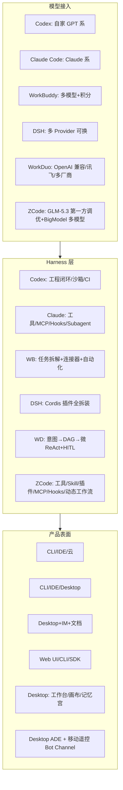

# WorkDuo 竞品差异化对照（2026-09-25）

> 对照对象：Codex（OpenAI）· WorkBuddy（腾讯）· Claude Code（Anthropic）· DeepSeek Harness（深度求索）· ZCode（智谱 Z.ai）
> 依据：本仓库 README / Harness 复评 / L2 测评方案 / 能力测评套件 + 本机 WorkBuddy 产品面 + 公开资料（DeepSeek Harness 官网/GitHub、WorkBuddy 官方文档、ZCode 官方文档 zcode.z.ai）+ 本机 ZCode 运行环境一手观察。
> 口径：说清「缺什么」和「该从哪里打开差异」，不重复产品说明书。成熟度自评沿用 09-24 结论（Codex=100 时约 72-76，L3 站稳）。

---

## 0. 一句话定位

| 产品 | 本质定位 | 主战场 |
|---|---|---|
| **Codex** | 云原生编程 Agent 运行时 + 企业工程闭环 | 真实仓库 issue / PR / CI，无人值守交付代码 |
| **Claude Code** | 终端/IDE 编程 Agent + 模型-工具协同生态 | 代码理解/重构/长任务，开发者工作流嵌入 |
| **WorkBuddy** | 全场景职场 AI 办公桌面工作台 | 文档/表格/PPT/调研/自动化，非程序员也能用 |
| **DeepSeek Harness** | 开源「一切皆插件」Agent Harness 基座 | 给 Harness 开发者二次组装，Trajectory 可回放 |
| **ZCode** | GLM-5.3 官方 Harness：ADE 桌面端 + 移动遥控（Bot Channel），模型-工具第一方协同调优 | 个人开发者编码工作流 + 长程任务自动化 + 文档交付 |
| **WorkDuo** | **本地优先的智能体工作台**（模型编排 + 记忆 + 产物 + HITL） | 可配置智能体的可控执行、记忆沉淀、产物交付 |

**核心判断**：WorkDuo 不是「再做一个 Codex」。它更像 **「可治理的本地 Agent 工作台」**——强在可控、可观测、可沉淀、可分发；弱在生态厚度、编程纵深、办公广度、运营锤炼。
**ZCode 入场的影响**：它与 Claude Code 同属「开发者 Harness」阵营（第三方已拿它与 CC 正面对比），护城河是 GLM 模型第一方调优 + 自动化/移动遥控形态。与 WorkDuo 不构成定位正面冲突——但 ZCode 的文档交付链与工作流编排说明，纯 Harness 玩家正在向「交付/自动化」渗透，WorkDuo 的差异化窗口在收窄、必须提速。

---

## 1. 产品骨架对比

---

## 2. 分维度对照（谁强 / WorkDuo 在哪）

### 2.1 编码与工程纵深

| 能力 | Codex | Claude Code | ZCode | WorkBuddy | DSH | WorkDuo |
|---|---|---|---|---|---|---|
| 真实 repo issue 解题 | ★★★★★ | ★★★★☆ | ★★★★（GLM 调优 + Goal Mode） | ★★☆ | ★★★☆ | ★★☆ |
| 代码库级上下文/索引 | ★★★★★ | ★★★★★ | ★★★☆（1M 上下文 + 检索子代理，无持久索引） | ★★ | ★★★ | ★★ |
| 测试/CI/PR 闭环 | ★★★★★ | ★★★★ | ★★★（gh/API 脚本级） | ★★ | ★★★ | ★★ |
| 多语言深度纠错 | ★★★★ | ★★★★ | ★★★★（GLM 多语言均衡） | ★★ | ★★★ | ★★（止步 Py/JS） |
| 沙箱隔离 | ★★★★★（三 OS） | ★★★★（worktree） | ★★★☆（权限四档 + bash 沙箱） | ★★★（权限规则） | ★★★★（可插件换） | ★★★（双守卫，隔离已验证） |

**WorkDuo 缺口**：题库虽扩到 19 包（含 CVE 溯源），仍是「等效复刻」而非真实大仓 issue；缺 IDE/CLI 形态；缺 PR/Review 流；多语言按用户决策放弃 Java。  
**不要硬追**：SWE-bench 榜单正面对轰 Codex 不划算。把「可验证交付」做透更符合你的地基。ZCode 入场后编程纵深更拥挤（模型厂红利 + 1M 上下文），再次印证：这是模型厂的主场，WorkDuo 的增值在 Harness 之上。

### 2.2 任务编排与自主性

| 能力 | Codex | Claude Code | ZCode | WorkBuddy | DSH | WorkDuo |
|---|---|---|---|---|---|---|
| 自主规划执行 | ★★★★★ | ★★★★ | ★★★★☆（Goal Mode + 动态工作流） | ★★★★ | ★★★★ | ★★★★（意图→DAG→ReAct） |
| 多智能体/子代理 | ★★★★★ | ★★★★（subagents） | ★★★★（Subagents + 工作流 fan-out） | ★★★★（多 Agent 协作） | ★★★★（委派/子代理） | ★☆（小分队占位） |
| HITL 人机门禁 | ★★★ | ★★★ | ★★★★（权限四档 + 计划确认 + 工作流门禁） | ★★★ | ★★★ | **★★★★★** |
| 分支重跑/回滚 | ★★★ | ★★★ | ★★★☆（工作流修订重跑 + Edit History） | ★★ | **★★★★★**（Trajectory 分叉回放） | ★★★★（画布分支+快照回滚） |
| 失败自愈 | ★★★★★ | ★★★★ | ★★★★（续跑/修订重跑 + 闲时重试） | ★★★ | ★★★★ | ★★★★（retry-with-context 已实证） |

**WorkDuo 亮点（可放大）**：HITL 三档审批 + 恢复门禁 + 计划审批，是五家里**产品化最完整的人机协同面**（ZCode 的权限四档偏运行门禁，WorkDuo 是「治理叙事」，层次不同）。  
**WorkDuo 缺口**：多 Agent 仍占位；子代理/并行专家是 WorkBuddy/CC/DSH 标配，ZCode 更进一步把编排做成**可编程工作流**（TS 脚本 + 类型化中间结果 + 断点续跑）——小分队执行层最直接的参照系。

### 2.3 记忆、知识与上下文

| 能力 | Codex | Claude Code | ZCode | WorkBuddy | DSH | WorkDuo |
|---|---|---|---|---|---|---|
| 长期记忆 | ★★★ | ★★★★（CLAUDE.md） | ★★★★（分型项目记忆 + 索引） | ★★★★（记忆模块） | ★★★（Memory MCP） | **★★★★★（记忆宫殿+三档模式）** |
| 项目级记忆 | ★★★ | ★★★★ | ★★★★（per-project 记忆库） | ★★★ | ★★★ | ★★★★（`.wd_mem` 七区） |
| 知识库 RAG + 引用 | ★★ | ★★ | ★★（无内建 KB，Web 检索有） | ★★★ | ★★ | **★★★★★（KB 检索+`[N]` 溯源）** |
| 上下文压缩 | ★★★★ | ★★★★ | ★★★★（自动摘要 + 1M 窗口） | ★★★ | ★★★ | ★★★★ |
| 跨会话传递 | ★★★ | ★★★★ | ★★★★（会话上下文按需 handoff） | ★★★★ | ★★★ | ★★★★（E-M3 实锤） |

**这是 WorkDuo 最有差异化的象限**。记忆宫殿 + 知识库引用 + 强制沉淀档，比 CLAUDE.md / 隐式记忆更「产品可见」。应继续做深，而不是做成配置项。ZCode 的记忆是「工程过程记忆」（agent 自管文件型，服务个人效率），WorkDuo 的记忆宫殿是「资产面」（热力图/分类/跨智能体沉淀）——同赛道但产品化深度不同，优势仍成立。

### 2.4 生态与可扩展

| 能力 | Codex | Claude Code | ZCode | WorkBuddy | DSH | WorkDuo |
|---|---|---|---|---|---|---|
| MCP | ★★★★ | ★★★★★ | ★★★★☆ | ★★★★ | ★★★★ | ★★★★（内建 77 工具+对外 MCP） |
| Skill/插件市场 | ★★★ | ★★★★★ | ★★★★（官方市场 + 创作器，第三方规模小） | **★★★★★** | ★★★★（社区 dsh-plugin） | ★★（自有 Skill Hub，无市场） |
| 连接器/第三方集成 | ★★★★ | ★★★★ | ★★★☆（Bot Channel 飞书/微信 + MCP 承接） | **★★★★★**（IM/日历/云文档） | ★★★ | ★★ |
| 开源/可二次开发 | ★★★ | ★★ | ★★（闭源桌面，GLM 模型开源） | ★★ | **★★★★★**（MIT + Cordis） | ★（闭源桌面） |
| 插件化架构可替换性 | ★★ | ★★★ | ★★★☆（Skill/Hook/插件/命令全开放，核心引擎闭） | ★★★★ | **★★★★★**（一切皆插件） | ★★（模块硬编码在 Rust 引擎） |

**WorkDuo 最大结构缺口**：不是「少几个插件」，而是 **引擎能力未插件化**。DSH 把模型/工具/沙箱/循环/调度/UI 全做成可换插件；WorkDuo 的能力层在 `register_native_tools` + Rust 模块里，扩展靠改引擎。ZCode 的「官方插件市场 + Skill/Plugin 创作器」证明桌面 Harness 也能养生态——WorkDuo Skill Hub 缺的不是形态，是第三方供给。

### 2.5 办公与泛场景

| 能力 | Codex | Claude Code | ZCode | WorkBuddy | DSH | WorkDuo |
|---|---|---|---|---|---|---|
| 文档/PPT/表格交付 | ★ | ★ | ★★★★（docx/pptx/xlsx/pdf 技能链 + 视觉验收） | **★★★★★** | ★★ | ★★★（产物多样+xlsx/png 模板） |
| 深度调研报告 | ★★ | ★★ | ★★★（Web 检索 + 精读 + 子代理汇编） | ★★★★★ | ★★ | ★★★ |
| 自动化/定时任务 | ★★ | ★★★ | ★★★★（Automations + 闲时任务 + IM 触发） | ★★★★★ | ★★★（schedule） | ★☆ |
| IM/协作平台接入 | ★★★ | ★★★ | ★★★☆（Bot Channel：飞书/微信 @ 触发 + 手机遥控） | ★★★★★ | ★★ | ★☆ |
| 非程序员可用性 | ★ | ★ | ★★☆（桌面 + IM 触达降门槛，主语仍是开发者） | **★★★★★** | ★★ | ★★★ |

**缺口清晰**：WorkBuddy 卖的是「职场同事」，WorkDuo 卖的是「智能体工位」。注意 ZCode 已用 Bot Channel（飞书/微信触发）+ 文档交付链，把「编码 Agent」往泛场景伸了一只脚——自动化与 IM 触达正在变成行业基线而非加分项。若目标用户含业务角色，办公交付链与自动化是必补；若锁定开发者/分析师，至少自动化要补。

### 2.6 可观测、治理与信任

| 能力 | Codex | Claude Code | ZCode | WorkBuddy | DSH | WorkDuo |
|---|---|---|---|---|---|---|
| 运行轨迹 | ★★★★ | ★★★ | ★★★★（工作流 journal 续跑 + Usage Stats + Edit History） | ★★★ | **★★★★★**（仅追加日志+回放） | ★★★★（per-run trace） |
| 产物画布/分支 | ★★ | ★ | ★★（无画布，文档交付有） | ★★ | ★★★★ | **★★★★★** |
| 成本治理 | ★★★★ | ★★★ | ★★★（配额/用量统计 + 闲时零配额） | ★★★★（积分） | ★★★ | ★★★★（预算/限流/回滚） |
| 发布门禁/自测 | ★★★★ | ★★★ | ★★★（评测试算台，无发布门禁） | ★★ | ★★★ | **★★★★★**（release gate+capability 套件） |
| 本地数据主权 | ★★ | ★★ | ★★（文件/记忆在本机，推理走云端） | ★★ | ★★★ | **★★★★★** |

**WorkDuo 已在「治理/自测/产物」上反超多数竞品**，这是被低估的资产，应产品化对外讲清楚。

---

## 3. 汇总：WorkDuo 缺什么（按优先级）

### P0 — 不补则产品站不住

1. **多智能体/子代理骨架**（小分队）  
   对手全有（ZCode 甚至已把多代理协作做成可编程工作流）；单 Agent 三支柱已绿，是开闸的正确时机。不必一次做到 Codex 级编排，先做「主 Agent + 2~3 专家子代理 + 汇总」。
2. **生态扩展面：Skill/插件市场 + 连接器**  
   WorkBuddy/DSH/CC 靠生态形成网络效应。WorkDuo 现在只有内建 Skill/MCP 管理，缺「第三方装得上、换得掉」。
3. **引擎能力插件化（或至少 Tool/Skill/沙箱可替换）**  
   对齐 DSH「一切皆插件」方向，否则每个扩展都要改 Rust，迭代速度会被生态型对手拖死。

### P1 — 形成差异的关键补强

4. **Trajectory 级回放/分叉**（DSH 的核心叙事）  
   你有画布分支，但缺「同一事件流恢复/检索/回放」的完整产品故事；可把现有 trace 升级为仅追加会话日志。
5. **自动化与长任务**（定时、提醒、后台续跑、>30min）  
   WorkBuddy/DSH/ZCode 都有（ZCode 的 Automations + 闲时任务 + IM 触发把「常驻感」做得最顺）；WorkDuo 路线图里 >30min 还是低优。
6. **真实工作负载题库 / 行业场景包**  
   从「自造种子」走向「用户可感知任务包」（数据管道、调研报告、代码修复），比刷 SWE-bench 分更适合你。
7. **CLI / 静默 API 形态**  
   Codex/CC/DSH/ZCode 都能被脚本或远端驱动（ZCode 还有 Bot Channel 手机遥控 + Remote Development）；你有 MCP，但缺「开发者命令行入口」，限制了嵌入 CI/流水线。

### P2 — 按目标用户决定

8. **办公交付链**（PPT/Word 模板、邮件、日历、IM 推送）— 对标 WorkBuddy  
9. **团队协作/云端会话共享** — 对标 Codex/WorkBuddy 企业面  
10. **开放源码或插件 SDK** — 对标 DSH  
11. **模型无关的 Code Mode（PTC）** — 对标 DSH 极简/PTC 模式，弱模型也能组合工具

---

## 4. 该从哪些方面打开差异（差异化路线）

不要做成「功能更少的 Codex」或「更技术的 WorkBuddy」。建议四条差异化轴：

### 轴 A：「可治理的本地智能体」——把 HITL + 安全 + 数据主权做成品牌

- **叙事**：云端推理、本地数据；高危必审、全程可审计；企业可控的 Agent 工位。
- **已有弹药**：审批三档、PathGuard、沙箱双守卫、敏感留痕、release gate、本地 SQLite/`.wd_mem`。
- **要做的**：审计日志导出、合规报告、权限角色（不止操作级审批）、离线/内网部署包。
- **对标谁**：Codex/CC 云端信任模型；WorkBuddy 生态数据面。

### 轴 B：「记忆与产物工作台」——把记忆宫殿 + 画布做成杀手级 UI

- **叙事**：Agent 不只改代码，它**记得住、交得出、可回溯**。
- **已有弹药**：记忆宫殿热力图、三档记忆模式、产物画布分支重跑、快照回滚、KB 引用。
- **要做的**：  
  1. Trajectory 只追加日志 + 回放/分叉（对齐 DSH）；  
  2. 「任务交付包」视图（产物+引用+成本+审批链一键导出）；  
  3. 记忆跨智能体共享（团队记忆库）。
- **对标谁**：DSH Trajectory；CC 记忆太文本化；WorkBuddy 结果区。

### 轴 C：「智能体工厂」——可配置 Agent + 可组合生态，而不是固定功能

- **叙事**：4 步向导创建智能体 → 挂 Skill/MCP/记忆模式 → 可导出可分享。
- **已有弹药**：Agent Studio、Skill Hub、MCP Hub、77 工具内建 MCP、能力测评套件。
- **要做的**：  
  1. Agent 模板市场（导出/导入/分享）；  
  2. 插件化 Tool/Skill 注册（对齐 DSH Cordis 思路，哪怕先做配置层）；  
  3. 「场景包」：调研/ETL/代码修复/周报，一键装成预置 Agent。
- **对标谁**：WorkBuddy 专家中心/技能市场；DSH preset 创作模式。

### 轴 D：「可验证交付」——自测、门禁、成本，做成买家能验收的指标

- **叙事**：不只「看起来跑通」，而是 resolved%、终态率、成本、锁释放都有数。
- **已有弹药**：L2 测评、capability 39 用例、gate 门禁、成本预算/限流、判分器。
- **要做的**：用户侧「任务验收卡」（预期产物 vs 实际、失败原因、token 账单）；把内部 harness 能力半开放给高级用户。
- **对标谁**：这是 WorkDuo **独有或领先**的叙事，五家都没有产品化到这个颗粒度（ZCode 的视觉验收最接近，但停在生成内检）。

---

## 5. 对手侧「值得抄」的清单（按 ROI）

| 来源 | 抄什么 | 为什么 | 落到 WorkDuo |
|---|---|---|---|
| **DSH** | 一切皆插件 + 仅追加 Trajectory + 运行模式（标准/极简/PTC/创造） | 架构自由度 + 可回放信任 | Tool/SandBox 插件化；会话事件流产品化 |
| **DSH** | 代码组合多轮工具（PTC / Code Mode） | 弱模型也能干重活 | 作为高级执行模式可选 |
| **WorkBuddy** | 连接器市场 + 自动化 + IM 接入 | 泛用户留存与场景宽度 | 先做 2~3 个高价值连接器（企微/飞书/本地文件夹） |
| **WorkBuddy** | 任务/结果/变更三分区 UI | 非开发者看懂交付 | 会话页强化「结果区」 |
| **Claude Code** | Subagent + Hooks + Skills 纪律 | 长任务并行与流程钩子 | 小分队最小可用；pre/post 工具钩子 |
| **ZCode** | 动态工作流（TS 编排多子代理，类型化结果 + 修订重跑带已完成缓存） | 多代理协作从「提示词约定」变成可校验程序 | 小分队执行层照此形：编队=工作流，审批点=工作流 gate |
| **ZCode** | Automations + 闲时任务 + Bot Channel（飞书/微信触发） | 常驻感与打开习惯；人不在电脑前任务也能推进 | P1-5 现成范式：定时 + IM 触达先行 |
| **ZCode** | 交付物技能链（docx/pptx/xlsx/pdf）+ 视觉验收 Agent | 产物出仓前有机器质检关 | 产物画布 → 「任务交付包」的最短参考路径 |
| **Codex** | 云端并行 Agent + 企业 CI 集成 | 规模化无人值守 | 远期；先保证本地多任务隔离已稳 |
| **Codex/CC** | 真实 issue 级评测 + 工程成熟度（异常路径） | 下限 | 继续 L3→L4 运营锤炼，不松 |

---

## 6. 不建议跟的坑

1. **正面对轰 SWE-bench 榜单**——模型红利 + 真实污染，你的工程分会被淹没。保留自造/溯源题库做回归即可。  
2. **大而全办公套件**——除非明确要打 WorkBuddy；否则场景包比功能表有用。  
3. **纯聊天体验优化**——SIMPLE_CHAT 已够用，差异在执行与沉淀。  
4. **Java 沙箱**——已拍板放弃，保持。  
5. **再堆 UI 皮肤**——轨迹/画布/记忆已是视觉资产，缺的是能力深度。  
6. **通用 Harness 军备竞赛**——ZCode/CC 背靠模型厂红利把工具面/技能/插件卷满；WorkDuo 再做「另一个通用编程 Agent」没有胜算，增量必须落在 Harness 之上的「治理与交付面」。

---

## 7. 建议的 90 天打开方式（差异化落地序）

| 阶段 | 主题 | 交付 | 对差异轴 |
|---|---|---|---|
| **0-30 天** | 补 P0 骨架 | 小分队 MVP（主+2 子代理）；Skill/Agent 导出导入；Trajectory 事件流只追加化 | 轴 B/C |
| **30-60 天** | 生态雏形 | 插件注册 API（Tool/Skill）；2 个官方场景包（调研报告、数据管道）；CLI/HTTP 静默入口 | 轴 C/D |
| **60-90 天** | 差异产品化 | 「任务交付包」导出；审计/合规面板；1 个 IM 连接器 + 定时自动化 | 轴 A/B |

**北极星指标建议**（替代再刷自评分）：
- 无人值守完成率（零外部应答）
- 交付包完整率（产物+引用+成本可验收）
- 第三方 Skill/插件安装数（生态）
- 跨会话记忆命中率（沉淀）
- 单任务成本 P90（治理）

---

## 8. 附：产品能力速查矩阵

| 能力簇 | Codex | Claude Code | ZCode | WorkBuddy | DSH | WorkDuo | 判定 |
|---|---|---|---|---|---|---|---|
| 编程纵深 | ●●●●● | ●●●●○ | ●●●●○ | ●●○○○ | ●●●○○ | ●●○○○ | 追不上则换赛道 |
| 自主执行 | ●●●●● | ●●●●○ | ●●●●○ | ●●●●○ | ●●●●○ | ●●●●○ | 已接近，差多 Agent |
| HITL/治理 | ●●●○○ | ●●●○○ | ●●●●○ | ●●●○○ | ●●●○○ | ●●●●● | **优势** |
| 记忆/知识 | ●●○○○ | ●●●●○ | ●●●●○ | ●●●●○ | ●●●○○ | ●●●●● | **优势** |
| 产物/回溯 | ●●○○○ | ●○○○○ | ●●●○○ | ●●●○○ | ●●●●● | ●●●●○ | 次优，可追 DSH |
| 生态市场 | ●●●○○ | ●●●●● | ●●●●○ | ●●●●● | ●●●●○ | ●●○○○ | **短板** |
| 办公泛场景 | ●○○○○ | ●○○○○ | ●●●○○ | ●●●●● | ●●○○○ | ●●●○○ | 看目标用户 |
| 本地主权 | ●●○○○ | ●●○○○ | ●●○○○ | ●●○○○ | ●●●○○ | ●●●●● | **优势** |
| 成本/门禁 | ●●●●○ | ●●●○○ | ●●●○○ | ●●●●○ | ●●●○○ | ●●●●○ | 优势 |
| 运营成熟 L4 | ●●●●● | ●●●●● | ●●●○○ | ●●●●○ | ●●●○○ | ●●○○○ | 时间换不来，只能用户 |

---

## 9. 结论（给决策用）

1. **WorkDuo 不欠「功能清单」，欠「生态厚度」和「形态宽度」**。引擎与治理已经站在 L3，短板在市场/连接器/多 Agent/CLI。  
2. **差异化不要选「更会写代码」**，要选 **「可治理的本地智能体工作台」**：记忆可见、产物可回放、审批可审计、数据不出机。  
3. **立刻该开的口子**：小分队（多 Agent）、Skill/Agent 可分发、Trajectory 回放、场景包 + 1~2 连接器。  
4. **长期护城河**是轴 B（记忆+产物）+ 轴 D（可验证交付）——五家竞品都还没产品化到你的颗粒度（ZCode 的视觉验收是生成内检，不是用户可感知的「交付验收卡」；它的记忆偏个人工程过程，不是资产面）。  
5. 继续用自有 harness 做回归，但对外叙事换成 **交付验收指标**，不要再用「自评 100 分」。

---

*信息边界：Codex / Claude Code 细节部分依赖公开基准与既有仓库竞评；WorkBuddy 含本机产品面与官方文档；DeepSeek Harness 以官网与开发者文档为准；ZCode 以官方文档（zcode.z.ai，2026-09 检索）+ 本机运行环境一手观察为准，其列由运行中的 ZCode 实例参与自评（按可观测工具面收敛口径，运营/市场份额数据留白）。浏览器自动搜索通道受限，未能穷尽最新 changelog。*
